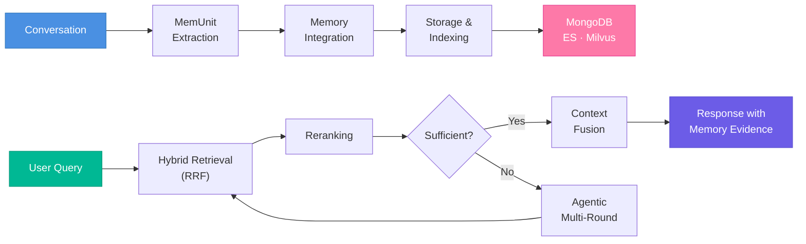
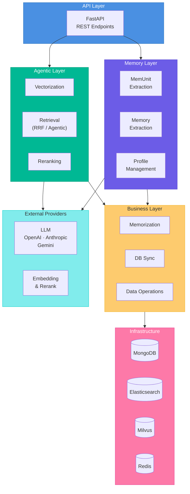

<div align="center">

<h1>Parallax</h1>

<p><strong>Long-term memory that makes AI actually understand you.</strong></p>

<p>
  <a href="https://everm.ai/" target="_blank">
    
  </a>
  <a href="https://github.com/perix-ai/parallax/releases">
    
  </a>
  
  
</p>

<p>
  
  
  
  
  
</p>

<p>
  <a href="README.md">English</a> | <a href="README_zh.md">简体中文</a>
</p>

</div>

---

## What's New

**v1.1.0** — Evaluation & Retrieval Enhancements

- **Smarter retrieval**: Type-aware answer prompts for temporal, counting, and aggregation queries
- **V4 evaluation pipeline**: Independent classification stage, C-RAG three-way evaluation, batch MemUnit extraction
- **Improved accuracy**: Optimized retrieval budgets and smart score truncation for cleaner context
- **New benchmarks**: Added LongMemEval and PersonaMem dataset support alongside LoCoMo

<details>
<summary>Previous releases</summary>

**v1.0.0** (2025-11-02) — Initial open-source release
- AI Memory System officially open sourced
- Complete documentation and API reference
- LoCoMo benchmark evaluation pipeline
- Interactive demo tools

</details>

---

## Why Parallax?

Most AI memory systems store isolated fragments. Parallax builds **coherent narratives** — it connects conversation pieces into thematic storylines, proactively surfaces relevant context, and maintains living user profiles that evolve with every interaction.

On the **LoCoMo** benchmark, our method achieves **92.3% reasoning accuracy** under LLM-Judge evaluation, outperforming comparable approaches.

<table>
  <tr>
    <td width="33%" valign="top">
      <h3>Coherent Narrative</h3>
      <p>Automatically links conversation fragments by theme and storyline. Distinguishes "Project A progress" from "Team B strategy" and maintains coherent context within each thread.</p>
    </td>
    <td width="33%" valign="top">
      <h3>Evidence-Based Perception</h3>
      <p>Proactively captures deep connections between memories and tasks. When a user asks for food recommendations, it recalls "dental surgery two days ago" and adjusts suggestions accordingly.</p>
    </td>
    <td width="33%" valign="top">
      <h3>Living Profiles</h3>
      <p>User profiles update in real-time with each conversation — preferences, habits, and focus areas continuously evolve. It doesn't just remember what you said; it learns who you are.</p>
    </td>
  </tr>
</table>

---

## How It Works

Parallax operates in two stages: **Memory Construction** and **Memory Perception**, forming a cognitive loop that continuously absorbs, consolidates, and applies past information.



### Memory Construction

Builds structured, retrievable long-term memory from raw conversations.

1. **MemUnit Extraction** — Identify key information and generate atomic memory units
2. **Memory Integration** — Organize by theme and participants into episodes, profiles, preferences, relationships, semantic knowledge, and core memories
3. **Storage & Indexing** — Persist to MongoDB, build keyword (Elasticsearch) and semantic (Milvus) indexes

### Memory Perception

Recalls relevant memories through multi-strategy retrieval and intelligent fusion.

- **Hybrid Retrieval (RRF)** — Parallel semantic + keyword search fused via Reciprocal Rank Fusion
- **Intelligent Reranking** — Deep relevance reordering with batch processing and exponential backoff
- **Agentic Multi-Round Recall** — LLM-guided complementary queries that fill retrieval blind spots
- **Lightweight Fast Mode** — Skip LLM calls for latency-sensitive scenarios

---

## Quick Start

### Prerequisites

- Python 3.12, [uv](https://github.com/astral-sh/uv)
- Docker 20.10+ & Docker Compose 2.0+
- At least 4GB RAM (for Elasticsearch and Milvus)

### Setup

```bash
# Clone and enter the project
git clone https://github.com/perix-ai/parallax.git
cd parallax

# Start infrastructure (MongoDB, Elasticsearch, Milvus, Redis)
docker-compose up -d

# Install dependencies
uv sync

# Configure environment
cp config/secrets/secrets.template.yaml config/secrets/secrets.yaml
# Edit secrets.yaml — set your LLM_API_KEY and DEEPINFRA_API_KEY
```

<details>
<summary>Docker service details</summary>

| Service | Port | Purpose |
|---------|------|---------|
| MongoDB | 27017 | Primary database for memory units and profiles |
| Elasticsearch | 19200 | Keyword search engine (BM25) |
| Milvus | 19530 | Vector database for semantic retrieval |
| Redis | 6379 | Cache |

</details>

### Try the Demo

```bash
# Terminal 1: Start the API server
uv run python src/bootstrap.py src/run.py --port 8001

# Terminal 2: Run the quick demo
uv run python src/bootstrap.py demo/simple_demo.py
```

The demo stores a few conversation messages, waits for indexing, then retrieves relevant memories with different queries — showing the full store → index → search workflow.

### Full Experience

For a complete walkthrough with memory extraction and interactive chat:

```bash
# Extract memories from sample conversations
uv run python src/bootstrap.py demo/extract_memory.py

# Start interactive chat with memory
uv run python src/bootstrap.py demo/chat_with_memory.py
```

See the [Demo Guide](demo/README.md) for detailed instructions.

---

## API

Start the API server, then use the V3 endpoints:

```bash
uv run python src/bootstrap.py src/run.py --port 8001
```

| Endpoint | Description |
|----------|-------------|
| `POST /api/v3/agentic/memorize` | Store a single message |
| `POST /api/v3/agentic/retrieve_lightweight` | Fast retrieval (Embedding + BM25 + RRF) |
| `POST /api/v3/agentic/retrieve_agentic` | Intelligent retrieval (LLM-guided multi-round) |

<details>
<summary>Example: Store a message</summary>

```bash
curl -X POST http://localhost:8001/api/v3/agentic/memorize \
  -H "Content-Type: application/json" \
  -d '{
    "message_id": "msg_001",
    "create_time": "2025-02-01T10:00:00+08:00",
    "sender": "user_103",
    "sender_name": "Chen",
    "content": "We need to complete the product design this week",
    "group_id": "group_001",
    "group_name": "Project Discussion Group",
    "scene": "group_chat"
  }'
```

</details>

<details>
<summary>Example: Retrieve memories</summary>

```bash
curl -X POST http://localhost:8001/api/v3/agentic/retrieve_lightweight \
  -H "Content-Type: application/json" \
  -d '{
    "query": "What sports does the user like?",
    "user_id": "user_001",
    "data_source": "episode",
    "memory_scope": "personal",
    "retrieval_mode": "rrf"
  }'
```

</details>

Full API reference: [Agentic V3 API Documentation](docs/api_docs/agentic_v3_api.md)

---

## Evaluation

Benchmark against standard datasets with the built-in evaluation framework:

```bash
# Install evaluation dependencies
uv sync --group eval

# Run evaluation
uv run python -m eval.cli --dataset locomo --system parallax
uv run python -m eval.cli --dataset longmemeval --system parallax
uv run python -m eval.cli --dataset personamem --system parallax
```

The pipeline runs 4 stages (add → search → answer → evaluate) with automatic checkpointing and resume. See the [Evaluation Guide](eval/README.md) for details.

---

## Architecture



<details>
<summary>Project directory structure</summary>

```
parallax/
├── src/
│   ├── agents/              # Agentic layer — retrieval, reranking, vectorization
│   ├── memory/              # Memory layer — MemUnit & memory extraction, prompts
│   ├── services/            # Business layer — memorization, sync, DB operations
│   ├── infrastructure/      # Adapters — API controllers, MongoDB/ES/Milvus persistence
│   ├── orchestration/       # Workflow orchestration
│   ├── providers/           # External services — LLM (OpenAI/Anthropic/Gemini), databases
│   ├── core/                # Framework — DI container, middleware, queue, cache, auth
│   └── utils/               # Shared utilities
├── demo/                    # Interactive demos and sample data
├── eval/                    # Evaluation framework and benchmarks
├── config/                  # YAML configuration files
└── docs/                    # Documentation
```

</details>

---

## Documentation

| | |
|---|---|
| [Quick Start Guide](docs/dev_docs/getting_started.md) | Installation and setup |
| [API Usage Guide](docs/dev_docs/api_usage_guide.md) | Endpoints and data formats |
| [Development Guide](docs/dev_docs/development_guide.md) | Architecture and best practices |
| [Demo Guide](demo/README.md) | Interactive examples |
| [Evaluation Guide](eval/README.md) | Benchmarking on standard datasets |
| [Agentic V3 API](docs/api_docs/agentic_v3_api.md) | Full API reference |

---

## Contributing

We welcome contributions of all kinds — bug reports, feature requests, and code improvements.

Please read the [Contributing Guide](CONTRIBUTING.md) before getting started.

---

## Community

<p>
  <a href="https://github.com/perix-ai/parallax/issues"></a>
  <a href="https://github.com/perix-ai/parallax/discussions"></a>
  <a href="mailto:heikiscott@gmail.com"></a>
</p>

## Acknowledgments

- [Memos](https://github.com/usememos/memos) — Inspiration for memory system design from their standardized open-source note-taking service.
- [Nemori](https://github.com/nemori-ai/nemori) — Inspiration from their self-organising long-term memory substrate for agentic LLM workflows.

## License

[Apache License 2.0](LICENSE)

---

<div align="center">

**If Parallax helps your work, please give us a star!**

Made with care by the Parallax Team

</div>
