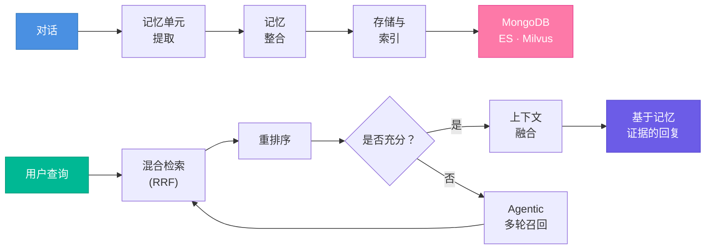
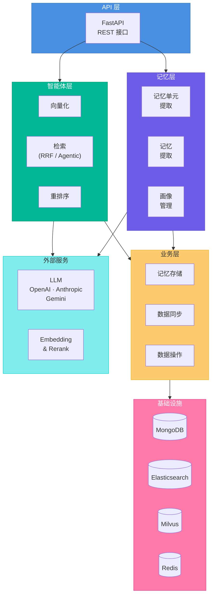

<div align="center">

<h1>Parallax</h1>

<p><strong>让 AI 真正理解你的长期记忆系统</strong></p>

<p>
  <a href="https://everm.ai/" target="_blank">
    
  </a>
  <a href="https://github.com/perix-ai/parallax/releases">
    
  </a>
  
  
</p>

<p>
  
  
  
  
  
</p>

<p>
  <a href="README.md">English</a> | <a href="README_zh.md">简体中文</a>
</p>

</div>

---

## 最新动态

**v1.1.0** — 评估与检索能力增强

- **更智能的检索**：针对时间类、计数类和聚合类查询的类型感知应答提示
- **V4 评估流水线**：独立分类阶段、C-RAG 三路评估、批量 MemUnit 提取
- **准确率提升**：优化检索预算和智能评分截断，生成更干净的上下文
- **新基准测试**：新增 LongMemEval 和 PersonaMem 数据集支持

<details>
<summary>历史版本</summary>

**v1.0.0**（2025-11-02）— 首次开源发布
- AI 记忆系统正式开源
- 完整文档和 API 参考
- LoCoMo 基准测试评估流程
- 交互式演示工具

</details>

---

## 为什么选择 Parallax？

大多数 AI 记忆系统只存储孤立的片段。Parallax 构建的是**连贯叙事**——它将对话片段按主题串联成完整故事线，主动浮现相关上下文，并维护随每次交互持续演化的用户画像。

在 **LoCoMo** 基准测试中，我们的方法在 LLM-Judge 评测下达到了 **92.3% 的推理准确率**，优于同类方案。

<table>
  <tr>
    <td width="33%" valign="top">
      <h3>脉络有绪</h3>
      <p>自动按主题和故事线串联对话片段。面对多线程对话时，自然区分"A 项目进度"和"B 团队策略"，并在每个主题内维持连贯的上下文逻辑。</p>
    </td>
    <td width="33%" valign="top">
      <h3>感知有据</h3>
      <p>主动捕捉记忆与任务间的深层关联。当用户请求"推荐食物"时，AI 会联想到"两天前刚做了牙科手术"，自动调整建议，避开不适宜的选项。</p>
    </td>
    <td width="33%" valign="top">
      <h3>画像有灵</h3>
      <p>用户画像随每次对话实时更新——偏好、习惯、关注点都在持续演化。它不只是"记住你说过什么"，而是在"学习你是谁"。</p>
    </td>
  </tr>
</table>

---

## 工作原理

Parallax 围绕两条主线运行：**记忆构筑**与**记忆感知**，形成认知闭环，持续吸收、沉淀并运用过往信息。



### 记忆构筑

从原始对话构建结构化、可检索的长期记忆。

1. **记忆单元提取** — 识别关键信息，生成原子记忆单元（MemUnit）
2. **记忆整合** — 按主题和参与者组织为情节、画像、偏好、关系、语义知识和核心记忆
3. **存储与索引** — 持久化至 MongoDB，建立关键词（Elasticsearch）和语义（Milvus）索引

### 记忆感知

通过多策略检索和智能融合召回相关记忆。

- **混合检索（RRF）** — 语义 + 关键词并行检索，Reciprocal Rank Fusion 融合
- **智能重排序** — 批量并发处理，按深度相关性重新排序
- **Agentic 多轮召回** — LLM 引导的互补查询，自动补足检索盲区
- **轻量级快速模式** — 跳过 LLM 调用，适用于延迟敏感场景

---

## 快速开始

### 环境要求

- Python 3.12，[uv](https://github.com/astral-sh/uv)
- Docker 20.10+ 和 Docker Compose 2.0+
- 至少 4GB 可用内存（用于 Elasticsearch 和 Milvus）

### 安装

```bash
# 克隆并进入项目
git clone https://github.com/perix-ai/parallax.git
cd parallax

# 启动基础设施（MongoDB、Elasticsearch、Milvus、Redis）
docker-compose up -d

# 安装依赖
uv sync

# 配置环境
cp config/secrets/secrets.template.yaml config/secrets/secrets.yaml
# 编辑 secrets.yaml — 填入 LLM_API_KEY 和 DEEPINFRA_API_KEY
```

<details>
<summary>Docker 服务详情</summary>

| 服务 | 端口 | 用途 |
|------|------|------|
| MongoDB | 27017 | 主数据库，存储记忆单元和画像 |
| Elasticsearch | 19200 | 关键词检索引擎（BM25） |
| Milvus | 19530 | 向量数据库，语义检索 |
| Redis | 6379 | 缓存 |

</details>

### 运行演示

```bash
# 终端 1：启动 API 服务器
uv run python src/bootstrap.py src/run.py --port 8001

# 终端 2：运行快速演示
uv run python src/bootstrap.py demo/simple_demo.py
```

演示会存储几条对话消息，等待索引建立，然后用不同查询检索相关记忆——展示完整的存储 → 索引 → 搜索工作流。

### 完整体验

完整的记忆提取和交互式聊天：

```bash
# 从样本对话中提取记忆
uv run python src/bootstrap.py demo/extract_memory.py

# 启动交互式记忆聊天
uv run python src/bootstrap.py demo/chat_with_memory.py
```

详细说明请参阅 [演示指南](demo/README_zh.md)。

---

## API

启动 API 服务器后使用 V3 接口：

```bash
uv run python src/bootstrap.py src/run.py --port 8001
```

| 接口 | 说明 |
|------|------|
| `POST /api/v3/agentic/memorize` | 存储单条消息 |
| `POST /api/v3/agentic/retrieve_lightweight` | 快速检索（Embedding + BM25 + RRF） |
| `POST /api/v3/agentic/retrieve_agentic` | 智能检索（LLM 引导多轮） |

<details>
<summary>示例：存储消息</summary>

```bash
curl -X POST http://localhost:8001/api/v3/agentic/memorize \
  -H "Content-Type: application/json" \
  -d '{
    "message_id": "msg_001",
    "create_time": "2025-02-01T10:00:00+08:00",
    "sender": "user_103",
    "sender_name": "Chen",
    "content": "我们需要在本周完成产品设计",
    "group_id": "group_001",
    "group_name": "项目讨论组",
    "scene": "group_chat"
  }'
```

</details>

<details>
<summary>示例：检索记忆</summary>

```bash
curl -X POST http://localhost:8001/api/v3/agentic/retrieve_lightweight \
  -H "Content-Type: application/json" \
  -d '{
    "query": "用户喜欢什么运动",
    "user_id": "user_001",
    "data_source": "episode",
    "memory_scope": "personal",
    "retrieval_mode": "rrf"
  }'
```

</details>

完整 API 文档：[Agentic V3 API](docs/api_docs/agentic_v3_api_zh.md)

---

## 评估

使用内置评估框架在标准数据集上进行基准测试：

```bash
# 安装评估依赖
uv sync --group eval

# 运行评估
uv run python -m eval.cli --dataset locomo --system parallax
uv run python -m eval.cli --dataset longmemeval --system parallax
uv run python -m eval.cli --dataset personamem --system parallax
```

流水线包含 4 个阶段（添加 → 搜索 → 回答 → 评估），支持自动检查点和断点续传。详见 [评估指南](eval/README_zh.md)。

---

## 架构



<details>
<summary>项目目录结构</summary>

```
parallax/
├── src/
│   ├── agents/              # 智能体层 — 检索、重排序、向量化
│   ├── memory/              # 记忆层 — MemUnit 与记忆提取、提示词
│   ├── services/            # 业务层 — 记忆存储、同步、数据库操作
│   ├── infrastructure/      # 适配层 — API 控制器、MongoDB/ES/Milvus 持久化
│   ├── orchestration/       # 工作流编排
│   ├── providers/           # 外部服务 — LLM（OpenAI/Anthropic/Gemini）、数据库
│   ├── core/                # 框架 — DI 容器、中间件、队列、缓存、鉴权
│   └── utils/               # 通用工具
├── demo/                    # 交互式演示和示例数据
├── eval/                    # 评估框架和基准测试
├── config/                  # YAML 配置文件
└── docs/                    # 文档
```

</details>

---

## 文档

| | |
|---|---|
| [快速开始指南](docs/dev_docs/getting_started.md) | 安装与配置 |
| [API 使用指南](docs/dev_docs/api_usage_guide.md) | 接口和数据格式 |
| [开发指南](docs/dev_docs/development_guide.md) | 架构设计和最佳实践 |
| [演示指南](demo/README_zh.md) | 交互式示例 |
| [评估指南](eval/README_zh.md) | 标准数据集基准测试 |
| [Agentic V3 API](docs/api_docs/agentic_v3_api_zh.md) | 完整 API 参考 |

---

## 贡献

欢迎所有形式的贡献——Bug 报告、功能建议或代码改进。

请在开始之前阅读 [贡献指南](CONTRIBUTING.md)。

---

## 社区

<p>
  <a href="https://github.com/perix-ai/parallax/issues"></a>
  <a href="https://github.com/perix-ai/parallax/discussions"></a>
  <a href="mailto:heikiscott@gmail.com"></a>
</p>

## 致谢

- [Memos](https://github.com/usememos/memos) — 其标准化的开源笔记服务为我们的记忆系统设计提供了宝贵启发。
- [Nemori](https://github.com/nemori-ai/nemori) — 其面向智能体 LLM 工作流的自组织长期记忆系统为我们提供了重要参考。

## 许可证

[Apache License 2.0](LICENSE)

---

<div align="center">

**如果 Parallax 对你有帮助，请给我们一个 Star!**

Made with care by the Parallax Team

</div>
