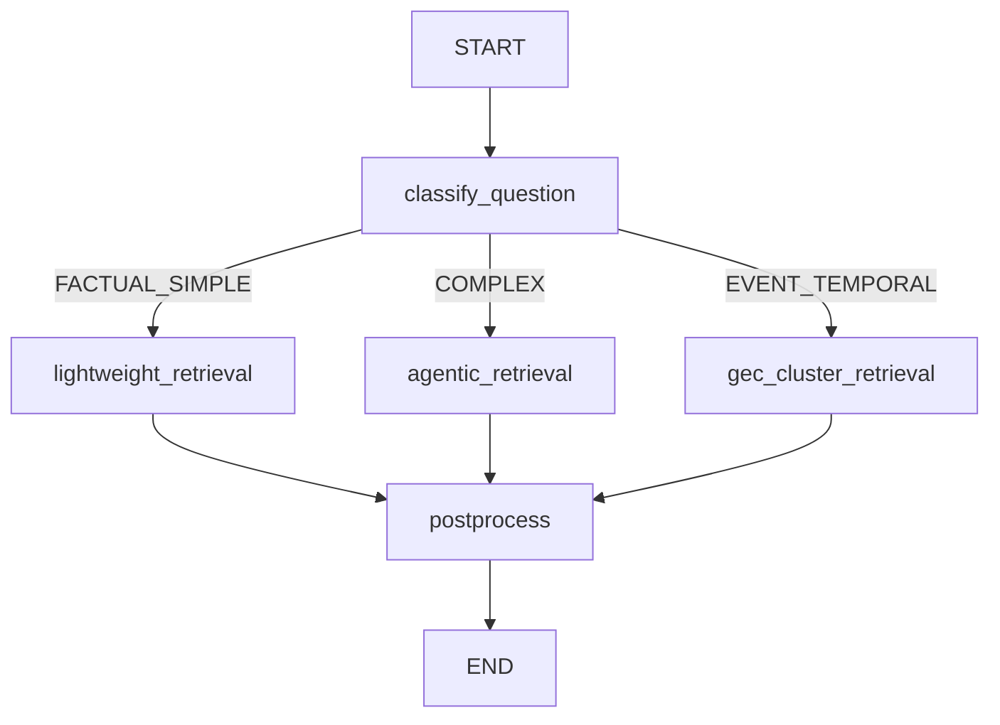

# Parallax 可配置检索 Pipeline 设计方案

## 目录

- [1. 概述](#1-概述)
  - [1.1 问题背景](#11-问题背景)
  - [1.2 设计目标](#12-设计目标)
- [2. 现有架构分析](#2-现有架构分析)
  - [2.1 现有 Pipeline 模式梳理](#21-现有-pipeline-模式梳理)
    - [2.1.1 评估 Pipeline](#211-评估-pipeline-evalcorepipelinepy)
    - [2.1.2 策略路由器](#212-策略路由器-evaladaptersparallaxstrategyrouterpy)
    - [2.1.3 Search Stage 细粒度检查点](#213-search-stage-细粒度检查点)
  - [2.2 兼容性问题识别](#22-兼容性问题识别)
  - [2.3 设计调整方案](#23-设计调整方案)
    - [调整 1：统一 Checkpoint 设计](#调整-1统一-checkpoint-设计必需)
    - [调整 2：明确 LangGraph 为核心编排引擎](#调整-2明确-langgraph-为核心编排引擎)
    - [调整 3：组件抽象作为概念指南](#调整-3组件抽象作为概念指南)
    - [调整 4：配置双轨支持](#调整-4配置双轨支持推荐)
- [3. 核心架构](#3-核心架构)
  - [3.1 基于 LangGraph 的编排架构](#31-基于-langgraph-的编排架构)
    - [核心设计原则](#核心设计原则-采用成熟的-stategraph-编排引擎)
    - [架构设计](#架构设计)
    - [状态定义](#状态定义)
    - [节点定义](#节点定义-nodes)
    - [路由函数](#路由函数-conditional-edges)
    - [构建 StateGraph](#构建-stategraph)
    - [使用示例](#使用示例)
    - [可视化调试](#可视化调试)
    - [高级特性](#高级特性)
    - [与现有架构的集成](#与现有架构的集成)
    - [优势总结](#优势总结)
  - [3.2 Pipeline 功能分类（概念层）](#32-pipeline-功能分类概念层)
    - [组件分类体系](#组件分类体系)
    - [1. Memory Building（记忆构建）](#1-memory-building记忆构建)
      - [阶段 1: MemUnit 提取](#阶段-1memunit-提取)
      - [阶段 2: 多类型 Memory 提取](#阶段-2多类型-memory-提取)
    - [2. Question Classification & Routing（问题分类与路由）](#2-question-classification--routing问题分类与路由)
    - [3. Query Preprocessing（查询预处理）](#3-query-preprocessing查询预处理)
    - [4. Retrieval（检索）](#4-retrieval检索)
    - [5. Result Expansion（结果扩展）](#5-result-expansion结果扩展)
    - [6. Retrieval Postprocessing（检索后处理）](#6-retrieval-postprocessing检索后处理)
    - [7. Prompt Adaptation（Prompt 适配）](#7-prompt-adaptationprompt-适配)
    - [8. Answer Generation（答案生成）](#8-answer-generation答案生成)
    - [9. Judgment（评判）](#9-judgment评判)
    - [横向能力（Cross-cutting Concerns）](#横向能力cross-cutting-concerns)
      - [1. Evaluation（评估）](#1-evaluation评估)
      - [2. Observability（可观测性）](#2-observability可观测性)
      - [3. 设计架构总览（纵向 + 横向）](#3-设计架构总览纵向--横向)
  - [3.3 从概念到实现：LangGraph Nodes 映射](#33-从概念到实现langgraph-nodes-映射)
    - [适配器设计模式](#适配器设计模式)
    - [使用示例](#使用示例-1)
  - [3.4 LangGraph 配置系统](#34-langgraph-配置系统)
    - [YAML 配置格式](#yaml-配置格式)
    - [配置加载器实现](#配置加载器实现)
    - [使用示例](#使用示例-2)
- [4. 配置示例](#4-配置示例)
  - [示例 1：完整的 Agentic RAG Workflow](#示例-1完整的-agentic-rag-workflow)
  - [示例 2：ColBERT 检索 Workflow](#示例-2colbert-检索-workflow)
  - [示例 3：轻量级检索（快速响应）](#示例-3轻量级检索快速响应)
  - [示例 4：混合检索 + 聚类扩展](#示例-4混合检索--聚类扩展)
- [5. 使用方式](#5-使用方式)
  - [方式 1：YAML 配置驱动（推荐）](#方式-1yaml-配置驱动推荐)
  - [方式 2：程序化构建（灵活）](#方式-2程序化构建灵活)
  - [集成到 Evaluation Pipeline](#集成到-evaluation-pipeline)
  - [流式执行示例](#流式执行示例)
  - [Checkpoint 恢复示例](#checkpoint-恢复示例)
- [6. 实施路线图](#6-实施路线图)
  - [Phase 1: 基础框架（1-2周）](#phase-1-基础框架1-2周)
  - [Phase 2: 包装现有实现（1周）](#phase-2-包装现有实现1周)
  - [Phase 3: 实现核心组件（2-3周）](#phase-3-实现核心组件2-3周)
  - [Phase 4: 横向能力集成（1-2周）](#phase-4-横向能力集成1-2周)
  - [Phase 5: 新检索方法（2-3周）](#phase-5-新检索方法2-3周)
  - [Phase 6: 配置化与优化（1-2周）](#phase-6-配置化与优化1-2周)
- [7. 关键文件清单](#7-关键文件清单)
  - [Phase 1 新增文件（基础框架）](#phase-1-新增文件基础框架)
  - [Phase 2 新增文件（包装现有实现）](#phase-2-新增文件包装现有实现)
  - [Phase 3 新增文件（核心组件实现）](#phase-3-新增文件核心组件实现)
  - [Phase 4 新增文件（横向能力）](#phase-4-新增文件横向能力)
  - [Phase 5 新增文件（新检索方法）](#phase-5-新增文件新检索方法)
  - [Phase 6 新增文件（配置化）](#phase-6-新增文件配置化)
  - [保持不变的文件](#保持不变的文件)
  - [目录结构总览](#目录结构总览)
  - [文件创建时间线](#文件创建时间线)
- [8. 优势总结](#8-优势总结)
  - [8.1 灵活性](#81-灵活性)
  - [8.2 扩展性](#82-扩展性)
  - [8.3 可维护性](#83-可维护性)
  - [8.4 性能](#84-性能)
  - [8.5 向后兼容](#85-向后兼容)
- [9. 风险与缓解](#9-风险与缓解)
  - [风险 1: 性能开销](#风险-1-性能开销)
  - [风险 2: 配置复杂度](#风险-2-配置复杂度)
  - [风险 3: 迁移成本](#风险-3-迁移成本)
- [10. 总结](#10-总结)
  - [核心创新](#核心创新)
  - [关键优势](#关键优势)
  - [最重要的是](#最重要的是)
- [11. 相关文档](#11-相关文档)
  - [用户文档](#用户文档)
  - [技术文档](#技术文档)
  - [代码仓库](#代码仓库)
- [附录](#附录)
  - [A. 参考资料](#a-参考资料)

---

## 1. 概述

### 1.1 问题背景

当前 Parallax 检索系统存在以下问题：

1. **策略层与实现层耦合**：`strategy/` 依赖 `eval/` 层函数，应该依赖 `src/agents/`
2. **配置分散**：`AgenticConfig`, `ExperimentConfig`, `GECConfig` 参数重复定义
3. **扩展性受限**：添加新检索方法需要修改 3-6 个文件
4. **灵活性不足**：无法通过配置文件灵活组合检索方法（如 ColBERT、QRHead）

### 1.2 设计目标

设计一个**可配置的 Agentic Retrieval Pipeline**，实现：

- ✅ **声明式配置**：通过 YAML/JSON 配置文件定义检索流程
- ✅ **模块化组件**：每个检索步骤（Retriever, Reranker, Expander）独立可插拔
- ✅ **零代码扩展**：添加新检索方法只需实现接口 + 注册，无需修改现有代码
- ✅ **向后兼容**：现有代码可以无缝迁移到新架构


[⬆️ 返回目录](#目录)

---

## 2. 现有架构分析

### 2.1 现有 Pipeline 模式梳理

Parallax 项目中已经存在多个 Pipeline 实现，在设计新的统一架构前，需要先理解现有模式：

#### 2.1.1 评估 Pipeline (`eval/core/pipeline.py`)

**职责**: 五阶段评估工作流编排（Add → Cluster → Search → Answer → Evaluate）

**优势**：
- ✅ **检查点系统**: 阶段级别和对话级别的细粒度检查点，支持断点续跑
- ✅ **异步执行**: 基于 async/await，Search Stage 使用 `asyncio.Semaphore(20)` 控制并发
- ✅ **阶段控制**: 可选择性执行特定阶段（如 `stages=["search", "answer"]`）
- ✅ **结果管理**: ResultSaver 自动保存 JSON 结果

**局限**：
- ❌ **硬编码 5 阶段**: 无法动态添加阶段
- ❌ **函数式调用**: 阶段是函数而非对象，缺乏多态性
- ❌ **配置方式**: 使用 Python 类 (`ExperimentConfig`) 而非声明式配置

#### 2.1.2 策略路由器 (`eval/adapters/parallax/strategy/router.py`)

**职责**: 基于问题分类选择检索策略

**优势**：
- ✅ **问题分类**: 完善的 `QuestionClassifier`，支持多种问题类型（事件时间、活动、属性等）
- ✅ **组件注册**: `register_strategy()` / `unregister_strategy()` 机制
- ✅ **策略覆盖**: `strategy_overrides` 配置支持
- ✅ **元数据传播**: 分类结果自动附加到 `result.metadata`

**架构**：
```python
class StrategyRouter:
    def __init__(self, classifier: QuestionClassifier):
        self._classifier = classifier
        self._strategies: Dict[StrategyType, BaseRetrievalStrategy] = {}

    async def route_and_retrieve(self, query, context):
        classification = self.classify(query)
        strategy = self._strategies[classification.strategy]
        return await strategy.retrieve(query, context)
```

**发现**: StrategyRouter 实际上已经是一个成熟的"问题分类 + 路由"组件，与提议设计中的 `BaseQuestionClassifier` 高度重合。

#### 2.1.3 Search Stage 细粒度检查点

**位置**: `eval/core/stages/search_stage.py`

**核心机制**：
- 对话级别检查点：每个 conversation 处理完成后保存
- 并发控制：`asyncio.Semaphore(20)` 限制同时处理 20 个对话
- 渐进式保存：避免全部完成才保存导致的数据丢失

这是**生产级别的检查点实现**，必须保留并集成到新设计中。


### 2.2 兼容性问题识别

对比提议设计与现有架构，发现 **4 个关键差异**：

| 维度 | 现有架构 | 提议设计 | 兼容性 |
|------|---------|---------|--------|
| **检查点** | ✅ 阶段 + 对话级别细粒度检查点 | ❌ 未提及 | **CRITICAL** - 必须集成 |
| **Pipeline 层次** | 单层（5 阶段流程） | 组件化（9 大类） | **需要双层架构** |
| **配置方式** | Python 类 + 部分 override | YAML 声明式 | **需要双轨支持** |
| **问题分类** | ✅ StrategyRouter 已实现 | BaseQuestionClassifier | **可直接复用** |


### 2.3 设计调整方案

基于兼容性分析，对原设计进行以下调整：

#### 调整 1：统一 Checkpoint 设计（必需）

**决策**：全面采用 LangGraph 的 `AsyncPostgresSaver` 作为统一 Checkpoint 方案

**理由**：
1. ✅ **已在生产使用**：代码仓已使用 `langgraph-checkpoint-postgres`
2. ✅ **自动持久化**：无需手动 save/load，减少代码量和出错风险
3. ✅ **数据库存储**：比文件系统更可靠，支持并发和事务
4. ✅ **原生集成**：与 LangGraph StateGraph 无缝集成
5. ✅ **细粒度控制**：通过 `thread_id` 支持对话级别的断点续传

**集成示例**：

```python
# eval/core/stages/search_stage.py (重构后)

from langgraph.checkpoint.postgres.aio import AsyncPostgresSaver
from src.providers.database.database_connection_provider import get_database_connection
from src.agents.graphs.retrieval_graph import compile_retrieval_graph

async def run_search_stage(dataset, config):
    # 1. 创建统一的 PostgreSQL Checkpoint
    db_connection = await get_database_connection()
    checkpointer = AsyncPostgresSaver(db_connection)

    # 2. 编译 LangGraph Retrieval Workflow (启用 checkpoint)
    retrieval_app = compile_retrieval_graph(checkpointer=checkpointer)

    # 3. 对每个问题执行检索 (自动 checkpoint)
    async with asyncio.Semaphore(20):
        for qa in dataset.qa_pairs:
            thread_id = f"{qa.conversation_id}__search"
            config_dict = {"configurable": {"thread_id": thread_id}}

            # LangGraph 自动处理 checkpoint
            result = await retrieval_app.ainvoke({
                "query": qa.question,
                "conversation_id": qa.conversation_id,
                "memory_index": memory_index,
                # ...
            }, config=config_dict)

            save_search_result(qa.question_id, result)
```

#### 调整 2：明确 LangGraph 为核心编排引擎

**决策**：采用 LangGraph StateGraph 作为 Retrieval Workflow 的唯一编排引擎

**架构层次**：

```
上层: Evaluation Pipeline (eval/core/pipeline.py)
├── Add Memory Stage
├── Cluster Stage (可选)
├── Search Stage  ← 使用 LangGraph StateGraph
│   └── LangGraph Retrieval Workflow
│       ├── classify_question (Node)
│       ├── Conditional Router
│       └── postprocess (Node)
├── Answer Stage
└── Evaluate Stage
```

#### 调整 3：功能分类作为概念指南，实现采用 LangGraph Nodes

**设计原则**：
- ✅ **概念层**：Section 3.2 定义 9 大功能分类（Memory Building, Retrieval, Reranker 等）
- ✅ **实现层**：直接用 LangGraph Nodes 实现，不引入抽象基类和适配器
- ✅ **原因**：避免过度设计，保持代码简洁

**好处**：
- 概念清晰：Section 3.2 帮助理解 Pipeline 逻辑结构
- 实现简单：Section 6-7 直接写 Node 函数，无需复杂的抽象层
- 代码维护：减少间接层次，代码更易读易维护

#### 调整 4：配置双轨支持（推荐）

同时支持 Python 类配置（向后兼容）和 YAML 配置（新功能）：

```python
# 方式 1: Python 类配置（现有方式 - 保留）
config = ExperimentConfig(
    adapter="parallax",
    retrieval_strategy="gec_cluster_rerank",
    enable_clustering=True,
)

# 方式 2: YAML 配置（新方式 - 推荐）
config = ExperimentConfig.from_yaml("config/experiments/exp001.yaml")
config.retrieval_graph_config = "config/graphs/agentic_hybrid.yaml"
```


[⬆️ 返回目录](#目录)

---

## 3. 核心架构

### 3.1 基于 LangGraph 的编排架构

#### 核心设计原则: 采用成熟的 StateGraph 编排引擎

本设计采用 **LangGraph StateGraph** 作为核心编排引擎,理由如下:

**为什么选择 LangGraph?**
1. ✅ **已在依赖中** (`langgraph>=0.2.6`) - 零额外成本
2. ✅ **成熟稳定** - Anthropic 官方支持,大量生产验证
3. ✅ **天然支持**:
   - 有向图(DAG)编排
   - 条件路由(conditional edges)
   - 并行执行(parallel nodes)
   - 状态持久化(checkpoint) - 已集成 PostgreSQL
   - 可视化调试(Mermaid 图)
4. ✅ **完美匹配需求**: 问题分类 → 路由到不同检索策略

**现有使用情况**:
- 代码仓已使用 `LangGraph` 的 `AsyncPostgresSaver` 作为 Checkpoint 持久化层
- 依赖完整: `langgraph`, `langgraph-checkpoint-postgres`, `langgraph-sdk`

---

#### 架构设计

```
LangGraph StateGraph:
┌─────────────────────────────────────────────────────────┐
│                   Retrieval Workflow                     │
├─────────────────────────────────────────────────────────┤
│                                                          │
│  START                                                   │
│    ↓                                                     │
│  ┌──────────────────────────────────────────────────┐  │
│  │ classify_question                                │  │
│  │ - QuestionClassifier.classify()                  │  │
│  │ - 输出: question_type, confidence                 │  │
│  └──────────────────────────────────────────────────┘  │
│    ↓                                                     │
│  [Conditional Router]                                   │
│    ├─ FACTUAL_SIMPLE → lightweight_retrieval           │
│    ├─ EVENT_TEMPORAL → gec_cluster_retrieval           │
│    ├─ COMPLEX_REASONING → agentic_retrieval            │
│    └─ ...                                               │
│    ↓                                                     │
│  ┌──────────────────────────────────────────────────┐  │
│  │ Strategy Nodes (并行分支)                         │  │
│  │                                                    │  │
│  │ ┌─ lightweight_retrieval                         │  │
│  │ │   - EmbeddingRetriever                         │  │
│  │ │   - DeepInfraReranker                          │  │
│  │                                                    │  │
│  │ ┌─ agentic_retrieval                             │  │
│  │ │   - HybridRetriever                            │  │
│  │ │   - SufficiencyChecker                         │  │
│  │ │   - MultiQueryExpander (条件执行)              │  │
│  │ │   - FinalReranker                              │  │
│  │                                                    │  │
│  │ ┌─ gec_cluster_retrieval                         │  │
│  │ │   - HybridRetriever                            │  │
│  │ │   - ClusterExpander                            │  │
│  │ │   - DeepInfraReranker                          │  │
│  └──────────────────────────────────────────────────┘  │
│    ↓                                                     │
│  ┌──────────────────────────────────────────────────┐  │
│  │ postprocess                                       │  │
│  │ - Deduplication                                   │  │
│  │ - Highlight                                       │  │
│  └──────────────────────────────────────────────────┘  │
│    ↓                                                     │
│  END                                                     │
│                                                          │
└─────────────────────────────────────────────────────────┘
```

---

#### 状态定义

```python
# src/agents/state.py

from typing import TypedDict, List, Dict, Any, Optional
from dataclasses import dataclass

@dataclass
class Document:
    """统一的文档表示"""
    id: str
    content: str
    metadata: Dict[str, Any]
    score: Optional[float] = None

class RetrievalState(TypedDict):
    """LangGraph 状态定义"""

    # 输入
    query: str
    conversation_id: str

    # 问题分类结果
    question_type: str           # "EVENT_TEMPORAL", "FACTUAL_SIMPLE", etc.
    classification_confidence: float
    classification_reasoning: str
    detected_patterns: List[str]

    # 检索结果
    documents: List[Document]

    # 元数据
    metadata: Dict[str, Any]
    retrieval_strategy: str      # 实际使用的策略

    # Pipeline Context (资源)
    memory_index: Any
    cluster_index: Optional[Any]
    vectorize_service: Optional[Any]
    rerank_service: Optional[Any]
    llm_provider: Optional[Any]
```

---

#### 节点定义 (Nodes)

```python
# src/agents/nodes.py

from langgraph.graph import StateGraph
from agents.question_classifier import QuestionClassifier, QuestionType

# ============ Node 1: 问题分类 ============
async def classify_question_node(state: RetrievalState) -> RetrievalState:
    """问题分类节点"""
    classifier = QuestionClassifier()
    classification = classifier.classify(state["query"])

    state["question_type"] = classification.question_type.value
    state["classification_confidence"] = classification.confidence
    state["classification_reasoning"] = classification.reasoning
    state["detected_patterns"] = classification.detected_patterns

    return state


# ============ Node 2-4: 检索策略节点 ============
async def lightweight_retrieval_node(state: RetrievalState) -> RetrievalState:
    """轻量级检索策略"""
    from src.agents.retrieval_utils import lightweight_retrieval

    results = await lightweight_retrieval(
        query=state["query"],
        memory_index=state["memory_index"],
        vectorize_service=state["vectorize_service"],
        rerank_service=state["rerank_service"],
        top_k=20
    )

    state["documents"] = results["memories"]
    state["metadata"] = results["metadata"]
    state["retrieval_strategy"] = "lightweight"

    return state


async def agentic_retrieval_node(state: RetrievalState) -> RetrievalState:
    """Agentic 检索策略"""
    from src.agents.retrieval_utils import agentic_retrieval

    results = await agentic_retrieval(
        query=state["query"],
        memory_index=state["memory_index"],
        cluster_index=state["cluster_index"],
        vectorize_service=state["vectorize_service"],
        rerank_service=state["rerank_service"],
        llm_provider=state["llm_provider"],
        top_k=20
    )

    state["documents"] = results["memories"]
    state["metadata"] = results["metadata"]
    state["retrieval_strategy"] = "agentic"

    return state


async def gec_cluster_retrieval_node(state: RetrievalState) -> RetrievalState:
    """GEC 聚类检索策略"""
    from eval.adapters.parallax.strategy.strategies import GECClusterRerankStrategy

    strategy = GECClusterRerankStrategy(config=None)
    results = await strategy.retrieve(
        query=state["query"],
        context=RetrievalContext(
            memory_index=state["memory_index"],
            cluster_index=state["cluster_index"],
            # ...
        )
    )

    state["documents"] = results.documents
    state["metadata"] = results.metadata
    state["retrieval_strategy"] = "gec_cluster_rerank"

    return state


# ============ Node 5: 后处理 ============
async def postprocess_node(state: RetrievalState) -> RetrievalState:
    """后处理节点:去重、高亮等"""
    from src.agents.retrieval_utils import deduplicate_documents, highlight_keywords

    # 去重
    state["documents"] = deduplicate_documents(state["documents"])

    # 高亮关键词
    state["documents"] = highlight_keywords(state["documents"], state["query"])

    state["metadata"]["postprocessed"] = True

    return state
```

---

#### 路由函数 (Conditional Edges)

```python
# src/agents/routers.py

from typing import Literal

def route_by_question_type(state: RetrievalState) -> Literal[
    "lightweight_retrieval",
    "agentic_retrieval",
    "gec_cluster_retrieval"
]:
    """根据问题类型路由到不同检索策略"""

    question_type = state["question_type"]

    # 简单事实查询 → 轻量级检索
    if question_type in ["FACTUAL_SIMPLE"]:
        return "lightweight_retrieval"

    # 事件时间/活动查询 → GEC 聚类检索
    elif question_type in ["EVENT_TEMPORAL", "EVENT_ACTIVITY", "EVENT_AGGREGATION"]:
        return "gec_cluster_retrieval"

    # 复杂推理/属性查询 → Agentic 检索
    else:
        return "agentic_retrieval"
```

---

#### 构建 StateGraph

```python
# src/agents/graph.py

from langgraph.graph import StateGraph, END
from .nodes import (
    classify_question_node,
    lightweight_retrieval_node,
    agentic_retrieval_node,
    gec_cluster_retrieval_node,
    postprocess_node,
)
from .routers import route_by_question_type
from .state import RetrievalState

def create_retrieval_graph() -> StateGraph:
    """创建检索 StateGraph"""

    # 1. 创建图
    workflow = StateGraph(RetrievalState)

    # 2. 添加节点
    workflow.add_node("classify_question", classify_question_node)
    workflow.add_node("lightweight_retrieval", lightweight_retrieval_node)
    workflow.add_node("agentic_retrieval", agentic_retrieval_node)
    workflow.add_node("gec_cluster_retrieval", gec_cluster_retrieval_node)
    workflow.add_node("postprocess", postprocess_node)

    # 3. 设置入口
    workflow.set_entry_point("classify_question")

    # 4. 添加条件边 (问题分类 → 路由到策略)
    workflow.add_conditional_edges(
        "classify_question",
        route_by_question_type,
        {
            "lightweight_retrieval": "lightweight_retrieval",
            "agentic_retrieval": "agentic_retrieval",
            "gec_cluster_retrieval": "gec_cluster_retrieval",
        }
    )

    # 5. 所有策略 → 后处理
    workflow.add_edge("lightweight_retrieval", "postprocess")
    workflow.add_edge("agentic_retrieval", "postprocess")
    workflow.add_edge("gec_cluster_retrieval", "postprocess")

    # 6. 后处理 → 结束
    workflow.add_edge("postprocess", END)

    return workflow


# 编译图
def compile_retrieval_graph(
    checkpointer=None,  # 可选: PostgreSQL Checkpoint
    debug: bool = False
):
    """编译 StateGraph 为可执行的应用"""
    workflow = create_retrieval_graph()

    return workflow.compile(
        checkpointer=checkpointer,
        debug=debug
    )
```

---

#### 使用示例

##### 方式 1: 基础使用

```python
# demo/retrieval_with_langgraph.py

import asyncio
from src.agents.graphs.retrieval_graph import compile_retrieval_graph
from src.agents.state import RetrievalState

async def main():
    # 1. 编译图
    app = compile_retrieval_graph()

    # 2. 准备输入状态
    initial_state: RetrievalState = {
        "query": "用户上周吃了什么？",
        "conversation_id": "conv_123",
        "memory_index": memory_index,
        "cluster_index": cluster_index,
        "vectorize_service": vectorize_service,
        "rerank_service": rerank_service,
        "llm_provider": llm_provider,
    }

    # 3. 执行图
    result = await app.ainvoke(initial_state)

    # 4. 查看结果
    print(f"问题类型: {result['question_type']}")
    print(f"使用策略: {result['retrieval_strategy']}")
    print(f"检索到 {len(result['documents'])} 条记忆")

    for i, doc in enumerate(result['documents'][:5], 1):
        print(f"\n[{i}] {doc.content[:100]}...")

if __name__ == "__main__":
    asyncio.run(main())
```

##### 方式 2: 启用 Checkpoint (断点续传)

```python
from langgraph.checkpoint.postgres.aio import AsyncPostgresSaver
from src.providers.database.database_connection_provider import get_database_connection

async def main_with_checkpoint():
    # 1. 创建 PostgreSQL Checkpoint
    db_connection = await get_database_connection()
    checkpointer = AsyncPostgresSaver(db_connection)

    # 2. 编译图 (启用 checkpoint)
    app = compile_retrieval_graph(checkpointer=checkpointer)

    # 3. 执行 (带 thread_id 支持恢复)
    config = {"configurable": {"thread_id": "user_123_session_456"}}
    result = await app.ainvoke(initial_state, config=config)

    # 如果中途失败,下次使用相同 thread_id 会自动恢复
```

##### 方式 3: 流式执行 (Streaming)

```python
async def main_with_streaming():
    app = compile_retrieval_graph()

    # 流式执行,实时输出每个节点的结果
    async for event in app.astream(initial_state):
        node_name = list(event.keys())[0]
        node_output = event[node_name]

        print(f"\n[Node: {node_name}]")
        if "question_type" in node_output:
            print(f"  分类结果: {node_output['question_type']}")
        if "documents" in node_output:
            print(f"  检索到 {len(node_output['documents'])} 条记忆")
```

---

#### 可视化调试

LangGraph 支持生成 Mermaid 图,可视化整个工作流:

```python
from IPython.display import Image, display

# 生成流程图
app = compile_retrieval_graph()
display(Image(app.get_graph().draw_mermaid_png()))
```

**生成的 Mermaid 图示例**:



---

#### 高级特性

##### 1. 并行检索节点

```python
# 并行执行多个检索器,然后融合结果

workflow.add_node("embedding_retrieval", embedding_retrieval_node)
workflow.add_node("bm25_retrieval", bm25_retrieval_node)
workflow.add_node("colbert_retrieval", colbert_retrieval_node)
workflow.add_node("fusion", rrf_fusion_node)

# 从分类节点并行到三个检索器
workflow.add_edge("classify_question", "embedding_retrieval")
workflow.add_edge("classify_question", "bm25_retrieval")
workflow.add_edge("classify_question", "colbert_retrieval")

# 所有检索器完成后 → 融合
workflow.add_edge("embedding_retrieval", "fusion")
workflow.add_edge("bm25_retrieval", "fusion")
workflow.add_edge("colbert_retrieval", "fusion")
```

##### 2. 条件执行 (Agentic Round 2)

```python
# 在 agentic_retrieval_node 内部检查充分性

async def agentic_retrieval_node(state):
    # Round 1
    docs = await hybrid_retrieval(state["query"])

    # 检查充分性
    is_sufficient = await check_sufficiency(docs, state["llm_provider"])

    if not is_sufficient:
        # Round 2: Multi-query expansion
        expanded_docs = await multi_query_expand(state["query"], docs)
        state["documents"] = expanded_docs
        state["metadata"]["is_multi_round"] = True
    else:
        state["documents"] = docs
        state["metadata"]["is_multi_round"] = False

    return state
```

##### 3. 动态路由 (Override)

```python
# 支持用户手动指定策略,覆盖自动分类

def route_with_override(state):
    # 检查是否有用户指定的策略
    if "force_strategy" in state.get("metadata", {}):
        return state["metadata"]["force_strategy"]

    # 否则按问题分类路由
    return route_by_question_type(state)
```

---

#### 与现有架构的集成

```
现有评估流程 (eval/core/pipeline.py)
├── Add Memory Stage
├── Cluster Stage
├── Search Stage  ← 使用 LangGraph StateGraph
│   └── LangGraph Retrieval Workflow
│       ├── classify_question (Node)
│       ├── Conditional Router
│       │   ├── lightweight_retrieval (Node)
│       │   ├── agentic_retrieval (Node)
│       │   └── gec_cluster_retrieval (Node)
│       └── postprocess (Node)
├── Answer Stage
└── Evaluate Stage
```

**集成方式**:

```python
# eval/core/stages/search_stage.py (重构后)

from src.agents.graphs.retrieval_graph import compile_retrieval_graph

async def run_search_stage(dataset, config):
    # 编译 LangGraph
    retrieval_app = compile_retrieval_graph(
        checkpointer=get_postgres_checkpointer()
    )

    # 对每个问题执行检索
    for qa in dataset.qa_pairs:
        result = await retrieval_app.ainvoke({
            "query": qa.question,
            "conversation_id": qa.conversation_id,
            "memory_index": memory_index,
            # ...
        })

        # 保存结果
        save_search_result(qa.question_id, result)
```

---

#### 优势总结

**相比自研 Pipeline + Component 方案**:

| 特性 | LangGraph | 自研方案 |
|------|-----------|---------|
| **学习曲线** | 中等 | 低 |
| **灵活性** | 高 (任意 DAG) | 高 (双向嵌套) |
| **可视化** | ✅ 内置 Mermaid | ❌ 需自己实现 |
| **持久化** | ✅ 原生支持 | 需集成 |
| **生态** | 大 (LangChain) | 无 |
| **调试** | ✅ LangSmith | 需自己实现 |
| **依赖** | 已有 | 需从零实现 |
| **社区支持** | 活跃 | 无 |
| **文档** | 完善 | 需自己写 |

**关键优势**:
1. ✅ **零新增依赖** - 已在 `pyproject.toml` 中
2. ✅ **生产验证** - Anthropic 官方支持,大量案例
3. ✅ **开箱即用** - PostgreSQL Checkpoint 已集成
4. ✅ **可视化调试** - 自动生成流程图
5. ✅ **流式支持** - 实时输出中间结果
6. ✅ **易于测试** - 每个节点独立测试


---

### 3.2 Pipeline 功能分类（概念层）

> **设计说明**：本节定义 Agentic Retrieval Pipeline 的**逻辑功能分类**（概念层），帮助理解整个流程的各个环节。
>
> **实现方式**：这些功能在实际实现中**直接映射为 LangGraph Nodes**（见 Section 6-7），而非抽象基类。
> - ✅ **概念清晰**：Section 3.2 定义功能分类（帮助理解）
> - ✅ **实现简洁**：Section 6-7 直接用 Node 函数实现（无需适配器）

本节将 Pipeline 分为 9 大功能类别，覆盖从记忆构建到答案评判的完整生命周期。

#### 组件分类体系

```
RAG Component Abstractions（概念层）
├── 1. Memory Building (记忆构建) - 两阶段提取
│   ├── 阶段 1: MemUnit 提取
│   │   ├── BaseMemUnitExtractor - MemUnit 提取器基类
│   │   │   ├── ConversationMemUnitExtractor (对话提取)
│   │   │   ├── DocumentMemUnitExtractor (文档提取)
│   │   │   └── MultiModalMemUnitExtractor (多模态提取)
│   │
│   └── 阶段 2: 多类型 Memory 提取（从 MemUnit）
│       ├── BaseMemoryExtractor - Memory 提取器基类
│       │   ├── EpisodeMemoryExtractor (情景记忆)
│       │   ├── SemanticMemoryExtractor (语义记忆)
│       │   ├── EventLogExtractor (事件日志)
│       │   ├── ProfileMemoryExtractor (用户画像)
│       │   └── GroupProfileMemoryExtractor (群体画像)
│
├── 2. Question Classification & Routing (问题分类与路由)
│   ├── BaseQuestionClassifier - 问题分类器基类
│   │   ├── ComplexityClassifier (复杂度分类)
│   │   ├── DomainClassifier (领域分类)
│   │   ├── IntentClassifier (意图分类)
│   │   └── StrategyRouter (策略路由器)
│
├── 3. Query Preprocessing (查询预处理)
│   ├── BaseQueryPreprocessor - 查询预处理基类
│   │   ├── QueryRewriter (查询改写)
│   │   ├── QueryDecomposer (查询分解)
│   │   └── QueryExpander (查询扩展)
│
├── 4. Retrieval (检索)
│   ├── BaseRetriever - 检索器基类
│   │   ├── EmbeddingRetriever
│   │   ├── BM25Retriever
│   │   ├── HybridRetriever
│   │   ├── ColBERTRetriever
│   │   └── QRHeadRetriever
│
├── 5. Result Expansion (结果扩展)
│   ├── BaseExpander - 扩展器基类
│   │   ├── ClusterExpander
│   │   ├── MultiQueryExpander
│   │   └── GraphExpander
│
├── 6. Retrieval Postprocessing (检索后处理)
│   ├── BaseReranker (重排序)
│   ├── BaseCompressor (压缩)
│   ├── BaseDeduplicator (去重)
│   └── BaseHighlighter (高亮)
│
├── 7. Prompt Adaptation (Prompt 适配)
│   ├── BasePromptAdapter - Prompt 适配器基类
│   │   ├── TemplateSelector (模板选择器)
│   │   ├── ContextInjector (上下文注入器)
│   │   └── PromptComposer (Prompt 组合器)
│
├── 8. Answer Generation (答案生成)
│   └── BaseGenerator - 生成器基类
│       ├── DirectGenerator
│       ├── IterativeGenerator
│       └── ChainOfThoughtGenerator
│
└── 9. Judgment (评判)
    └── BaseJudge - 评判器基类
        ├── RetrievalJudge (检索质量评判)
        └── AnswerJudge (答案质量评判)
```

---

#### 1. Memory Building（记忆构建）

将原始对话转换为可存储和检索的多层次记忆。记忆构建采用**两阶段提取**：

```
对话输入 → [阶段 1: MemUnit 提取] → MemUnit → [阶段 2: 多类型 Memory 提取] → 多种 Memory 类型
```

##### 阶段 1：MemUnit 提取

从对话边界检测结果中提取原始记忆单元（MemUnit）。

**BaseMemUnitExtractor**

```python
class BaseMemUnitExtractor(Node):
    """MemUnit 提取器基类 - 对话边界检测后的第一层提取"""

    @abstractmethod
    async def extract_memunit(self, conversation: Conversation) -> Optional[MemUnit]:
        """
        从对话中提取 MemUnit（原始记忆单元）

        Args:
            conversation: 对话边界检测的输出

        Returns:
            MemUnit: 包含对话内容、参与者、时间等原始信息
        """
        pass
```

**实现类型**：
- `ConversationMemUnitExtractor`：从对话中提取 MemUnit
- `DocumentMemUnitExtractor`：从文档中提取 MemUnit
- `MultiModalMemUnitExtractor`：从多模态输入（文本+图像）中提取 MemUnit

---

##### 阶段 2：多类型 Memory 提取

在 MemUnit 基础上提取不同类型的结构化记忆。

**BaseMemoryExtractor**

```python
class BaseMemoryExtractor(Node):
    """Memory 提取器基类 - 从 MemUnit 提取特定类型的记忆"""

    def __init__(self, memory_type: MemoryType):
        self.memory_type = memory_type

    @abstractmethod
    async def extract_memory(self, memunit: MemUnit, user_id: str) -> Optional[Memory]:
        """
        从 MemUnit 提取特定类型的 Memory

        Args:
            memunit: MemUnit 原始记忆单元
            user_id: 用户 ID（用于用户视角的记忆）

        Returns:
            Memory: 特定类型的结构化记忆
        """
        pass
```

**Memory 类型层次结构**（基于 `src/memory/schema/memory_type.py`）：

```
MemUnit (原始记忆单元)
    │
    ├── EpisodeMemory (情景记忆)
    │     从用户视角描述的个人叙事性记忆
    │     用途: 记录用户的主观体验和经历
    │     示例: "今天我和小明讨论了项目进度，他提到下周要上线..."
    │
    ├── SemanticMemory (语义记忆)
    │     从对话中提取的客观事实性知识
    │     用途: 存储可验证的事实信息
    │     示例: "用户熟悉 Python 编程"
    │
    ├── EventLog (事件日志)
    │     带时间戳的原子事实记录
    │     用途: 精确的时间线回溯
    │     示例: "2024-03-14 14:30 - 用户提到明天有会议"
    │
    ├── ProfileMemory (用户画像)
    │     用户的技能、性格、偏好等特征
    │     用途: 构建用户个人档案
    │     示例: {"hard_skills": [{"value": "Python", "level": "expert"}]}
    │
    └── GroupProfileMemory (群体画像)
          群体的话题、角色、互动模式
          用途: 分析群体动态和关系
          示例: {"roles": {"DECISION_MAKER": ["user_123"]}}
```

**实现类型**：
- `EpisodeMemoryExtractor`：提取情景记忆（个人叙事视角）
- `SemanticMemoryExtractor`：提取语义记忆（客观事实）
- `EventLogExtractor`：提取事件日志（时间戳 + 原子事实）
- `ProfileMemoryExtractor`：提取用户画像（技能、性格、偏好）
- `GroupProfileMemoryExtractor`：提取群体画像（角色、话题、互动模式）

---

##### 完整流程示例

```python
# 阶段 1: 提取 MemUnit
memunit_extractor = ConversationMemUnitExtractor()
memunit = await memunit_extractor.extract_memunit(conversation)

# 阶段 2: 并行提取多种 Memory 类型
episode_extractor = EpisodeMemoryExtractor(MemoryType.EPISODE_SUMMARY)
semantic_extractor = SemanticMemoryExtractor(MemoryType.SEMANTIC_SUMMARY)
event_extractor = EventLogExtractor(MemoryType.EVENT_LOG)
profile_extractor = ProfileMemoryExtractor(MemoryType.PROFILE)

# 并行提取
memories = await asyncio.gather(
    episode_extractor.extract_memory(memunit, user_id),
    semantic_extractor.extract_memory(memunit, user_id),
    event_extractor.extract_memory(memunit, user_id),
    profile_extractor.extract_memory(memunit, user_id),
)

# 存储到不同的索引
for memory in memories:
    if memory:
        await memory_index.add(memory)
```

---

#### 2. Question Classification & Routing（问题分类与路由）

对问题进行分类并路由到合适的处理策略。这是 Workflow 的**决策中枢**。

##### BaseQuestionClassifier

```python
class BaseQuestionClassifier(Node):
    """问题分类器基类"""

    @abstractmethod
    async def classify(self, question: str, context: 'ExecutionContext') -> QuestionType:
        """分类问题，返回问题类型"""
        pass

    @abstractmethod
    async def route(self, question_type: QuestionType, context: 'ExecutionContext') -> str:
        """根据问题类型路由到 Workflow 配置"""
        pass
```

**子类型**：

- **ComplexityClassifier（复杂度分类器）**：判断问题复杂度
  - `SimpleQuestionClassifier`：简单事实查询 → 使用 Lightweight Workflow
  - `ComplexQuestionClassifier`：复杂推理问题 → 使用 Agentic Workflow
  - `MultiHopClassifier`：多跳问题 → 使用 Multi-Query Expansion

- **DomainClassifier（领域分类器）**：判断问题所属领域
  - `TechnicalDomainClassifier`：技术问题 → 使用专业术语 Prompt
  - `GeneralDomainClassifier`：通用问题 → 使用通用 Prompt
  - `MultiDomainClassifier`：跨领域问题 → 使用多领域检索

- **IntentClassifier（意图分类器）**：判断用户意图
  - `FactualIntentClassifier`：事实查询 → 直接检索
  - `AnalyticalIntentClassifier`：分析类问题 → 需要推理
  - `ComparativeIntentClassifier`：比较类问题 → 需要多文档对比

- **StrategyRouter（策略路由器）**：根据分类结果选择 Workflow 策略
  - `RuleBasedRouter`：基于规则的路由
  - `LLMBasedRouter`：基于 LLM 的智能路由
  - `HybridRouter`：规则 + LLM 混合路由

**使用示例**：

```python
class LLMComplexityClassifier(ComplexityClassifier):
    async def classify(self, question: str, context: 'ExecutionContext') -> QuestionType:
        prompt = f"Classify the complexity of this question: {question}\nOptions: simple, medium, complex"
        response = await context.llm_provider.generate(prompt)
        return self._parse_complexity(response)

    async def route(self, question_type: QuestionType, context: 'ExecutionContext') -> str:
        if question_type.complexity == "simple":
            return "config/graphs/lightweight.yaml"
        elif question_type.complexity == "medium":
            return "config/graphs/hybrid_retrieval.yaml"
        else:
            return "config/graphs/full_agentic_rag.yaml"
```

---

#### 3. Query Preprocessing（查询预处理）

在检索前对查询进行优化和转换。

##### BaseQueryPreprocessor

```python
class BaseQueryPreprocessor(Node):
    """查询预处理基类"""

    @abstractmethod
    async def preprocess(self, query: str, context: 'ExecutionContext') -> Union[str, List[str]]:
        """预处理查询，返回单个查询或多个查询"""
        pass
```

**子类型**：

- **QueryRewriter（查询改写器）**：改写查询以提升检索效果
  - `LLMQueryRewriter`：使用 LLM 改写查询
  - `ExpansionQueryRewriter`：添加同义词扩展
  - `ClarificationQueryRewriter`：澄清模糊查询

- **QueryDecomposer（查询分解器）**：将复杂查询分解为子问题
  - `SubQuestionDecomposer`：分解为子问题序列
  - `AspectDecomposer`：分解为多个方面
  - `TemporalDecomposer`：分解为时间段

- **QueryExpander（查询扩展器）**：扩展查询覆盖范围
  - `PRFExpander`：伪相关反馈扩展
  - `KnowledgeExpander`：基于知识库扩展
  - `SynonymExpander`：同义词扩展

---

#### 3. Retrieval（检索）

从索引中检索候选文档。

##### BaseRetriever

```python
class BaseRetriever(Node):
    """检索器基类"""

    @abstractmethod
    async def search(self, query: str, top_k: int, context: 'ExecutionContext') -> List[Document]:
        """执行检索，返回 top_k 文档"""
        pass
```

**具体实现**：
- `EmbeddingRetriever`：基于向量 Embedding 的检索
- `BM25Retriever`：基于 BM25 的关键词检索
- `HybridRetriever`：混合检索（Embedding + BM25 + RRF）
- `ColBERTRetriever`：ColBERT Late Interaction 检索
- `QRHeadRetriever`：QRHead 注意力分数检索

---

#### 4. Result Expansion（结果扩展）

扩展检索结果以提升覆盖度。

##### BaseExpander

```python
class BaseExpander(Node):
    """结果扩展器基类"""

    @abstractmethod
    async def expand(self, query: str, documents: List[Document], context: 'ExecutionContext') -> List[Document]:
        """扩展检索结果"""
        pass
```

**具体实现**：
- `ClusterExpander`：基于聚类的邻域扩展
- `MultiQueryExpander`：生成多个查询并行检索，融合结果
- `GraphExpander`：基于知识图谱扩展相关文档
- `TemporalExpander`：基于时间关系扩展

---

#### 5. Retrieval Postprocessing（检索后处理）

对检索结果进行精炼和优化。

##### BaseReranker（重排序器）

```python
class BaseReranker(Node):
    """重排序器基类"""

    @abstractmethod
    async def rerank(self, query: str, documents: List[Document], top_k: int, context: 'ExecutionContext') -> List[Document]:
        """重排序文档"""
        pass
```

**具体实现**：
- `DeepInfraReranker`：使用 DeepInfra Rerank API
- `ColBERTReranker`：使用 ColBERT 模型精细打分
- `CrossEncoderReranker`：使用 Cross-Encoder 模型

##### BaseCompressor（压缩器）

```python
class BaseCompressor(Node):
    """压缩器基类"""

    @abstractmethod
    async def compress(self, query: str, documents: List[Document], context: 'ExecutionContext') -> List[Document]:
        """压缩文档，移除无关内容"""
        pass
```

**具体实现**：
- `LLMCompressor`：使用 LLM 压缩无关内容
- `ExtractiveSummaryCompressor`：抽取式摘要压缩
- `SentenceFilterCompressor`：句子级别过滤

##### BaseDeduplicator（去重器）

```python
class BaseDeduplicator(Node):
    """去重器基类"""

    @abstractmethod
    async def deduplicate(self, documents: List[Document], context: 'ExecutionContext') -> List[Document]:
        """去除重复文档"""
        pass
```

**具体实现**：
- `SemanticDeduplicator`：语义去重
- `ExactDeduplicator`：精确去重
- `FuzzyDeduplicator`：模糊去重

##### BaseHighlighter（高亮器）

```python
class BaseHighlighter(Node):
    """高亮器基类"""

    @abstractmethod
    async def highlight(self, query: str, documents: List[Document], context: 'ExecutionContext') -> List[Document]:
        """高亮相关片段"""
        pass
```

**具体实现**：
- `KeywordHighlighter`：关键词高亮
- `RelevanceHighlighter`：相关片段高亮
- `EntityHighlighter`：实体高亮

---

#### 7. Prompt Adaptation（Prompt 适配）

**Prompt 元编程核心**：根据问题类型、领域、检索结果动态选择和组合 Prompt 模板。

##### BasePromptAdapter

```python
class BasePromptAdapter(Node):
    """Prompt 适配器基类"""

    @abstractmethod
    async def adapt(
        self,
        query: str,
        documents: List[Document],
        question_type: QuestionType,
        context: 'ExecutionContext'
    ) -> str:
        """根据上下文适配 Prompt"""
        pass
```

**子类型**：

- **TemplateSelector（模板选择器）**：根据问题类型选择 Prompt 模板
  - `QuestionTypeTemplateSelector`：
    - 事实查询 → 使用 "Based on the following documents, answer: {question}"
    - 分析类问题 → 使用 "Analyze the following information and provide insights: {question}"
    - 比较类问题 → 使用 "Compare the following aspects: {question}"
  - `DomainTemplateSelector`：
    - 技术领域 → 使用技术术语模板
    - 通用领域 → 使用通俗语言模板
  - `ComplexityTemplateSelector`：
    - 简单问题 → 使用简洁模板
    - 复杂问题 → 使用详细推理模板（Chain-of-Thought）

- **ContextInjector（上下文注入器）**：将检索结果注入 Prompt
  - `DocumentContextInjector`：格式化文档并注入
  - `MetadataContextInjector`：注入文档元数据（来源、时间等）
  - `RelevanceScoreInjector`：注入相关性分数
  - `HighlightContextInjector`：注入高亮片段

- **PromptComposer（Prompt 组合器）**：组合多个 Prompt 片段
  - `SequentialComposer`：按顺序组合（System Prompt + Context + Question）
  - `ConditionalComposer`：根据条件组合不同片段
  - `TemplateInterpolator`：模板变量插值

**使用示例**：

```python
class AdaptivePromptAdapter(BasePromptAdapter):
    def __init__(self):
        self.template_selector = QuestionTypeTemplateSelector()
        self.context_injector = DocumentContextInjector()
        self.composer = SequentialComposer()

    async def adapt(self, query, documents, question_type, context):
        # 1. 选择模板
        base_template = await self.template_selector.select(question_type)

        # 2. 注入文档上下文
        doc_context = await self.context_injector.inject(documents, max_tokens=2000)

        # 3. 组合 Prompt
        final_prompt = await self.composer.compose([
            "You are a helpful AI assistant.",
            doc_context,
            base_template.format(question=query)
        ])

        return final_prompt
```

**Prompt 模板仓库示例**：

```python
# src/agents/prompts/templates.py

PROMPT_TEMPLATES = {
    "factual_simple": """Based on the following documents, provide a concise answer to the question.

Documents:
{documents}

Question: {question}

Answer:""",

    "analytical_complex": """Analyze the following information carefully and provide detailed insights.

Context:
{documents}

Question: {question}

Please think step by step:
1. Identify key information
2. Analyze relationships
3. Draw conclusions

Analysis:""",

    "comparative": """Compare the following aspects based on the provided documents.

Documents:
{documents}

Question: {question}

Comparison Table:
| Aspect | Option A | Option B |
|--------|----------|----------|

Conclusion:""",
}
```

---

#### 8. Answer Generation（答案生成）

基于检索结果生成答案。

##### BaseGenerator

```python
class BaseGenerator(Node):
    """生成器基类"""

    @abstractmethod
    async def generate(self, query: str, documents: List[Document], context: 'ExecutionContext') -> str:
        """生成答案"""
        pass
```

**具体实现**：
- `DirectGenerator`：直接生成答案
- `IterativeGenerator`：迭代式生成（多轮检索-生成）
- `ChainOfThoughtGenerator`：思维链生成
- `StructuredGenerator`：结构化答案生成


#### 9. Judgment（评判）

评判检索和生成质量。

##### BaseJudge

```python
class BaseJudge(Node):
    """评判器基类"""

    @abstractmethod
    async def judge(self, query: str, context: 'ExecutionContext') -> Dict[str, Any]:
        """评判质量，返回评判结果"""
        pass
```

**子类型**：

- **RetrievalJudge（检索质量评判）**：
  - `SufficiencyJudge`：判断检索结果是否充分
  - `RelevanceJudge`：判断检索结果相关性
  - `CoverageJudge`：判断是否覆盖查询的所有方面
  - `DiversityJudge`：判断结果多样性

- **AnswerJudge（答案质量评判）**：
  - `FactualityJudge`：判断答案事实性
  - `CompletenessJudge`：判断答案完整性
  - `GroundingJudge`：判断答案是否有检索结果支撑
  - `HallucinationJudge`：检测幻觉

---

#### 横向能力（Cross-cutting Concerns）

除了上述 9 个纵向流程组件，以下横向能力贯穿整个 RAG Pipeline：

##### 1. Evaluation（评估）

**在每个阶段都可插入的评估能力**

```python
class StageEvaluator(ABC):
    """阶段评估器基类 - 可附加到任何 Pipeline 阶段"""

    @abstractmethod
    async def evaluate(
        self,
        stage_name: str,
        input_data: Any,
        output_data: Any,
        context: 'ExecutionContext'
    ) -> Dict[str, float]:
        """
        评估当前阶段的输出质量

        Returns:
            Dict[str, float]: 评估指标 -> 分数的映射
        """
        pass
```

**按阶段的评估实现**：

- **Memory Building 评估**：
  - `MemoryCompletenessEvaluator`：记忆完整性
  - `MemoryAccuracyEvaluator`：记忆准确性

- **Retrieval 评估**：
  - `RetrievalPrecisionEvaluator`：精确率（检索到的相关文档比例）
  - `RetrievalRecallEvaluator`：召回率（相关文档被检索到的比例）
  - `RetrievalF1Evaluator`：F1 分数
  - `RetrievalMRREvaluator`：MRR (Mean Reciprocal Rank)
  - `RetrievalNDCGEvaluator`：NDCG (Normalized Discounted Cumulative Gain)

- **Reranker 评估**：
  - `RankingQualityEvaluator`：排序质量（排序后的指标提升）
  - `RankingEfficiencyEvaluator`：排序效率

- **Compression 评估**：
  - `CompressionRatioEvaluator`：压缩率
  - `InformationRetentionEvaluator`：信息保留率（压缩后保留的关键信息比例）

- **Answer Generation 评估**：
  - `AnswerBLEUEvaluator`：BLEU 分数（与参考答案的相似度）
  - `AnswerROUGEEvaluator`：ROUGE 分数
  - `AnswerBERTScoreEvaluator`：BERTScore（语义相似度）
  - `AnswerFactualityEvaluator`：事实准确性
  - `AnswerGroundingEvaluator`：是否基于检索结果（而非幻觉）

**使用示例**：

```python
# 在 LangGraph Node 中嵌入评估
async def retrieval_with_eval_node(state: RetrievalState) -> RetrievalState:
    # 1. 执行检索
    retriever = HybridRetriever(...)
    documents = await retriever.search(state["query"], top_k=20, context)

    # 2. 评估检索质量（如果有 ground truth）
    if state.get("ground_truth_docs"):
        evaluators = [
            RetrievalPrecisionEvaluator(),
            RetrievalRecallEvaluator(),
            RetrievalF1Evaluator(),
        ]

        eval_results = {}
        for evaluator in evaluators:
            metrics = await evaluator.evaluate(
                stage_name="retrieval",
                input_data=state["query"],
                output_data=documents,
                context=context
            )
            eval_results.update(metrics)

        state["metadata"]["retrieval_eval"] = eval_results
        # 例如: {"precision": 0.85, "recall": 0.72, "f1": 0.78}

    # 3. 返回结果
    state["documents"] = documents
    return state
```

---

##### 2. Observability（可观测性）

**端到端的追踪、审计、验证能力**

```python
class ObservabilityMiddleware(ABC):
    """可观测性中间件 - 包装每个 Pipeline 阶段"""

    @abstractmethod
    async def before_stage(
        self,
        stage_name: str,
        input_data: Any,
        context: 'ExecutionContext'
    ) -> None:
        """阶段执行前的钩子"""
        pass

    @abstractmethod
    async def after_stage(
        self,
        stage_name: str,
        input_data: Any,
        output_data: Any,
        duration_ms: float,
        context: 'ExecutionContext'
    ) -> None:
        """阶段执行后的钩子"""
        pass

    @abstractmethod
    async def on_error(
        self,
        stage_name: str,
        error: Exception,
        context: 'ExecutionContext'
    ) -> None:
        """阶段出错时的钩子"""
        pass
```

**具体实现**：

- **AuditLogger（审计日志）**：
  ```python
  class AuditLogger(ObservabilityMiddleware):
      """记录每个阶段的输入/输出、执行时间、用户权限"""

      async def after_stage(self, stage_name, input_data, output_data, duration_ms, context):
          await self.db.insert_audit_log({
              "timestamp": datetime.now(),
              "user_id": context.user_id,
              "stage_name": stage_name,
              "input_hash": hash_data(input_data),
              "output_hash": hash_data(output_data),
              "duration_ms": duration_ms,
              "permissions": context.permissions,
          })
  ```

- **PermissionValidator（权限验证）**：
  ```python
  class PermissionValidator(ObservabilityMiddleware):
      """在每个阶段验证用户权限"""

      async def before_stage(self, stage_name, input_data, context):
          required_permission = self.stage_permissions.get(stage_name)
          if required_permission and required_permission not in context.permissions:
              raise PermissionDeniedError(
                  f"User {context.user_id} lacks permission: {required_permission}"
              )
  ```

- **DataValidator（数据验证）**：
  ```python
  class DataValidator(ObservabilityMiddleware):
      """验证每个阶段的输出是否符合 Schema"""

      async def after_stage(self, stage_name, input_data, output_data, duration_ms, context):
          schema = self.stage_schemas.get(stage_name)
          if schema:
              try:
                  schema.validate(output_data)
              except ValidationError as e:
                  logger.error(f"Stage {stage_name} output validation failed: {e}")
                  await self.on_error(stage_name, e, context)
  ```

- **PerformanceTracer（性能追踪）**：
  ```python
  class PerformanceTracer(ObservabilityMiddleware):
      """追踪每个阶段的性能（延迟、吞吐量）"""

      async def after_stage(self, stage_name, input_data, output_data, duration_ms, context):
          # 记录到 Prometheus/Grafana
          metrics.histogram(f"{stage_name}_duration_ms", duration_ms)
          metrics.counter(f"{stage_name}_invocations").inc()

          # 如果超过阈值，告警
          if duration_ms > self.slo_thresholds.get(stage_name, float('inf')):
              await alert(f"Stage {stage_name} exceeded SLO: {duration_ms}ms")
  ```

- **ProvenanceTracker（溯源追踪）**：
  ```python
  class ProvenanceTracker(ObservabilityMiddleware):
      """追踪数据血缘：哪些源文档 → 哪些记忆 → 哪些检索结果 → 最终答案"""

      async def after_stage(self, stage_name, input_data, output_data, duration_ms, context):
          # 构建溯源链
          if stage_name == "memory_extraction":
              context.provenance["memory_sources"] = [
                  mem.source_id for mem in output_data
              ]
          elif stage_name == "retrieval":
              context.provenance["retrieved_memory_ids"] = [
                  doc.id for doc in output_data
              ]
          elif stage_name == "answer_generation":
              context.provenance["final_answer"] = output_data
              # 完整的溯源链：源文档 ID → 记忆 ID → 答案
              await self.save_provenance_chain(context.provenance)
  ```

**在 LangGraph 中集成可观测性**：

```python
# 在每个 Node 外包装可观测性中间件
def wrap_with_observability(node_func: NodeFunction, stage_name: str) -> NodeFunction:
    async def wrapped_node(state: RetrievalState) -> RetrievalState:
        middlewares = [
            AuditLogger(),
            PermissionValidator(),
            DataValidator(),
            PerformanceTracer(),
        ]

        # Before hooks
        for middleware in middlewares:
            await middleware.before_stage(stage_name, state, context)

        # 执行 Node
        start_time = time.time()
        try:
            output_state = await node_func(state)
            duration_ms = (time.time() - start_time) * 1000

            # After hooks
            for middleware in middlewares:
                await middleware.after_stage(
                    stage_name, state, output_state, duration_ms, context
                )

            return output_state

        except Exception as e:
            # Error hooks
            for middleware in middlewares:
                await middleware.on_error(stage_name, e, context)
            raise

    return wrapped_node

# 应用到所有 Nodes
workflow.add_node("retrieval", wrap_with_observability(retrieval_node, "retrieval"))
workflow.add_node("rerank", wrap_with_observability(rerank_node, "rerank"))
```

---

##### 3. 设计架构总览（纵向 + 横向）

```
┌─────────────────────────────────────────────────────────────────────┐
│                      横向能力 (Cross-cutting)                          │
│  ┌──────────────┐  ┌──────────────┐  ┌──────────────┐               │
│  │  Evaluation  │  │Observability │  │ Permissions  │               │
│  │ (评估每阶段)  │  │ (审计/追踪)   │  │  (权限验证)   │               │
│  └──────────────┘  └──────────────┘  └──────────────┘               │
└─────────────────────────────────────────────────────────────────────┘
              ↓ 应用到每个纵向阶段 ↓
┌─────────────────────────────────────────────────────────────────────┐
│                         纵向流程 (Pipeline)                           │
│  1. Memory Building                                                  │
│     ├── MemUnit 提取                                                  │
│     └── Memory 类型提取 (Episode, Semantic, Profile...)              │
│                                                                       │
│  2. Question Classification & Routing                                │
│                                                                       │
│  3. Query Preprocessing                                              │
│                                                                       │
│  4. Retrieval                                                        │
│     ├── Embedding Retriever                                          │
│     ├── BM25 Retriever                                               │
│     └── Hybrid Retriever (RRF Fusion)                                │
│                                                                       │
│  5. Result Expansion                                                 │
│     ├── Cluster Expansion                                            │
│     └── Multi-Query Expansion                                        │
│                                                                       │
│  6. Retrieval Postprocessing                                         │
│     ├── Reranking                                                    │
│     ├── Compression                                                  │
│     └── Deduplication                                                │
│                                                                       │
│  7. Prompt Adaptation                                                │
│                                                                       │
│  8. Answer Generation                                                │
│                                                                       │
│  9. Judgment                                                         │
└─────────────────────────────────────────────────────────────────────┘
```


---


### 3.3 从概念到实现：LangGraph Nodes 映射

Section 3.2 定义的功能分类在实现时**直接映射为 LangGraph Nodes**，而非通过抽象类和适配器。

#### 实现方式对比

**传统方式（不采用）**：
```python
# 1. 定义抽象类
class BaseRetriever(ABC):
    @abstractmethod
    async def search(self, query, top_k, context):
        pass

# 2. 实现具体类
class HybridRetriever(BaseRetriever):
    async def search(self, query, top_k, context):
        # 实现检索逻辑
        ...

# 3. 通过适配器转换为 Node
retriever_node = RetrieverAdapter(HybridRetriever())

# 4. 添加到 Graph
graph.add_node("retrieval", retriever_node)
```

**我们的方式（推荐）**：
```python
# 1. 直接实现 Node 函数
async def hybrid_retrieval_node(state: RetrievalState) -> RetrievalState:
    """混合检索 Node（对应 Section 3.2 的 Retrieval 功能）"""
    query = state["query"]
    context = state["context"]

    # 直接实现检索逻辑（Embedding + BM25 + RRF）
    emb_results = await embedding_search(query, top_k=50, context)
    bm25_results = await bm25_search(query, top_k=50, context)
    results = reciprocal_rank_fusion([emb_results, bm25_results], top_k=20)

    state["documents"] = results
    return state

# 2. 直接添加到 Graph
graph.add_node("retrieval", hybrid_retrieval_node)
```

**优势**：
- ✅ **更简单**：一个函数搞定，不需要类层次结构
- ✅ **更直观**：看代码就知道 Node 做什么
- ✅ **更符合 LangGraph 习惯**：LangGraph 推荐使用函数作为 Node
- ✅ **易于测试**：直接测试函数，无需 Mock 复杂的适配器

---

#### 概念到实现的映射表

以下是 Section 3.2 的功能分类与 Section 6-7 实际实现的映射关系：

| 概念功能（Section 3.2） | 实现 Nodes（Section 7） | 文件位置 | 说明 |
|------------------------|------------------------|---------|------|
| **1. Memory Building** | `memory_building_node()` | `nodes/memory_nodes.py` | 记忆构建（两阶段：MemUnit → Memory） |
| **2. Question Classification** | `classify_question_node()` | `nodes/retrieval_nodes.py` | 问题分类与路由 |
| **3. Query Preprocessing** | `query_rewrite_node()` | `nodes/preprocessing_nodes.py` | 查询改写/分解/扩展 |
| **4. Retrieval** | `hybrid_retrieval_node()`<br>`colbert_retrieval_node()`<br>`lightweight_retrieval_node()`<br>`agentic_retrieval_node()` | `nodes/retrieval_nodes.py`<br>`nodes/colbert_nodes.py`<br>`nodes/retrieval_nodes.py`<br>`nodes/retrieval_nodes.py` | 多种检索策略：<br>- 混合检索<br>- ColBERT<br>- 轻量级<br>- Agentic |
| **5. Result Expansion** | `cluster_expansion_node()`<br>`multi_query_expansion_node()`<br>`graph_expansion_node()` | `nodes/advanced_retrieval_nodes.py` | 聚类扩展<br>多查询扩展<br>图扩展 |
| **6. Retrieval Postprocessing** | `rerank_node()`<br>`dedup_node()`<br>`compress_node()` | `nodes/retrieval_nodes.py`<br>`nodes/advanced_retrieval_nodes.py` | Rerank<br>去重<br>压缩 |
| **7. Prompt Adaptation** | `prompt_adaptation_node()` | `nodes/answer_nodes.py` | Prompt 模板选择与上下文注入 |
| **8. Answer Generation** | `answer_generation_node()` | `nodes/answer_nodes.py` | LLM 答案生成 |
| **9. Judgment** | `retrieval_judge_node()`<br>`answer_judge_node()` | `nodes/evaluation_nodes.py` | 检索充分性判断<br>答案质量判断 |
| **横向能力 - Evaluation** | `retrieval_evaluation_node()`<br>`answer_evaluation_node()` | `nodes/evaluation_nodes.py` | 检索指标评估<br>答案指标评估 |
| **横向能力 - Observability** | `with_logging()`<br>`with_performance_tracking()` | `middleware.py` | 日志中间件<br>性能追踪中间件 |

---

#### 代码示例：完整的 Node 实现

以下是一个完整的检索 Node 示例：

```python
# src/agents/nodes/retrieval_nodes.py

from typing import Dict, Any, List
from ..state import RetrievalState
from ..node_utils import reciprocal_rank_fusion, format_documents

async def hybrid_retrieval_node(state: RetrievalState) -> RetrievalState:
    """
    混合检索 Node（Embedding + BM25 + RRF融合）

    对应概念：Section 3.2 - 4. Retrieval
    """
    query = state["query"]
    context = state["context"]

    # Embedding 检索
    emb_results = await context.vectorize_service.search(
        query=query,
        index=context.memory_index,
        top_k=50
    )

    # BM25 检索
    bm25_results = await context.memory_index.bm25_search(
        query=query,
        top_k=50
    )

    # RRF 融合
    fused_results = reciprocal_rank_fusion(
        [emb_results, bm25_results],
        top_k=20
    )

    # 更新 State
    state["documents"] = fused_results
    state["metadata"]["retrieval_method"] = "hybrid"
    state["metadata"]["retrieval_count"] = len(fused_results)

    return state
```

---

#### 使用示例

**在 LangGraph Workflow 中使用**：

```python
# src/agents/graphs/retrieval_graph.py

from langgraph.graph import StateGraph
from ..state import RetrievalState
from ..nodes.retrieval_nodes import (
    classify_question_node,
    hybrid_retrieval_node,
    lightweight_retrieval_node,
    rerank_node
)

def create_retrieval_graph() -> StateGraph:
    """创建检索 Workflow"""
    graph = StateGraph(RetrievalState)

    # 添加 Nodes（直接映射概念功能）
    graph.add_node("classify", classify_question_node)
    graph.add_node("hybrid_retrieval", hybrid_retrieval_node)
    graph.add_node("lightweight_retrieval", lightweight_retrieval_node)
    graph.add_node("rerank", rerank_node)

    # 定义路由
    graph.set_entry_point("classify")
    graph.add_conditional_edges(
        "classify",
        lambda state: state["question_type"],
        {
            "complex": "hybrid_retrieval",
            "simple": "lightweight_retrieval"
        }
    )
    graph.add_edge("hybrid_retrieval", "rerank")
    graph.add_edge("lightweight_retrieval", "rerank")
    graph.set_finish_point("rerank")

    return graph
```

---

#### 总结

| 方面 | 传统方式（抽象类 + 适配器） | 我们的方式（直接 Node） |
|------|---------------------------|------------------------|
| **代码层次** | 3 层（抽象类 → 实现类 → 适配器） | 1 层（Node 函数） |
| **代码量** | ~200 行/组件 | ~50 行/组件 |
| **易读性** | 需要跳转多个文件理解 | 一个文件直接看懂 |
| **可测试性** | 需要 Mock 适配器和基类 | 直接测试函数 |
| **扩展性** | 新组件需要继承基类 | 新 Node 直接写函数 |
| **符合 LangGraph** | ❌ 过度封装 | ✅ 官方推荐方式 |

**关键要点**：
- ✅ **Section 3.2 是概念指南**：帮助理解 Pipeline 逻辑
- ✅ **Section 3.3 是映射说明**：概念如何映射到实现
- ✅ **Section 6-7 是实际实现**：直接用 LangGraph Nodes


### 3.4 LangGraph 配置系统

为了支持声明式配置，我们设计了从 YAML 配置构建 LangGraph StateGraph 的加载器。

#### YAML 配置格式

```yaml
# config/graphs/agentic_hybrid.yaml

graph:
  name: "agentic_hybrid"
  state_class: "RetrievalState"

  # 定义节点
  nodes:
    # 方式 1: 直接使用函数
    - name: "classify_question"
      type: "function"
      function: "src.agents.nodes.retrieval_nodes.classify_question_node"

    # 方式 2: 使用组件 + 适配器
    - name: "hybrid_retrieval"
      type: "component"
      component:
        class: "src.agents.nodes.advanced_retrieval_nodes.HybridRetriever"
        config:
          emb_top_k: 50
          bm25_top_k: 50
          fusion_mode: "rrf"
      adapter: "RetrieverAdapter"

    - name: "rerank"
      type: "component"
      component:
        class: "src.agents.nodes.reranker.DeepInfraReranker"
        config:
          top_k: 20
      adapter: "RerankerAdapter"

    - name: "cluster_expand"
      type: "component"
      component:
        class: "src.agents.nodes.expander.ClusterExpander"
        config:
          expansion_strategy: "insert_after_hit"
          max_expansion_per_hit: 3
      adapter: "ExpanderAdapter"

    - name: "postprocess"
      type: "function"
      function: "src.agents.nodes.retrieval_nodes.postprocess_node"

  # 定义边
  edges:
    # 普通边
    - type: "normal"
      source: "START"
      target: "classify_question"

    # 条件边
    - type: "conditional"
      source: "classify_question"
      router: "src.agents.graphs.retrieval_graph.route_by_question_type"
      targets:
        lightweight: "lightweight_retrieval"
        agentic: "hybrid_retrieval"
        gec_cluster: "gec_cluster_retrieval"

    - type: "normal"
      source: "hybrid_retrieval"
      target: "rerank"

    - type: "normal"
      source: "rerank"
      target: "cluster_expand"

    - type: "normal"
      source: "cluster_expand"
      target: "postprocess"

    - type: "normal"
      source: "postprocess"
      target: "END"

# Checkpoint 配置
checkpoint:
  enabled: true
  provider: "postgres"
  connection_provider: "src.providers.database.database_connection_provider.get_database_connection"
```

#### 配置加载器实现

```python
# src/agents/config_loader.py

import yaml
import importlib
from typing import Dict, Any
from langgraph.graph import StateGraph, END
from langgraph.checkpoint.postgres.aio import AsyncPostgresSaver

class GraphConfigLoader:
    """从 YAML 配置构建 LangGraph StateGraph"""

    @staticmethod
    def load_config(config_path: str) -> Dict[str, Any]:
        """加载 YAML 配置文件"""
        with open(config_path, 'r', encoding='utf-8') as f:
            return yaml.safe_load(f)

    @staticmethod
    def _import_from_string(import_path: str) -> Any:
        """从字符串导入模块/类/函数"""
        module_path, obj_name = import_path.rsplit('.', 1)
        module = importlib.import_module(module_path)
        return getattr(module, obj_name)

    @staticmethod
    async def build_graph(config_path: str) -> StateGraph:
        """根据配置构建 StateGraph"""
        config = GraphConfigLoader.load_config(config_path)
        graph_config = config['graph']

        # 1. 获取 State 类
        state_class = GraphConfigLoader._import_from_string(
            f"src.agents.state.{graph_config['state_class']}"
        )

        # 2. 创建 StateGraph
        workflow = StateGraph(state_class)

        # 3. 添加节点
        for node_config in graph_config['nodes']:
            node_name = node_config['name']

            if node_config['type'] == 'function':
                # 直接使用函数
                node_func = GraphConfigLoader._import_from_string(
                    node_config['function']
                )

            elif node_config['type'] == 'component':
                # 使用组件 + 适配器
                component_class = GraphConfigLoader._import_from_string(
                    node_config['component']['class']
                )
                component = component_class(**node_config['component']['config'])

                adapter_class = GraphConfigLoader._import_from_string(
                    f"src.agents.component_to_node.{node_config['adapter']}"
                )
                node_func = adapter_class.to_node(component)

            else:
                raise ValueError(f"Unknown node type: {node_config['type']}")

            workflow.add_node(node_name, node_func)

        # 4. 设置入口
        workflow.set_entry_point(graph_config['edges'][0]['target'])

        # 5. 添加边
        for edge in graph_config['edges']:
            if edge['type'] == 'normal':
                if edge['source'] == 'START':
                    continue  # 已通过 set_entry_point 设置
                elif edge['target'] == 'END':
                    workflow.add_edge(edge['source'], END)
                else:
                    workflow.add_edge(edge['source'], edge['target'])

            elif edge['type'] == 'conditional':
                router_func = GraphConfigLoader._import_from_string(
                    edge['router']
                )
                workflow.add_conditional_edges(
                    edge['source'],
                    router_func,
                    edge['targets']
                )

        return workflow

    @staticmethod
    async def compile_graph(
        config_path: str,
        enable_checkpoint: bool = True
    ):
        """编译 StateGraph 为可执行应用"""
        config = GraphConfigLoader.load_config(config_path)
        workflow = await GraphConfigLoader.build_graph(config_path)

        # 配置 Checkpoint
        checkpointer = None
        if enable_checkpoint and config.get('checkpoint', {}).get('enabled', False):
            checkpoint_config = config['checkpoint']

            if checkpoint_config['provider'] == 'postgres':
                connection_provider = GraphConfigLoader._import_from_string(
                    checkpoint_config['connection_provider']
                )
                db_connection = await connection_provider()
                checkpointer = AsyncPostgresSaver(db_connection)

        return workflow.compile(checkpointer=checkpointer)
```

#### 使用示例

```python
# demo/retrieval_with_yaml_config.py

import asyncio
from src.agents.graph_config import GraphConfigLoader

async def main():
    # 1. 从 YAML 配置加载并编译图
    app = await GraphConfigLoader.compile_graph(
        "config/graphs/agentic_hybrid.yaml",
        enable_checkpoint=True
    )

    # 2. 准备输入状态
    initial_state = {
        "query": "用户上周吃了什么？",
        "conversation_id": "conv_123",
        "memory_index": memory_index,
        "cluster_index": cluster_index,
        "vectorize_service": vectorize_service,
        "rerank_service": rerank_service,
        "llm_provider": llm_provider,
    }

    # 3. 执行图 (带 checkpoint)
    config = {"configurable": {"thread_id": "conv_123__search"}}
    result = await app.ainvoke(initial_state, config=config)

    # 4. 查看结果
    print(f"问题类型: {result['question_type']}")
    print(f"使用策略: {result['retrieval_strategy']}")
    print(f"检索到 {len(result['documents'])} 条记忆")

if __name__ == "__main__":
    asyncio.run(main())
```


[⬆️ 返回目录](#目录)

---

## 4. 配置示例

以下示例展示如何使用 YAML 配置定义不同的 LangGraph Retrieval Workflow。

### 示例 1：完整的 Agentic RAG Workflow

包含问题分类、条件路由、多轮检索、聚类扩展的完整流程。

```yaml
# config/graphs/full_agentic_rag.yaml

graph:
  name: "full_agentic_rag"
  state_class: "RetrievalState"

  nodes:
    # 问题分类
    - name: "classify_question"
      type: "function"
      function: "src.agents.nodes.retrieval_nodes.classify_question_node"

    # 轻量级检索 (简单问题)
    - name: "lightweight_retrieval"
      type: "function"
      function: "src.agents.nodes.retrieval_nodes.lightweight_retrieval_node"

    # Agentic 检索 (复杂问题)
    - name: "agentic_retrieval"
      type: "function"
      function: "src.agents.nodes.retrieval_nodes.agentic_retrieval_node"

    # GEC 聚类检索 (事件查询)
    - name: "gec_cluster_retrieval"
      type: "function"
      function: "src.agents.nodes.retrieval_nodes.gec_cluster_retrieval_node"

    # 后处理
    - name: "postprocess"
      type: "function"
      function: "src.agents.nodes.retrieval_nodes.postprocess_node"

  edges:
    - type: "normal"
      source: "START"
      target: "classify_question"

    # 条件路由: 根据问题类型选择检索策略
    - type: "conditional"
      source: "classify_question"
      router: "src.agents.graphs.retrieval_graph.route_by_question_type"
      targets:
        lightweight_retrieval: "lightweight_retrieval"
        agentic_retrieval: "agentic_retrieval"
        gec_cluster_retrieval: "gec_cluster_retrieval"

    # 所有策略 → 后处理
    - type: "normal"
      source: "lightweight_retrieval"
      target: "postprocess"

    - type: "normal"
      source: "agentic_retrieval"
      target: "postprocess"

    - type: "normal"
      source: "gec_cluster_retrieval"
      target: "postprocess"

    - type: "normal"
      source: "postprocess"
      target: "END"

checkpoint:
  enabled: true
  provider: "postgres"
  connection_provider: "src.providers.database.database_connection_provider.get_database_connection"
```

### 示例 2：ColBERT 检索 Workflow

使用 ColBERT 组件的高性能检索配置。

```yaml
# config/graphs/colbert_retrieval.yaml

graph:
  name: "colbert_retrieval"
  state_class: "RetrievalState"

  nodes:
    # ColBERT 检索
    - name: "colbert_search"
      type: "component"
      component:
        class: "src.agents.nodes.advanced_retrieval_nodes.ColBERTRetriever"
        config:
          model_name: "colbert-v2"
          doc_embeddings_path: "cache/colbert_embeddings.pkl"
          top_k: 100
      adapter: "RetrieverAdapter"

    # ColBERT Rerank
    - name: "colbert_rerank"
      type: "component"
      component:
        class: "src.agents.nodes.reranker.ColBERTReranker"
        config:
          top_k: 20
      adapter: "RerankerAdapter"

    # 聚类扩展
    - name: "cluster_expand"
      type: "component"
      component:
        class: "src.agents.nodes.expander.ClusterExpander"
        config:
          expansion_strategy: "insert_after_hit"
          max_expansion_per_hit: 3
      adapter: "ExpanderAdapter"

    # 去重
    - name: "deduplicate"
      type: "component"
      component:
        class: "src.agents.nodes.postprocessor.SemanticDeduplicator"
        config:
          threshold: 0.85
      adapter: "PostprocessorAdapter"

  edges:
    - type: "normal"
      source: "START"
      target: "colbert_search"

    - type: "normal"
      source: "colbert_search"
      target: "colbert_rerank"

    - type: "normal"
      source: "colbert_rerank"
      target: "cluster_expand"

    - type: "normal"
      source: "cluster_expand"
      target: "deduplicate"

    - type: "normal"
      source: "deduplicate"
      target: "END"

checkpoint:
  enabled: true
  provider: "postgres"
  connection_provider: "src.providers.database.database_connection_provider.get_database_connection"
```

### 示例 3：轻量级检索（快速响应）

适用于简单查询的精简配置。

```yaml
# config/graphs/lightweight.yaml

graph:
  name: "lightweight_retrieval"
  state_class: "RetrievalState"

  nodes:
    # Embedding 检索
    - name: "embedding_search"
      type: "component"
      component:
        class: "src.agents.nodes.advanced_retrieval_nodes.EmbeddingRetriever"
        config:
          top_k: 20
      adapter: "RetrieverAdapter"

    # 快速 Rerank
    - name: "rerank"
      type: "component"
      component:
        class: "src.agents.nodes.reranker.DeepInfraReranker"
        config:
          top_k: 10
      adapter: "RerankerAdapter"

  edges:
    - type: "normal"
      source: "START"
      target: "embedding_search"

    - type: "normal"
      source: "embedding_search"
      target: "rerank"

    - type: "normal"
      source: "rerank"
      target: "END"

checkpoint:
  enabled: false  # 简单查询无需 checkpoint
```

### 示例 4：混合检索 + 聚类扩展

当前生产使用的配置。

```yaml
# config/graphs/agentic_hybrid.yaml

graph:
  name: "agentic_hybrid"
  state_class: "RetrievalState"

  nodes:
    # 混合检索 (Embedding + BM25 + RRF)
    - name: "hybrid_search"
      type: "component"
      component:
        class: "src.agents.nodes.advanced_retrieval_nodes.HybridRetriever"
        config:
          emb_top_k: 50
          bm25_top_k: 50
          fusion_mode: "rrf"
          final_top_k: 20
      adapter: "RetrieverAdapter"

    # Rerank
    - name: "rerank"
      type: "component"
      component:
        class: "src.agents.nodes.reranker.DeepInfraReranker"
        config:
          top_k: 20
      adapter: "RerankerAdapter"

    # 聚类扩展
    - name: "cluster_expand"
      type: "component"
      component:
        class: "src.agents.nodes.expander.ClusterExpander"
        config:
          expansion_strategy: "insert_after_hit"
          max_expansion_per_hit: 3
      adapter: "ExpanderAdapter"

    # 最终 Rerank
    - name: "final_rerank"
      type: "component"
      component:
        class: "src.agents.nodes.reranker.DeepInfraReranker"
        config:
          top_k: 20
      adapter: "RerankerAdapter"

  edges:
    - type: "normal"
      source: "START"
      target: "hybrid_search"

    - type: "normal"
      source: "hybrid_search"
      target: "rerank"

    - type: "normal"
      source: "rerank"
      target: "cluster_expand"

    - type: "normal"
      source: "cluster_expand"
      target: "final_rerank"

    - type: "normal"
      source: "final_rerank"
      target: "END"

checkpoint:
  enabled: true
  provider: "postgres"
  connection_provider: "src.providers.database.database_connection_provider.get_database_connection"
```

[⬆️ 返回目录](#目录)

---

## 5. 使用方式

### 方式 1：YAML 配置驱动（推荐）

适用于大多数场景，通过配置文件定义检索流程。

```python
# eval/adapters/parallax/stage3_memory_retrivel.py (重构后)

import asyncio
from src.agents.graph_config import GraphConfigLoader

async def agentic_retrieval(
    query: str,
    memory_index,
    cluster_index,
    config: ExperimentConfig
):
    # 1. 从配置文件加载并编译 LangGraph
    retrieval_graph_config = config.retrieval_graph_config or "config/graphs/agentic_hybrid.yaml"
    app = await GraphConfigLoader.compile_graph(
        retrieval_graph_config,
        enable_checkpoint=True
    )

    # 2. 准备输入状态
    initial_state = {
        "query": query,
        "conversation_id": config.conversation_id,
        "memory_index": memory_index,
        "cluster_index": cluster_index,
        "vectorize_service": get_vectorize_service(),
        "rerank_service": get_rerank_service(),
        "llm_provider": get_llm_provider(config),
    }

    # 3. 执行图 (带 checkpoint)
    thread_id = f"{config.conversation_id}__search"
    result = await app.ainvoke(
        initial_state,
        config={"configurable": {"thread_id": thread_id}}
    )

    return result["documents"], result["metadata"]
```

### 方式 2：程序化构建（灵活）

适用于需要动态调整流程的场景。

```python
import asyncio
from langgraph.graph import StateGraph, END
from src.agents.state import RetrievalState
from src.agents.nodes.retrieval_nodes import (
    classify_question_node,
    lightweight_retrieval_node,
    agentic_retrieval_node,
    postprocess_node,
)
from src.agents.graphs.retrieval_graph import route_by_question_type
from langgraph.checkpoint.postgres.aio import AsyncPostgresSaver
from src.providers.database.database_connection_provider import get_database_connection

async def create_custom_retrieval_graph():
    # 1. 创建 StateGraph
    workflow = StateGraph(RetrievalState)

    # 2. 添加节点
    workflow.add_node("classify", classify_question_node)
    workflow.add_node("lightweight", lightweight_retrieval_node)
    workflow.add_node("agentic", agentic_retrieval_node)
    workflow.add_node("postprocess", postprocess_node)

    # 3. 设置入口
    workflow.set_entry_point("classify")

    # 4. 添加条件边
    workflow.add_conditional_edges(
        "classify",
        route_by_question_type,
        {
            "lightweight_retrieval": "lightweight",
            "agentic_retrieval": "agentic",
        }
    )

    # 5. 添加普通边
    workflow.add_edge("lightweight", "postprocess")
    workflow.add_edge("agentic", "postprocess")
    workflow.add_edge("postprocess", END)

    # 6. 编译 (启用 checkpoint)
    db_connection = await get_database_connection()
    checkpointer = AsyncPostgresSaver(db_connection)

    return workflow.compile(checkpointer=checkpointer)

# 使用
async def main():
    app = await create_custom_retrieval_graph()
    result = await app.ainvoke(initial_state, config={"configurable": {"thread_id": "conv_123"}})
```

### 集成到 Evaluation Pipeline

```python
# eval/core/stages/search_stage.py (重构后)

from langgraph.checkpoint.postgres.aio import AsyncPostgresSaver
from src.providers.database.database_connection_provider import get_database_connection
from src.agents.graph_config import GraphConfigLoader

async def run_search_stage(dataset, config):
    # 1. 加载并编译 LangGraph Retrieval Workflow
    app = await GraphConfigLoader.compile_graph(
        config.retrieval_graph_config or "config/graphs/agentic_hybrid.yaml",
        enable_checkpoint=True
    )

    # 2. 并发执行检索 (保持现有的并发控制)
    async with asyncio.Semaphore(20):
        for qa in dataset.qa_pairs:
            # 检查是否已有 checkpoint
            thread_id = f"{qa.conversation_id}__search"
            config_dict = {"configurable": {"thread_id": thread_id}}

            # 执行检索 (自动 checkpoint)
            result = await app.ainvoke({
                "query": qa.question,
                "conversation_id": qa.conversation_id,
                "memory_index": memory_index,
                "cluster_index": cluster_index,
                "vectorize_service": vectorize_service,
                "rerank_service": rerank_service,
                "llm_provider": llm_provider,
            }, config=config_dict)

            # 保存结果
            save_search_result(qa.question_id, result)
```

### 流式执行示例

LangGraph 支持流式输出中间结果，实时查看每个节点的执行状态。

```python
async def streaming_retrieval():
    app = await GraphConfigLoader.compile_graph("config/graphs/agentic_hybrid.yaml")

    # 流式执行，实时输出每个节点的结果
    async for event in app.astream(initial_state):
        node_name = list(event.keys())[0]
        node_output = event[node_name]

        print(f"\n[Node: {node_name}]")
        if "question_type" in node_output:
            print(f"  分类结果: {node_output['question_type']}")
        if "documents" in node_output:
            print(f"  检索到 {len(node_output['documents'])} 条记忆")
```

### Checkpoint 恢复示例

如果中途失败，使用相同 `thread_id` 重新执行会自动从中断点恢复。

```python
async def recoverable_retrieval():
    app = await GraphConfigLoader.compile_graph(
        "config/graphs/agentic_hybrid.yaml",
        enable_checkpoint=True
    )

    thread_id = "conv_123__search"
    config = {"configurable": {"thread_id": thread_id}}

    try:
        # 第一次执行 (可能中途失败)
        result = await app.ainvoke(initial_state, config=config)
    except Exception as e:
        print(f"执行失败: {e}")

        # 第二次执行 (自动从 checkpoint 恢复)
        print("从 checkpoint 恢复...")
        result = await app.ainvoke(initial_state, config=config)

    return result
```

[⬆️ 返回目录](#目录)

---

## 6. 实施路线图

> **架构演进策略**：渐进式重构 + 完整组件抽象 + LangGraph 编排
>
> - Phase 1: 基础框架（LangGraph + 组件抽象基类）
> - Phase 2: 包装现有实现（快速验证 + 向后兼容）
> - Phase 3: 实现核心组件（Retriever, Reranker, Expander）
> - Phase 4: 横向能力集成（Evaluation + Observability）
> - Phase 5: 新检索方法（ColBERT, QRHead）
> - Phase 6: 配置化与优化（YAML配置 + 文档）

---

### Phase 1: 基础框架（1-2周）

**目标**：建立 LangGraph 编排框架 + 组件抽象基础设施

#### 1.1 创建目录结构

```
src/agents/           # 新架构根目录
├── components/                # 组件抽象（第3.2章设计）
│   ├── base.py               # Node, Document, RetrievalResult
│   ├── retriever.py          # BaseRetriever
│   ├── reranker.py           # BaseReranker
│   ├── expander.py           # BaseExpander
│   ├── classifier.py         # BaseQuestionClassifier
│   └── evaluator.py          # BaseEvaluator
├── adapters/                 # 组件 → LangGraph Node 适配器（第3.3章）
│   └── component_to_node.py  # RetrieverAdapter, RerankerAdapter, ...
├── middleware/               # 横向能力
│   ├── evaluation.py         # StageEvaluator
│   └── observability.py      # ObservabilityMiddleware
├── state.py                  # RetrievalState 定义
├── context.py                # ExecutionContext 定义
├── registry.py               # NodeRegistry
└── config_loader.py          # GraphConfigLoader
```

#### 1.2 实现组件抽象基类

**1. 基础抽象** (`src/agents/nodes/base.py`)

```python
from abc import ABC, abstractmethod
from dataclasses import dataclass
from typing import List, Dict, Any, Optional

@dataclass
class Document:
    """统一的文档表示"""
    id: str
    content: str
    metadata: Dict[str, Any] = None
    score: Optional[float] = None

@dataclass
class RetrievalResult:
    """统一的检索结果"""
    documents: List[Document]
    metadata: Dict[str, Any]

class Node(ABC):
    """Pipeline 组件基类 - 所有组件的顶层抽象"""

    @abstractmethod
    async def process(self, input_data: Any, context: 'ExecutionContext') -> Any:
        """处理输入，返回输出"""
        pass

    def get_config(self) -> Dict[str, Any]:
        """返回组件配置"""
        return {}
```

**2. Retriever 抽象** (`src/agents/nodes/retriever.py`)

```python
from abc import abstractmethod
from typing import List
from .base import Node, Document

class BaseRetriever(Node):
    """检索器基类"""

    @abstractmethod
    async def search(
        self,
        query: str,
        top_k: int,
        context: 'ExecutionContext'
    ) -> List[Document]:
        """执行检索，返回 top_k 文档"""
        pass

    async def process(self, input_data: Any, context: 'ExecutionContext') -> Any:
        """Node 接口实现"""
        query = input_data if isinstance(input_data, str) else input_data["query"]
        top_k = input_data.get("top_k", 20) if isinstance(input_data, dict) else 20
        return await self.search(query, top_k, context)
```

**3. Reranker 抽象** (`src/agents/nodes/reranker.py`)

```python
class BaseReranker(Node):
    """重排序器基类"""

    @abstractmethod
    async def rerank(
        self,
        query: str,
        documents: List[Document],
        top_k: int,
        context: 'ExecutionContext'
    ) -> List[Document]:
        """重排序文档"""
        pass
```

**4. Expander 抽象** (`src/agents/nodes/expander.py`)

```python
class BaseExpander(Node):
    """结果扩展器基类"""

    @abstractmethod
    async def expand(
        self,
        query: str,
        documents: List[Document],
        context: 'ExecutionContext'
    ) -> List[Document]:
        """扩展检索结果"""
        pass
```

#### 1.3 实现适配器

**组件 → LangGraph Node 适配器** (`src/agents/component_to_node.py`)

```python
from typing import Callable
from ..components.base import Node
from ..state import RetrievalState
from ..context import ExecutionContext

NodeFunction = Callable[[RetrievalState], RetrievalState]

class RetrieverAdapter:
    """将 BaseRetriever 适配为 LangGraph Node"""

    @staticmethod
    def to_node(retriever: 'BaseRetriever') -> NodeFunction:
        async def node_function(state: RetrievalState) -> RetrievalState:
            # 构建上下文
            context = ExecutionContext(
                memory_index=state["memory_index"],
                cluster_index=state.get("cluster_index"),
                vectorize_service=state.get("vectorize_service"),
                rerank_service=state.get("rerank_service"),
                llm_provider=state.get("llm_provider"),
            )

            # 调用 Retriever
            documents = await retriever.search(
                query=state["query"],
                top_k=20,
                context=context
            )

            # 更新 State
            state["documents"] = documents
            state["metadata"]["retrieval_count"] = len(documents)
            state["metadata"]["retriever_type"] = retriever.__class__.__name__

            return state

        return node_function
```

#### 1.4 State 和 Context 定义

**State** (`src/agents/state.py`)

```python
from typing import TypedDict, List, Dict, Any, Optional

class RetrievalState(TypedDict):
    """LangGraph Workflow 的状态定义"""
    # 输入
    query: str
    conversation_id: str

    # 上下文
    memory_index: Any
    cluster_index: Optional[Any]
    vectorize_service: Any
    rerank_service: Any
    llm_provider: Any

    # 中间结果
    question_type: Optional[str]

    # 输出
    documents: List[Dict[str, Any]]
    metadata: Dict[str, Any]
```

**Context** (`src/agents/context.py`)

```python
@dataclass
class ExecutionContext:
    """Pipeline 组件执行上下文"""
    memory_index: Any
    cluster_index: Optional[Any] = None
    vectorize_service: Optional[Any] = None
    rerank_service: Optional[Any] = None
    llm_provider: Optional[Any] = None
    config: Dict[str, Any] = None
```

#### 1.5 组件注册表

**NodeRegistry** (`src/agents/registry.py`)

```python
from typing import Dict, Type
from .components.base import Node

class NodeRegistry:
    """组件注册表 - 支持动态注册和创建组件"""

    _registry: Dict[str, Type[Node]] = {}

    @classmethod
    def register(cls, name: str, component_class: Type[Node]):
        """注册组件"""
        cls._registry[name] = component_class

    @classmethod
    def create(cls, name: str, config: Dict) -> Node:
        """创建组件实例"""
        if name not in cls._registry:
            raise ValueError(f"Unknown component: {name}")

        component_class = cls._registry[name]
        return component_class(**config)

    @classmethod
    def list_components(cls) -> List[str]:
        """列出所有已注册组件"""
        return list(cls._registry.keys())
```

#### 1.6 验收标准

- ✅ 组件抽象基类定义完成（`BaseRetriever`, `BaseReranker`, `BaseExpander`）
- ✅ 适配器实现完成（`RetrieverAdapter`, `RerankerAdapter`, `ExpanderAdapter`）
- ✅ State 和 Context 定义完成
- ✅ NodeRegistry 实现完成
- ✅ 单元测试通过

---

### Phase 2: 包装现有实现（1周）

**目标**：将现有检索逻辑快速包装为 Node 函数，验证 LangGraph 可行性

#### 2.1 创建 Node 包装函数

**现有函数 → Node 函数** (`src/agents/nodes/legacy_nodes.py`)

```python
from ..state import RetrievalState

# Node 1: 包装现有的问题分类
async def classify_question_node(state: RetrievalState) -> RetrievalState:
    """包装现有的 QuestionClassifier"""
    from eval.adapters.parallax.strategy.question_classifier import QuestionClassifier

    classifier = QuestionClassifier()
    question_type = classifier.classify(state["query"])

    state["question_type"] = question_type
    state["metadata"]["question_type"] = question_type

    return state


# Node 2: 包装现有的 lightweight_retrieval
async def lightweight_retrieval_node(state: RetrievalState) -> RetrievalState:
    """包装现有的 lightweight_retrieval 函数"""
    from src.agents.retrieval_utils import lightweight_retrieval

    results = await lightweight_retrieval(
        query=state["query"],
        memory_index=state["memory_index"],
        vectorize_service=state["vectorize_service"],
        rerank_service=state["rerank_service"],
        top_k=20
    )

    state["documents"] = results["memories"]
    state["metadata"].update(results.get("metadata", {}))
    state["retrieval_strategy"] = "lightweight"

    return state


# Node 3: 包装现有的 agentic_retrieval
async def agentic_retrieval_node(state: RetrievalState) -> RetrievalState:
    """包装现有的 agentic_retrieval 函数"""
    from src.agents.retrieval_utils import agentic_retrieval

    results = await agentic_retrieval(
        query=state["query"],
        memory_index=state["memory_index"],
        cluster_index=state["cluster_index"],
        vectorize_service=state["vectorize_service"],
        rerank_service=state["rerank_service"],
        llm_provider=state["llm_provider"],
        top_k=20
    )

    state["documents"] = results["memories"]
    state["metadata"].update(results.get("metadata", {}))
    state["retrieval_strategy"] = "agentic"

    return state
```

#### 2.2 构建 LangGraph Workflow

**Workflow 构建** (`src/agents/graphs/retrieval_workflow.py`)

```python
from langgraph.graph import StateGraph, END
from ..state import RetrievalState
from ..nodes.legacy_nodes import (
    classify_question_node,
    lightweight_retrieval_node,
    agentic_retrieval_node,
)

def route_by_question_type(state: RetrievalState) -> str:
    """根据问题类型路由"""
    question_type = state["question_type"]

    if question_type in ["FACTUAL_SIMPLE"]:
        return "lightweight_retrieval"
    else:
        return "agentic_retrieval"


def create_retrieval_workflow():
    """创建检索 Workflow"""
    workflow = StateGraph(RetrievalState)

    # 添加节点
    workflow.add_node("classify_question", classify_question_node)
    workflow.add_node("lightweight_retrieval", lightweight_retrieval_node)
    workflow.add_node("agentic_retrieval", agentic_retrieval_node)

    # 设置路由
    workflow.set_entry_point("classify_question")
    workflow.add_conditional_edges(
        "classify_question",
        route_by_question_type,
        {
            "lightweight_retrieval": "lightweight_retrieval",
            "agentic_retrieval": "agentic_retrieval",
        }
    )

    # 结束
    workflow.add_edge("lightweight_retrieval", END)
    workflow.add_edge("agentic_retrieval", END)

    return workflow


def compile_retrieval_workflow(checkpointer=None):
    """编译 Workflow"""
    workflow = create_retrieval_workflow()
    return workflow.compile(checkpointer=checkpointer)
```

#### 2.3 集成到 Search Stage

**修改 Search Stage** (`eval/core/stages/search_stage.py`)

```python
from langgraph.checkpoint.postgres.aio import AsyncPostgresSaver
from src.agents.graphs.retrieval_workflow import compile_retrieval_workflow
from src.providers.database.database_connection_provider import get_database_connection

async def run_search_stage(dataset, config):
    """Search Stage - 使用 LangGraph 编排"""

    # 1. 创建 PostgreSQL Checkpoint
    db_connection = await get_database_connection()
    checkpointer = AsyncPostgresSaver(db_connection)

    # 2. 编译 Workflow
    retrieval_app = compile_retrieval_workflow(checkpointer=checkpointer)

    # 3. 对每个问题执行检索
    for qa in dataset.qa_pairs:
        thread_id = f"{qa.conversation_id}__search"

        result = await retrieval_app.ainvoke(
            {
                "query": qa.question,
                "conversation_id": qa.conversation_id,
                "memory_index": memory_index,
                "cluster_index": cluster_index,
                "vectorize_service": vectorize_service,
                "rerank_service": rerank_service,
                "llm_provider": llm_provider,
                "metadata": {},
            },
            config={"configurable": {"thread_id": thread_id}}
        )

        # 4. 保存结果
        save_search_result(
            question_id=qa.question_id,
            documents=result["documents"],
            metadata=result["metadata"]
        )
```

#### 2.4 验收标准

- ✅ LangGraph Workflow 可以成功执行
- ✅ 结果与现有实现一致（差异 < 0.1%）
- ✅ PostgreSQL Checkpoint 正常工作
- ✅ 断点续跑功能验证通过
- ✅ 所有现有测试通过

---

### Phase 3: 实现核心组件（2-3周）

**目标**：实现核心组件抽象，将现有逻辑迁移为组件

#### 3.1 实现 Retriever 组件

**HybridRetriever** (`src/agents/nodes/retriever.py`)

```python
class HybridRetriever(BaseRetriever):
    """混合检索器（Embedding + BM25 + RRF）"""

    def __init__(self, emb_top_k=50, bm25_top_k=50, fusion_mode="rrf", final_top_k=20):
        self.emb_top_k = emb_top_k
        self.bm25_top_k = bm25_top_k
        self.fusion_mode = fusion_mode
        self.final_top_k = final_top_k

    async def search(self, query, top_k, context):
        # 1. Embedding 检索
        emb_results = await context.vectorize_service.search(
            query, context.memory_index, top_k=self.emb_top_k
        )

        # 2. BM25 检索
        bm25_results = await bm25_search(
            query, context.memory_index, top_k=self.bm25_top_k
        )

        # 3. Reciprocal Rank Fusion
        fused_results = reciprocal_rank_fusion(
            [emb_results, bm25_results],
            top_k=self.final_top_k
        )

        return [Document(id=r.id, content=r.content, score=r.score) for r in fused_results]
```

**AgenticRetriever** (`src/agents/nodes/retriever.py`)

```python
class AgenticRetriever(BaseRetriever):
    """
    Agentic 检索器 - 从现有 agentic_retrieval 迁移而来

    流程：混合检索 → Rerank → 充分性检查 → 多查询扩展 → 聚类扩展
    """

    def __init__(self, rerank_service, llm_provider, cluster_index):
        self.hybrid_retriever = HybridRetriever(emb_top_k=50, bm25_top_k=50)
        self.rerank_service = rerank_service
        self.llm_provider = llm_provider
        self.cluster_index = cluster_index

    async def search(self, query, top_k, context):
        # 1. 混合检索
        round1_docs = await self.hybrid_retriever.search(query, 50, context)

        # 2. Rerank
        reranked_docs = await self.rerank_service.rerank(query, round1_docs, top_k=20)

        # 3. 充分性检查
        from src.agents.agentic_utils import check_sufficiency
        is_sufficient = await check_sufficiency(query, reranked_docs[:5], self.llm_provider)

        if not is_sufficient:
            # 4. 多查询扩展
            from src.agents.agentic_utils import multi_query_expansion
            expanded_docs = await multi_query_expansion(query, reranked_docs, self.llm_provider)
            reranked_docs = await self.rerank_service.rerank(query, expanded_docs, top_k=20)

        # 5. 聚类扩展
        from src.agents.cluster_utils import cluster_expansion
        final_docs = await cluster_expansion(query, reranked_docs, self.cluster_index)

        return final_docs[:top_k]
```

#### 3.2 实现 Reranker 组件

**DeepInfraReranker** (`src/agents/nodes/reranker.py`)

```python
class DeepInfraReranker(BaseReranker):
    """DeepInfra Rerank 服务"""

    def __init__(self, top_k=20):
        self.top_k = top_k

    async def rerank(self, query, documents, top_k, context):
        rerank_service = context.rerank_service
        return await rerank_service.rerank(query, documents, top_k=top_k)
```

#### 3.3 实现 Expander 组件

**ClusterExpander** (`src/agents/nodes/expander.py`)

```python
class ClusterExpander(BaseExpander):
    """基于聚类的扩展器"""

    def __init__(self, expansion_strategy="insert_after_hit", max_expansion=3):
        self.strategy = expansion_strategy
        self.max_expansion = max_expansion

    async def expand(self, query, documents, context):
        cluster_index = context.cluster_index
        expanded_docs = []

        for doc in documents:
            expanded_docs.append(doc)
            # 扩展同一聚类的文档
            cluster_neighbors = await cluster_index.get_neighbors(doc.id, self.max_expansion)
            expanded_docs.extend(cluster_neighbors)

        return expanded_docs
```

#### 3.4 使用组件更新 Workflow

**组件化 Workflow** (`src/agents/graphs/component_workflow.py`)

```python
from langgraph.graph import StateGraph, END
from ..components.retriever import AgenticRetriever, HybridRetriever
from ..adapters.component_to_node import RetrieverAdapter
from ..nodes.legacy_nodes import classify_question_node

def create_component_workflow(config):
    """使用组件创建 Workflow"""
    workflow = StateGraph(RetrievalState)

    # 1. 创建组件实例
    agentic_retriever = AgenticRetriever(
        rerank_service=config.rerank_service,
        llm_provider=config.llm_provider,
        cluster_index=config.cluster_index,
    )
    lightweight_retriever = HybridRetriever(emb_top_k=30, bm25_top_k=20, final_top_k=20)

    # 2. 组件 → Node
    agentic_node = RetrieverAdapter.to_node(agentic_retriever)
    lightweight_node = RetrieverAdapter.to_node(lightweight_retriever)

    # 3. 添加节点
    workflow.add_node("classify_question", classify_question_node)
    workflow.add_node("agentic_retrieval", agentic_node)
    workflow.add_node("lightweight_retrieval", lightweight_node)

    # 4. 路由
    workflow.set_entry_point("classify_question")
    workflow.add_conditional_edges("classify_question", route_by_question_type, {...})
    workflow.add_edge("agentic_retrieval", END)
    workflow.add_edge("lightweight_retrieval", END)

    return workflow.compile(checkpointer=config.checkpointer)
```

#### 3.5 验收标准

- ✅ 核心组件实现完成（`HybridRetriever`, `AgenticRetriever`, `ClusterExpander`）
- ✅ 组件 → Node 适配器正常工作
- ✅ 组件化 Workflow 与 Phase 2 结果一致
- ✅ 现有检索逻辑完全迁移为组件

---

### Phase 4: 横向能力集成（1-2周）

**目标**：添加评估和可观测性中间件

#### 4.1 评估中间件

**StageEvaluator** (`src/agents/evaluation.py`)

```python
class StageEvaluator(ABC):
    """阶段评估器基类"""

    @abstractmethod
    async def evaluate(
        self,
        stage_name: str,
        input_data: Any,
        output_data: Any,
        context: Dict[str, Any]
    ) -> Dict[str, float]:
        """返回评估指标"""
        pass


class RetrievalEvaluator(StageEvaluator):
    """检索评估器"""

    async def evaluate(self, stage_name, input_data, output_data, context):
        from eval.core.stages.evaluate_stage import calculate_retrieval_metrics

        retrieved_docs = output_data
        ground_truth_docs = context.get("ground_truth_docs", [])

        metrics = calculate_retrieval_metrics(retrieved_docs, ground_truth_docs)

        return {
            "precision": metrics["precision"],
            "recall": metrics["recall"],
            "f1": metrics["f1"],
            "mrr": metrics.get("mrr"),
            "ndcg": metrics.get("ndcg"),
        }


# 包装 Node 添加评估
def wrap_with_evaluation(node_func, evaluator, stage_name):
    """在 Node 外包装评估"""
    async def wrapped_node(state):
        input_data = state.get("query")

        # 执行 Node
        output_state = await node_func(state)
        output_data = output_state.get("documents")

        # 评估
        if "ground_truth_docs" in state:
            metrics = await evaluator.evaluate(
                stage_name,
                input_data,
                output_data,
                context={"ground_truth_docs": state.get("ground_truth_docs")}
            )

            if "evaluation" not in output_state:
                output_state["evaluation"] = {}
            output_state["evaluation"][stage_name] = metrics

        return output_state

    return wrapped_node
```

#### 4.2 可观测性中间件

**ObservabilityMiddleware** (`src/agents/observability.py`)

```python
import time
import logging

logger = logging.getLogger(__name__)

class ObservabilityMiddleware(ABC):
    """可观测性中间件基类"""

    @abstractmethod
    async def before_stage(self, stage_name: str, input_data: Any, context: Dict) -> None:
        pass

    @abstractmethod
    async def after_stage(self, stage_name: str, input_data: Any, output_data: Any,
                         duration_ms: float, context: Dict) -> None:
        pass

    @abstractmethod
    async def on_error(self, stage_name: str, error: Exception, context: Dict) -> None:
        pass


class AuditLogger(ObservabilityMiddleware):
    """审计日志"""

    async def before_stage(self, stage_name, input_data, context):
        logger.info(f"[{stage_name}] Start | Query: {input_data[:100]}")

    async def after_stage(self, stage_name, input_data, output_data, duration_ms, context):
        logger.info(f"[{stage_name}] End | Duration: {duration_ms:.2f}ms | Docs: {len(output_data)}")


class PerformanceTracer(ObservabilityMiddleware):
    """性能追踪"""

    async def after_stage(self, stage_name, input_data, output_data, duration_ms, context):
        # 记录到 Prometheus
        histogram_metric = f"pipeline_stage_duration_{stage_name}"
        prometheus_client.histogram(histogram_metric, duration_ms)


# 包装 Node 添加可观测性
def wrap_with_observability(node_func, stage_name, middlewares):
    """在 Node 外包装可观测性"""
    async def wrapped_node(state):
        # Before
        for mw in middlewares:
            await mw.before_stage(stage_name, state.get("query"), {})

        start_time = time.time()

        try:
            # Execute
            output_state = await node_func(state)
            duration_ms = (time.time() - start_time) * 1000

            # After
            for mw in middlewares:
                await mw.after_stage(
                    stage_name,
                    state.get("query"),
                    output_state.get("documents"),
                    duration_ms,
                    {}
                )

            return output_state

        except Exception as e:
            for mw in middlewares:
                await mw.on_error(stage_name, e, {})
            raise

    return wrapped_node
```

#### 4.3 验收标准

- ✅ 评估中间件自动计算 Precision, Recall, F1
- ✅ 可观测性中间件记录日志、性能、错误
- ✅ 中间件可以通过 wrapper 集成到 Node

---

### Phase 5: 新检索方法（2-3周）

**目标**：基于组件抽象实现 ColBERT、QRHead

#### 5.1 ColBERT 检索器

**ColBERTRetriever** (`src/agents/nodes/retriever.py`)

```python
import torch

class ColBERTRetriever(BaseRetriever):
    """ColBERT Late Interaction 检索器"""

    def __init__(self, model_name="colbert-v2", doc_embeddings_cache_path=None, top_k=100):
        self.model = self._load_model(model_name)
        self.doc_embeddings = self._load_cache(doc_embeddings_cache_path)
        self.top_k = top_k

    def _load_model(self, model_name):
        from colbert.modeling.checkpoint import Checkpoint
        return Checkpoint(model_name)

    def _load_cache(self, cache_path):
        import pickle
        with open(cache_path, 'rb') as f:
            return pickle.load(f)

    async def _late_interaction(self, query_emb, doc_embeddings):
        """ColBERT Late Interaction 计算"""
        scores = {}
        for doc_id, doc_emb in doc_embeddings.items():
            # MaxSim: max_{j} (q_i · d_j) for each query token i
            token_scores = torch.matmul(query_emb, doc_emb.T)
            max_scores = token_scores.max(dim=1).values
            scores[doc_id] = max_scores.sum().item()
        return scores

    async def search(self, query, top_k, context):
        # 1. Encode query
        query_emb = await self.model.encode_query(query)

        # 2. Late interaction
        scores = await self._late_interaction(query_emb, self.doc_embeddings)

        # 3. Top-k
        sorted_docs = sorted(scores.items(), key=lambda x: x[1], reverse=True)[:top_k]

        return [
            Document(id=doc_id, content=self._get_document_content(doc_id), score=score)
            for doc_id, score in sorted_docs
        ]
```

**预计算脚本** (`scripts/precompute_colbert_embeddings.py`)

```python
async def precompute_embeddings(dataset_name: str):
    """预计算 ColBERT 文档 embeddings"""
    from src.agents.nodes.advanced_retrieval_nodes import ColBERTRetriever

    retriever = ColBERTRetriever(model_name="colbert-v2")
    memories = await load_all_memories(dataset_name)

    doc_embeddings = {}
    for mem in tqdm(memories):
        doc_embeddings[mem.id] = await retriever.model.encode_document(mem.content)

    # 保存
    import pickle
    with open(f"cache/colbert_{dataset_name}.pkl", 'wb') as f:
        pickle.dump(doc_embeddings, f)
```

#### 5.2 添加到 Workflow

```python
# 注册 ColBERT 组件
NodeRegistry.register("ColBERTRetriever", ColBERTRetriever)

# 在 Workflow 中使用
colbert_retriever = ColBERTRetriever(
    model_name="colbert-v2",
    doc_embeddings_cache_path="cache/colbert_locomo.pkl",
    top_k=100
)
colbert_node = RetrieverAdapter.to_node(colbert_retriever)
workflow.add_node("colbert_retrieval", colbert_node)
```

#### 5.3 验收标准

- ✅ ColBERT 检索器实现并测试
- ✅ 预计算脚本可以生成文档 embeddings
- ✅ ColBERT 集成到 Workflow
- ✅ 性能对比报告：ColBERT vs Embedding vs QRHead

---

### Phase 6: 配置化与优化（1-2周）

**目标**：YAML 配置系统 + 文档化

#### 6.1 YAML 配置系统

**配置格式** (`config/graphs/agentic_hybrid.yaml`)

```yaml
graph:
  name: "agentic_hybrid"
  state_class: "RetrievalState"

  nodes:
    - name: "classify_question"
      type: "function"
      function: "src.agents.nodes.retrieval_nodes.legacy_nodes.classify_question_node"

    - name: "agentic_retrieval"
      type: "component"
      component:
        class: "src.agents.nodes.advanced_retrieval_nodes.AgenticRetriever"
        config:
          rerank_service: "${rerank_service}"
          llm_provider: "${llm_provider}"
          cluster_index: "${cluster_index}"
      adapter: "RetrieverAdapter"

    - name: "colbert_retrieval"
      type: "component"
      component:
        class: "src.agents.nodes.advanced_retrieval_nodes.ColBERTRetriever"
        config:
          model_name: "colbert-v2"
          doc_embeddings_cache_path: "cache/colbert_locomo.pkl"
          top_k: 100
      adapter: "RetrieverAdapter"

  edges:
    - type: "entry"
      to: "classify_question"

    - type: "conditional"
      from: "classify_question"
      router: "route_by_question_type"
      mapping:
        agentic_retrieval: "agentic_retrieval"
        colbert_retrieval: "colbert_retrieval"

    - type: "edge"
      from: "agentic_retrieval"
      to: "END"

    - type: "edge"
      from: "colbert_retrieval"
      to: "END"

evaluation:
  enabled: true
  stages:
    - "agentic_retrieval"
    - "colbert_retrieval"

observability:
  enabled: true
  middlewares:
    - "AuditLogger"
    - "PerformanceTracer"
```

**配置加载器** (`src/agents/config_loader.py`)

```python
import yaml
from langgraph.graph import StateGraph, END
from .registry import NodeRegistry
from .adapters.component_to_node import RetrieverAdapter, RerankerAdapter

class GraphConfigLoader:
    """从 YAML 加载并构建 LangGraph Workflow"""

    @staticmethod
    def load(config_path: str) -> dict:
        with open(config_path, 'r') as f:
            return yaml.safe_load(f)

    @staticmethod
    async def compile_graph(config_path: str, checkpointer=None):
        config = GraphConfigLoader.load(config_path)
        workflow = StateGraph(RetrievalState)

        # 1. 创建节点
        for node_config in config["graph"]["nodes"]:
            if node_config["type"] == "function":
                # 函数节点
                node_func = import_function(node_config["function"])
                workflow.add_node(node_config["name"], node_func)

            elif node_config["type"] == "component":
                # 组件节点
                component = NodeRegistry.create(
                    node_config["component"]["class"].split(".")[-1],
                    node_config["component"]["config"]
                )

                # 适配为 Node
                adapter_name = node_config["adapter"]
                if adapter_name == "RetrieverAdapter":
                    node_func = RetrieverAdapter.to_node(component)
                # ... 其他适配器

                workflow.add_node(node_config["name"], node_func)

        # 2. 添加边
        for edge_config in config["graph"]["edges"]:
            # ... 同第3.4章

        # 3. 编译
        return workflow.compile(checkpointer=checkpointer)
```

#### 6.2 文档化

- 用户文档：如何使用 YAML 配置切换检索策略
- 开发者文档：如何实现新组件、如何注册组件
- 性能对比报告：ColBERT vs Embedding vs QRHead

#### 6.3 验收标准

- ✅ YAML 配置可以完整定义 Workflow
- ✅ 配置加载器正常工作
- ✅ 多个预设配置文件（agentic_hybrid, colbert, lightweight）
- ✅ 文档完整

---

### 关键里程碑时间线

```
Week 1-2:  Phase 1 - 基础框架
           └─ 输出：组件抽象 + 适配器 + Registry

Week 3:    Phase 2 - 包装现有实现
           └─ 输出：LangGraph Workflow 可运行，结果一致

Week 4-6:  Phase 3 - 实现核心组件
           └─ 输出：HybridRetriever, AgenticRetriever, ClusterExpander

Week 7-8:  Phase 4 - 横向能力集成
           └─ 输出：评估和可观测性中间件

Week 9-11: Phase 5 - 新检索方法
           └─ 输出：ColBERT, QRHead 集成

Week 12:   Phase 6 - 配置化与优化
           └─ 输出：YAML 配置系统，完整文档
```

**总计**: 约 12 周

---

### 关键原则总结

1. **完整的组件抽象**：
   - 实现第3.2章设计的9大组件类
   - 每个组件独立可测试、可替换

2. **渐进式迁移**：
   - Phase 2: 先包装现有函数（快速验证）
   - Phase 3: 再实现组件抽象（架构改造）
   - 两种方式并存，灵活选择

3. **LangGraph 编排**：
   - StateGraph 管理流程
   - 组件通过适配器转为 Node
   - PostgreSQL Checkpoint（断点续跑）

4. **横向能力**：
   - 评估中间件（自动计算指标）
   - 可观测性中间件（日志、性能、错误）
   - 通过 wrapper 集成，不侵入组件

5. **配置驱动**：
   - YAML 定义 Workflow
   - NodeRegistry 支持动态注册
   - 零代码扩展新检索方法

[⬆️ 返回目录](#目录)

---

## 7. 关键文件清单

### Phase 1 新增文件（基础框架）

**LangGraph State 定义**：
- `src/agents/state.py` - RetrievalState TypedDict 定义
  - 定义 LangGraph 中各 Node 共享的状态结构
  - 包含 query, documents, metadata, question_type 等字段

**执行上下文**：
- `src/agents/context.py` - ExecutionContext 执行上下文
  - 包装 memory_index, vectorize_service, rerank_service 等依赖
  - 提供统一的服务访问接口

**基础 Node 工具函数**：
- `src/agents/node_utils.py` - Node 辅助函数
  - 数据转换函数（Document 格式转换）
  - 常用工具函数（RRF, 去重等）

---

### Phase 2 新增文件（包装现有实现）

**LangGraph Nodes**：
- `src/agents/nodes/retrieval_nodes.py` - 检索相关 Nodes
  - `classify_question_node()` - 包装 QuestionClassifier
  - `lightweight_retrieval_node()` - 包装 lightweight_retrieval
  - `agentic_retrieval_node()` - 包装 agentic_retrieval
  - `rerank_node()` - 包装 rerank 服务

**LangGraph Workflows**：
- `src/agents/graphs/retrieval_graph.py` - 检索 Workflow 定义
  - `create_retrieval_graph()` - 创建 StateGraph
  - `compile_retrieval_graph()` - 编译为可执行的 CompiledGraph
  - `route_by_question_type()` - 问题分类路由函数

**修改文件**：
- `eval/core/stages/search_stage.py` - 集成 LangGraph
  - 添加 `compile_retrieval_graph()` 调用
  - 替换原有的检索逻辑

---

### Phase 3 新增文件（核心组件实现）

**高级检索 Nodes**：
- `src/agents/nodes/advanced_retrieval_nodes.py` - 高级检索 Nodes
  - `hybrid_retrieval_node()` - 混合检索 (Embedding + BM25 + RRF)
  - `multi_query_expansion_node()` - 多查询扩展
  - `cluster_expansion_node()` - 聚类扩展
  - `sufficiency_check_node()` - LLM 充分性判断

**完整 RAG Workflow**：
- `src/agents/graphs/full_rag_graph.py` - 完整 RAG Workflow
  - 整合检索、扩展、Rerank、Answer Generation
  - 支持多轮检索迭代

---

### Phase 4 新增文件（横向能力）

**评估 Nodes**：
- `src/agents/nodes/evaluation_nodes.py` - 评估相关 Nodes
  - `retrieval_evaluation_node()` - 包装 calculate_retrieval_metrics
  - `answer_evaluation_node()` - 包装 calculate_answer_metrics

**可观测性工具**：
- `src/agents/observability.py` - 可观测性工具
  - `LoggingMiddleware` - 日志记录装饰器
  - `PerformanceTracker` - 性能追踪
  - `DataValidator` - 数据验证
  - `ProvenanceTracker` - 血缘追踪

**Middleware Wrapper**：
- `src/agents/middleware.py` - Node Middleware 包装器
  - `with_logging()` - 为 Node 添加日志
  - `with_performance_tracking()` - 为 Node 添加性能追踪
  - `with_validation()` - 为 Node 添加数据验证

---

### Phase 5 新增文件（新检索方法）

**ColBERT Nodes**：
- `src/agents/nodes/colbert_nodes.py` - ColBERT 检索 Nodes
  - `colbert_retrieval_node()` - ColBERT Late Interaction 检索
  - `colbert_rerank_node()` - ColBERT 精细打分

**ColBERT Workflow**：
- `src/agents/graphs/colbert_graph.py` - ColBERT 检索 Workflow
  - 使用预计算的文档 embeddings
  - 支持高效的 late interaction 检索

**预计算脚本**：
- `scripts/precompute_colbert_embeddings.py` - 预计算文档 embeddings
  - 批量处理数据集
  - 生成缓存文件

**缓存文件**：
- `cache/colbert_locomo.pkl` - LoCoMo 数据集的 ColBERT embeddings
- `cache/colbert_[dataset_name].pkl` - 其他数据集的 embeddings

---

### Phase 6 新增文件（配置化）

**配置加载器**：
- `src/agents/graph_config.py` - Graph 配置加载器
  - `load_graph_config()` - 从 YAML 加载配置
  - `build_graph_from_config()` - 根据配置构建 Graph

**YAML 配置文件**：
- `config/graphs/agentic_hybrid.yaml` - Agentic 混合检索配置
- `config/graphs/colbert.yaml` - ColBERT 检索配置
- `config/graphs/lightweight.yaml` - 轻量级检索配置
- `config/graphs/full_agentic_rag.yaml` - 完整 Agentic RAG 配置

---

### 保持不变的文件

**现有检索工具**（作为 Nodes 内部实现）：
- `src/agents/retrieval_utils.py` - agentic_retrieval(), lightweight_retrieval()
- `src/agents/agentic_utils.py` - multi_query_expansion(), check_sufficiency()
- `src/agents/deep_infra_vectorize_service.py` - Embedding 服务
- `src/agents/deep_infra_rerank_service.py` - Rerank 服务

**现有问题分类**（Phase 2 包装使用）：
- `src/agents/question_classifier.py` - QuestionClassifier

**现有评估逻辑**（Phase 4 包装使用）：
- `eval/core/stages/evaluate_stage.py` - calculate_retrieval_metrics(), calculate_answer_metrics()

---

### 目录结构总览

```
src/agents/                      # Agents 根目录
├── graphs/                      # Phase 2+3+5: LangGraph Workflow 定义
│   ├── retrieval_graph.py      # Phase 2: 基础检索 Workflow
│   ├── full_rag_graph.py       # Phase 3: 完整 RAG Workflow
│   └── colbert_graph.py        # Phase 5: ColBERT Workflow
├── nodes/                       # Phase 2+3+4+5: LangGraph Nodes 实现
│   ├── retrieval_nodes.py      # Phase 2: 基础检索 Nodes
│   ├── advanced_retrieval_nodes.py  # Phase 3: 高级检索 Nodes
│   ├── evaluation_nodes.py     # Phase 4: 评估 Nodes
│   └── colbert_nodes.py        # Phase 5: ColBERT Nodes
├── state.py                     # Phase 1: LangGraph State 定义
├── context.py                   # Phase 1: 执行上下文
├── node_utils.py                # Phase 1: Node 辅助函数
├── middleware.py                # Phase 4: Node Middleware
├── observability.py             # Phase 4: 可观测性工具
├── graph_config.py              # Phase 6: Graph 配置加载器
├── retrieval_utils.py           # 现有：保持不变
├── agentic_utils.py             # 现有：保持不变
├── question_classifier.py       # 现有：保持不变
├── deep_infra_vectorize_service.py  # 现有：保持不变
├── deep_infra_rerank_service.py     # 现有：保持不变
└── ...

config/graphs/                   # Phase 6: YAML 配置文件
├── agentic_hybrid.yaml
├── colbert.yaml
├── lightweight.yaml
└── full_agentic_rag.yaml

scripts/                         # Phase 5: 预计算脚本
└── precompute_colbert_embeddings.py

cache/                           # Phase 5: 缓存文件
├── colbert_locomo.pkl
└── colbert_[dataset].pkl
```

---

### 文件创建时间线

```
Week 1-2 (Phase 1):
  创建基础框架
  └─ state.py, context.py, node_utils.py

Week 3 (Phase 2):
  包装现有实现
  └─ nodes/retrieval_nodes.py
     graphs/retrieval_graph.py
     修改 eval/core/stages/search_stage.py

Week 4-6 (Phase 3):
  实现高级检索组件
  └─ nodes/advanced_retrieval_nodes.py
     graphs/full_rag_graph.py

Week 7-8 (Phase 4):
  横向能力集成
  └─ nodes/evaluation_nodes.py
     middleware.py
     observability.py

Week 9-11 (Phase 5):
  新检索方法
  └─ nodes/colbert_nodes.py
     graphs/colbert_graph.py
     scripts/precompute_colbert_embeddings.py
     cache/colbert_*.pkl

Week 12 (Phase 6):
  配置化与优化
  └─ graph_config.py
     config/graphs/*.yaml
```

[⬆️ 返回目录](#目录)


## 8. 优势总结

### 8.1 灵活性
- **声明式配置**：修改 YAML 即可切换检索策略，无需改代码
- **组合自由**：任意组合 Retriever + Reranker + Expander
- **条件执行**：支持基于前序结果的动态流程（如充分性判断）

### 8.2 扩展性
- **零代码扩展**：新组件只需实现接口 + 注册到 Registry
- **插件化**：用户可以自定义组件并注册，无需修改框架代码

### 8.3 可维护性
- **关注点分离**：检索逻辑、配置、流程编排完全解耦
- **单一职责**：每个组件只负责一个检索步骤
- **易于测试**：每个组件可独立单元测试

### 8.4 性能
- **并行执行**：Pipeline 支持 async/await 并行阶段
- **缓存友好**：ColBERT 等方法的预计算结果可缓存
- **懒加载**：组件仅在需要时加载

### 8.5 向后兼容
- **渐进式迁移**：通过 Adapter 包装现有代码
- **双轨运行**：新旧系统可以并存
- **零风险**：新架构不影响现有功能


[⬆️ 返回目录](#目录)

---

## 9. 风险与缓解

### 风险 1: 性能开销

**风险**：引入抽象层可能增加性能开销

**缓解措施**：
- 使用 `async/await` 并行执行多个阶段
- 缓存中间结果（如 embeddings、rerank 分数）
- 性能测试确保开销 < 5%

### 风险 2: 配置复杂度

**风险**：配置文件可能过于复杂，增加学习成本

**缓解措施**：
- 提供多个预设配置模板（agentic_hybrid, colbert, lightweight）
- 99% 场景直接使用预设配置
- 详细文档和示例

### 风险 3: 迁移成本

**风险**：重构现有代码需要大量工作

**缓解措施**：
- 使用 Adapter 模式，逐步迁移
- 不强制一次性重写
- Phase 4 为可选阶段

[⬆️ 返回目录](#目录)

---

## 10. 总结

这个重构方案通过采用 **LangGraph StateGraph + 组件适配层 + 统一 Checkpoint**，实现了：

### 核心创新

1. **采用成熟编排引擎**
   - 使用 LangGraph StateGraph 作为核心编排引擎
   - 避免重复造轮子，享受成熟生态和工具支持
   - 内置可视化、调试、流式执行、checkpoint 等功能

2. **统一 Checkpoint 设计**
   - 全面采用 PostgreSQL AsyncPostgresSaver
   - 上层评估流程 + 下层检索流程共享数据库连接
   - 通过 `thread_id` 实现对话级别的细粒度断点续传
   - 自动持久化，无需手动保存/加载

3. **组件抽象 + 适配层**
   - 9 大组件分类作为概念指南和代码组织原则
   - 通过适配器将组件转换为 LangGraph Nodes
   - 支持现有函数包装和新组件开发
   - 灵活性高，易于测试和维护

4. **声明式配置**
   - YAML 配置文件定义完整的检索流程
   - 支持节点、边、条件路由、checkpoint 等配置
   - 配置驱动 + 程序化构建双轨支持
   - 易于实验和快速迭代

5. **向后兼容**
   - 保留现有 Evaluation Pipeline (5 阶段流程)
   - StrategyRouter 适配为 LangGraph Node
   - 现有检索函数通过包装器集成
   - 渐进式迁移，零风险

### 关键优势

**相比自研 Pipeline 方案**：

- ✅ **零新增依赖**：LangGraph 已在 `pyproject.toml` 中
- ✅ **生产验证**：Anthropic 官方支持，大量案例
- ✅ **开箱即用**：PostgreSQL Checkpoint 已集成
- ✅ **可视化调试**：自动生成流程图
- ✅ **流式支持**：实时输出中间结果
- ✅ **易于测试**：每个节点独立测试

### 最重要的是

这个设计为集成 **ColBERT、QRHead** 等新检索方法提供了清晰的路径：

1. 实现 `BaseRetriever` 接口（或直接写 Node 函数）
2. 通过适配器转换为 LangGraph Node
3. 在 YAML 配置文件中声明节点和边
4. 执行 `compile_graph()` 即可使用

**无需修改任何现有代码**，也无需在现有代码上"打补丁"。这将大大提升 Parallax 检索系统的灵活性和可维护性。

[⬆️ 返回目录](#目录)

---

---

## 11. 相关文档

### 用户文档
- **[Agentic Retrieval 使用指南](./agentic_retrieval_guide.md)**: 当前 Agentic 检索功能的快速开始、API 使用、配置说明和最佳实践

### 技术文档
- **[QRHead CPU 实施总结](./QRHead_CPU_实施总结.md)**: QRHead CPU 集成经验和性能优化
- **[QRHead 安装指南](./QRHEAD_SETUP.md)**: QRHead 环境配置和安装步骤

### 代码仓库
- `src/agents/` - Pipeline 核心实现（待创建）
- `eval/adapters/parallax/` - 现有检索适配器
- `eval/core/pipeline.py` - 评估流程 Pipeline
- `config/pipelines/` - Pipeline 配置文件（待创建）


---

## 附录

### A. 参考资料

- ColBERT 论文：[Efficient Passage Retrieval with Hashing for Open-domain Question Answering](https://arxiv.org/abs/2004.12832)
- QRHead 论文：[Query-Focused Retrieval Heads for Retrieval-Augmented Generation](https://arxiv.org/abs/2410.xxxxx)
- Parallax 现有架构文档：`docs/memory/`

[⬆️ 返回目录](#目录)
