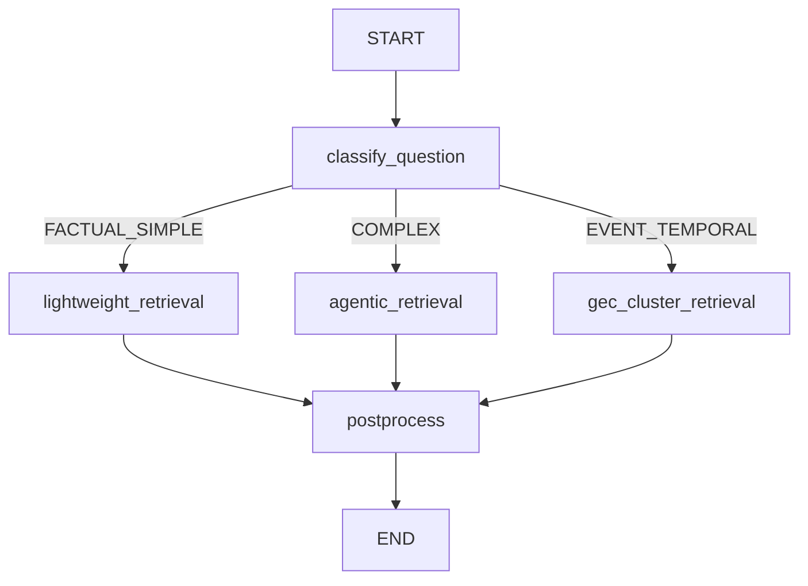

# Parallax 可配置检索 Pipeline 设计方案

## 目录

- [1. 概述](#1-概述)
  - [1.1 问题背景](#11-问题背景)
  - [1.2 设计目标](#12-设计目标)
- [2. 现有架构分析](#2-现有架构分析)
  - [2.1 现有 Pipeline 模式梳理](#21-现有-pipeline-模式梳理)
    - [2.1.1 评估 Pipeline](#211-评估-pipeline-evalcorepipelinepy)
    - [2.1.2 策略路由器](#212-策略路由器-evaladaptersparallaxstrategyrouterpy)
    - [2.1.3 Search Stage 细粒度检查点](#213-search-stage-细粒度检查点)
  - [2.2 兼容性问题识别](#22-兼容性问题识别)
  - [2.3 设计调整方案](#23-设计调整方案)
    - [调整 1：统一 Checkpoint 设计](#调整-1统一-checkpoint-设计必需)
    - [调整 2：明确 LangGraph 为核心编排引擎](#调整-2明确-langgraph-为核心编排引擎)
    - [调整 3：组件抽象作为概念指南](#调整-3组件抽象作为概念指南)
    - [调整 4：配置双轨支持](#调整-4配置双轨支持推荐)
- [3. 核心架构](#3-核心架构)
  - [3.1 基于 LangGraph 的编排架构](#31-基于-langgraph-的编排架构)
    - [核心设计原则](#核心设计原则-采用成熟的-stategraph-编排引擎)
    - [架构设计](#架构设计)
    - [状态定义](#状态定义)
    - [节点定义](#节点定义-nodes)
    - [路由函数](#路由函数-conditional-edges)
    - [构建 StateGraph](#构建-stategraph)
    - [使用示例](#使用示例)
    - [可视化调试](#可视化调试)
    - [高级特性](#高级特性)
    - [与现有架构的集成](#与现有架构的集成)
    - [优势总结](#优势总结)
  - [3.2 Pipeline 功能分类（概念层）](#32-pipeline-功能分类概念层)
    - [组件分类体系](#组件分类体系)
    - [1. Memory Building（记忆构建）](#1-memory-building记忆构建)
      - [阶段 1: MemUnit 提取](#阶段-1memunit-提取)
      - [阶段 2: 多类型 Memory 提取](#阶段-2多类型-memory-提取)
    - [2. Question Classification & Routing（问题分类与路由）](#2-question-classification--routing问题分类与路由)
    - [3. Query Preprocessing（查询预处理）](#3-query-preprocessing查询预处理)
    - [4. Retrieval（检索）](#4-retrieval检索)
    - [5. Result Expansion（结果扩展）](#5-result-expansion结果扩展)
    - [6. Retrieval Postprocessing（检索后处理）](#6-retrieval-postprocessing检索后处理)
    - [7. Prompt Adaptation（Prompt 适配）](#7-prompt-adaptationprompt-适配)
    - [8. Answer Generation（答案生成）](#8-answer-generation答案生成)
    - [9. Judgment（评判）](#9-judgment评判)
    - [横向能力（Cross-cutting Concerns）](#横向能力cross-cutting-concerns)
      - [1. Evaluation（评估）](#1-evaluation评估)
      - [2. Observability（可观测性）](#2-observability可观测性)
      - [3. 设计架构总览（纵向 + 横向）](#3-设计架构总览纵向--横向)
  - [3.3 从概念到实现：LangGraph Nodes 映射](#33-从概念到实现langgraph-nodes-映射)
    - [适配器设计模式](#适配器设计模式)
    - [使用示例](#使用示例-1)
  - [3.4 LangGraph 配置系统](#34-langgraph-配置系统)
    - [YAML 配置格式](#yaml-配置格式)
    - [配置加载器实现](#配置加载器实现)
    - [使用示例](#使用示例-2)
- [4. 配置示例](#4-配置示例)
  - [示例 1：完整的 Agentic RAG Workflow](#示例-1完整的-agentic-rag-workflow)
  - [示例 2：ColBERT 检索 Workflow](#示例-2colbert-检索-workflow)
  - [示例 3：轻量级检索（快速响应）](#示例-3轻量级检索快速响应)
  - [示例 4：混合检索 + 聚类扩展](#示例-4混合检索--聚类扩展)
- [5. 使用方式](#5-使用方式)
  - [方式 1：YAML 配置驱动（推荐）](#方式-1yaml-配置驱动推荐)
  - [方式 2：程序化构建（灵活）](#方式-2程序化构建灵活)
  - [集成到 Evaluation Pipeline](#集成到-evaluation-pipeline)
  - [流式执行示例](#流式执行示例)
  - [Checkpoint 恢复示例](#checkpoint-恢复示例)
- [5.5 架构分层与目录组织（常见问题解答）](#55-架构分层与目录组织常见问题解答)
  - [5.5.1 Node 层 vs 组件层：目录组织](#551-node-层-vs-组件层目录组织)
  - [5.5.2 Evaluation Pipeline 的配置化程度](#552-evaluation-pipeline-的配置化程度)
  - [5.5.3 添加新检索方式的步骤](#553-添加新检索方式的步骤)
  - [5.5.4 总结：架构问题快速参考](#554-总结架构问题快速参考)
  - [5.5.5 文件组织与模块分离](#555-文件组织与模块分离phase-1-2-重构完成)
- [6. 实施路线图](#6-实施路线图)
  - [Phase 1: 基础框架（1-2周）✅](#phase-1-基础框架1-2周-已完成)
  - [Phase 2: 核心检索组件（2-3周）✅](#phase-2-核心检索组件2-3周-已完成)
  - [Phase 3: 包装现有逻辑（Legacy Nodes）✅](#phase-3-包装现有逻辑legacy-nodes-已完成)
  - [Phase 4: 集成到 Search Stage ✅](#phase-4-集成到-search-stage-已完成)
  - [Phase 5: 新检索方法（ColBERT, QRHead）](#phase-5-新检索方法colbert-qrhead)
  - [Phase 6: 横向能力与优化](#phase-6-横向能力与优化)
- [7. 总结与优势](#7-总结与优势)
  - [实现的目标](#实现的目标)
  - [关键优势](#关键优势)
  - [下一步行动](#下一步行动)

---

## 1. 概述

### 1.1 问题背景

当前 Parallax 检索系统存在以下问题：

1. **策略层与实现层耦合**：`strategy/` 依赖 `eval/` 层函数，应该依赖 `src/agents/`
2. **配置分散**：`AgenticConfig`, `ExperimentConfig`, `GECConfig` 参数重复定义
3. **扩展性受限**：添加新检索方法需要修改 3-6 个文件
4. **灵活性不足**：无法通过配置文件灵活组合检索方法（如 ColBERT、QRHead）

### 1.2 设计目标

设计一个**可配置的 Agentic Retrieval Pipeline**，实现：

- ✅ **声明式配置**：通过 YAML/JSON 配置文件定义检索流程
- ✅ **模块化组件**：每个检索步骤（Retriever, Reranker, Expander）独立可插拔
- ✅ **零代码扩展**：添加新检索方法只需实现接口 + 注册，无需修改现有代码
- ✅ **向后兼容**：现有代码可以无缝迁移到新架构


[⬆️ 返回目录](#目录)

---

## 2. 现有架构分析

### 2.1 现有 Pipeline 模式梳理

Parallax 项目中已经存在多个 Pipeline 实现，在设计新的统一架构前，需要先理解现有模式：

#### 2.1.1 评估 Pipeline (`eval/core/pipeline.py`)

**职责**: 五阶段评估工作流编排（Add → Cluster → Search → Answer → Evaluate）

**优势**：
- ✅ **检查点系统**: 阶段级别和对话级别的细粒度检查点，支持断点续跑
- ✅ **异步执行**: 基于 async/await，Search Stage 使用 `asyncio.Semaphore(20)` 控制并发
- ✅ **阶段控制**: 可选择性执行特定阶段（如 `stages=["search", "answer"]`）
- ✅ **结果管理**: ResultSaver 自动保存 JSON 结果

**局限**：
- ❌ **硬编码 5 阶段**: 无法动态添加阶段
- ❌ **函数式调用**: 阶段是函数而非对象，缺乏多态性
- ❌ **配置方式**: 使用 Python 类 (`ExperimentConfig`) 而非声明式配置

#### 2.1.2 策略路由器 (`eval/adapters/parallax/strategy/router.py`)

**职责**: 基于问题分类选择检索策略

**优势**：
- ✅ **问题分类**: 完善的 `QuestionClassifier`，支持多种问题类型（事件时间、活动、属性等）
- ✅ **组件注册**: `register_strategy()` / `unregister_strategy()` 机制
- ✅ **策略覆盖**: `strategy_overrides` 配置支持
- ✅ **元数据传播**: 分类结果自动附加到 `result.metadata`

**架构**：
```python
class StrategyRouter:
    def __init__(self, classifier: QuestionClassifier):
        self._classifier = classifier
        self._strategies: Dict[StrategyType, BaseRetrievalStrategy] = {}

    async def route_and_retrieve(self, query, context):
        classification = self.classify(query)
        strategy = self._strategies[classification.strategy]
        return await strategy.retrieve(query, context)
```

**发现**: StrategyRouter 实际上已经是一个成熟的"问题分类 + 路由"组件，与提议设计中的 `BaseQuestionClassifier` 高度重合。

#### 2.1.3 Search Stage 细粒度检查点

**位置**: `eval/core/stages/search_stage.py`

**核心机制**：
- 对话级别检查点：每个 conversation 处理完成后保存
- 并发控制：`asyncio.Semaphore(20)` 限制同时处理 20 个对话
- 渐进式保存：避免全部完成才保存导致的数据丢失

这是**生产级别的检查点实现**，必须保留并集成到新设计中。


### 2.2 兼容性问题识别

对比提议设计与现有架构，发现 **4 个关键差异**：

| 维度 | 现有架构 | 提议设计 | 兼容性 |
|------|---------|---------|--------|
| **检查点** | ✅ 阶段 + 对话级别细粒度检查点 | ❌ 未提及 | **CRITICAL** - 必须集成 |
| **Pipeline 层次** | 单层（5 阶段流程） | 组件化（9 大类） | **需要双层架构** |
| **配置方式** | Python 类 + 部分 override | YAML 声明式 | **需要双轨支持** |
| **问题分类** | ✅ StrategyRouter 已实现 | BaseQuestionClassifier | **可直接复用** |


### 2.3 设计调整方案

基于兼容性分析，对原设计进行以下调整：

#### 调整 1：统一 Checkpoint 设计（必需）

**决策**：全面采用 LangGraph 的 `AsyncPostgresSaver` 作为统一 Checkpoint 方案

**理由**：
1. ✅ **已在生产使用**：代码仓已使用 `langgraph-checkpoint-postgres`
2. ✅ **自动持久化**：无需手动 save/load，减少代码量和出错风险
3. ✅ **数据库存储**：比文件系统更可靠，支持并发和事务
4. ✅ **原生集成**：与 LangGraph StateGraph 无缝集成
5. ✅ **细粒度控制**：通过 `thread_id` 支持对话级别的断点续传

**集成示例**：

```python
# eval/core/stages/search_stage.py (重构后)

from langgraph.checkpoint.postgres.aio import AsyncPostgresSaver
from src.providers.database.database_connection_provider import get_database_connection
from src.agents.graphs.retrieval_graph import compile_retrieval_graph

async def run_search_stage(dataset, config):
    # 1. 创建统一的 PostgreSQL Checkpoint
    db_connection = await get_database_connection()
    checkpointer = AsyncPostgresSaver(db_connection)

    # 2. 编译 LangGraph Retrieval Workflow (启用 checkpoint)
    retrieval_app = compile_retrieval_graph(checkpointer=checkpointer)

    # 3. 对每个问题执行检索 (自动 checkpoint)
    async with asyncio.Semaphore(20):
        for qa in dataset.qa_pairs:
            thread_id = f"{qa.conversation_id}__search"
            config_dict = {"configurable": {"thread_id": thread_id}}

            # LangGraph 自动处理 checkpoint
            result = await retrieval_app.ainvoke({
                "query": qa.question,
                "conversation_id": qa.conversation_id,
                "memory_index": memory_index,
                # ...
            }, config=config_dict)

            save_search_result(qa.question_id, result)
```

#### 调整 2：明确 LangGraph 为核心编排引擎

**决策**：采用 LangGraph StateGraph 作为 Retrieval Workflow 的唯一编排引擎

**架构层次**：

```
上层: Evaluation Pipeline (eval/core/pipeline.py)
├── Add Memory Stage
├── Cluster Stage (可选)
├── Search Stage  ← 使用 LangGraph StateGraph
│   └── LangGraph Retrieval Workflow
│       ├── classify_question (Node)
│       ├── Conditional Router
│       └── postprocess (Node)
├── Answer Stage
└── Evaluate Stage
```

#### 调整 3：功能分类作为概念指南，实现采用 LangGraph Nodes

**设计原则**：
- ✅ **概念层**：Section 3.2 定义 9 大功能分类（Memory Building, Retrieval, Reranker 等）
- ✅ **实现层**：直接用 LangGraph Nodes 实现，不引入抽象基类和适配器
- ✅ **原因**：避免过度设计，保持代码简洁

**好处**：
- 概念清晰：Section 3.2 帮助理解 Pipeline 逻辑结构
- 实现简单：Section 6-7 直接写 Node 函数，无需复杂的抽象层
- 代码维护：减少间接层次，代码更易读易维护

#### 调整 4：配置双轨支持（推荐）

同时支持 Python 类配置（向后兼容）和 YAML 配置（新功能）：

```python
# 方式 1: Python 类配置（现有方式 - 保留）
config = ExperimentConfig(
    adapter="parallax",
    retrieval_strategy="gec_cluster_rerank",
    enable_clustering=True,
)

# 方式 2: YAML 配置（新方式 - 推荐）
config = ExperimentConfig.from_yaml("config/experiments/exp001.yaml")
config.retrieval_graph_config = "config/graphs/agentic_hybrid.yaml"
```


[⬆️ 返回目录](#目录)

---

## 3. 核心架构

### 3.1 基于 LangGraph 的编排架构

#### 核心设计原则: 采用成熟的 StateGraph 编排引擎

本设计采用 **LangGraph StateGraph** 作为核心编排引擎,理由如下:

**为什么选择 LangGraph?**
1. ✅ **已在依赖中** (`langgraph>=0.2.6`) - 零额外成本
2. ✅ **成熟稳定** - Anthropic 官方支持,大量生产验证
3. ✅ **天然支持**:
   - 有向图(DAG)编排
   - 条件路由(conditional edges)
   - 并行执行(parallel nodes)
   - 状态持久化(checkpoint) - 已集成 PostgreSQL
   - 可视化调试(Mermaid 图)
4. ✅ **完美匹配需求**: 问题分类 → 路由到不同检索策略

**现有使用情况**:
- 代码仓已使用 `LangGraph` 的 `AsyncPostgresSaver` 作为 Checkpoint 持久化层
- 依赖完整: `langgraph`, `langgraph-checkpoint-postgres`, `langgraph-sdk`

---

#### 架构设计

```
LangGraph StateGraph:
┌─────────────────────────────────────────────────────────┐
│                   Retrieval Workflow                     │
├─────────────────────────────────────────────────────────┤
│                                                          │
│  START                                                   │
│    ↓                                                     │
│  ┌──────────────────────────────────────────────────┐  │
│  │ classify_question                                │  │
│  │ - QuestionClassifier.classify()                  │  │
│  │ - 输出: question_type, confidence                 │  │
│  └──────────────────────────────────────────────────┘  │
│    ↓                                                     │
│  [Conditional Router]                                   │
│    ├─ FACTUAL_SIMPLE → lightweight_retrieval           │
│    ├─ EVENT_TEMPORAL → gec_cluster_retrieval           │
│    ├─ COMPLEX_REASONING → agentic_retrieval            │
│    └─ ...                                               │
│    ↓                                                     │
│  ┌──────────────────────────────────────────────────┐  │
│  │ Strategy Nodes (并行分支)                         │  │
│  │                                                    │  │
│  │ ┌─ lightweight_retrieval                         │  │
│  │ │   - EmbeddingRetriever                         │  │
│  │ │   - DeepInfraReranker                          │  │
│  │                                                    │  │
│  │ ┌─ agentic_retrieval                             │  │
│  │ │   - HybridRetriever                            │  │
│  │ │   - SufficiencyChecker                         │  │
│  │ │   - MultiQueryExpander (条件执行)              │  │
│  │ │   - FinalReranker                              │  │
│  │                                                    │  │
│  │ ┌─ gec_cluster_retrieval                         │  │
│  │ │   - HybridRetriever                            │  │
│  │ │   - ClusterExpander                            │  │
│  │ │   - DeepInfraReranker                          │  │
│  └──────────────────────────────────────────────────┘  │
│    ↓                                                     │
│  ┌──────────────────────────────────────────────────┐  │
│  │ postprocess                                       │  │
│  │ - Deduplication                                   │  │
│  │ - Highlight                                       │  │
│  └──────────────────────────────────────────────────┘  │
│    ↓                                                     │
│  END                                                     │
│                                                          │
└─────────────────────────────────────────────────────────┘
```

---

#### 状态定义

```python
# src/orchestration/state.py

from typing import TypedDict, List, Dict, Any, Optional
from dataclasses import dataclass

@dataclass
class Document:
    """统一的文档表示"""
    id: str
    content: str
    metadata: Dict[str, Any]
    score: Optional[float] = None

class RetrievalState(TypedDict):
    """LangGraph 状态定义"""

    # 输入
    query: str
    conversation_id: str

    # 问题分类结果
    question_type: str           # "EVENT_TEMPORAL", "FACTUAL_SIMPLE", etc.
    classification_confidence: float
    classification_reasoning: str
    detected_patterns: List[str]

    # 检索结果
    documents: List[Document]

    # 元数据
    metadata: Dict[str, Any]
    retrieval_strategy: str      # 实际使用的策略

    # Pipeline Context (资源)
    memory_index: Any
    cluster_index: Optional[Any]
    vectorize_service: Optional[Any]
    rerank_service: Optional[Any]
    llm_provider: Optional[Any]
```

---

#### 节点定义 (Nodes)

```python
# src/orchestration/nodes/__init__.py

from langgraph.graph import StateGraph
from agents.question_classifier import QuestionClassifier, QuestionType

# ============ Node 1: 问题分类 ============
async def classify_question_node(state: RetrievalState) -> RetrievalState:
    """问题分类节点"""
    classifier = QuestionClassifier()
    classification = classifier.classify(state["query"])

    state["question_type"] = classification.question_type.value
    state["classification_confidence"] = classification.confidence
    state["classification_reasoning"] = classification.reasoning
    state["detected_patterns"] = classification.detected_patterns

    return state


# ============ Node 2-4: 检索策略节点 ============
async def lightweight_retrieval_node(state: RetrievalState) -> RetrievalState:
    """轻量级检索策略"""
    from src.agents.retrieval_utils import lightweight_retrieval

    results = await lightweight_retrieval(
        query=state["query"],
        memory_index=state["memory_index"],
        vectorize_service=state["vectorize_service"],
        rerank_service=state["rerank_service"],
        top_k=20
    )

    state["documents"] = results["memories"]
    state["metadata"] = results["metadata"]
    state["retrieval_strategy"] = "lightweight"

    return state


async def agentic_retrieval_node(state: RetrievalState) -> RetrievalState:
    """Agentic 检索策略"""
    from src.agents.retrieval_utils import agentic_retrieval

    results = await agentic_retrieval(
        query=state["query"],
        memory_index=state["memory_index"],
        cluster_index=state["cluster_index"],
        vectorize_service=state["vectorize_service"],
        rerank_service=state["rerank_service"],
        llm_provider=state["llm_provider"],
        top_k=20
    )

    state["documents"] = results["memories"]
    state["metadata"] = results["metadata"]
    state["retrieval_strategy"] = "agentic"

    return state


async def gec_cluster_retrieval_node(state: RetrievalState) -> RetrievalState:
    """GEC 聚类检索策略"""
    from eval.adapters.parallax.strategy.strategies import GECClusterRerankStrategy

    strategy = GECClusterRerankStrategy(config=None)
    results = await strategy.retrieve(
        query=state["query"],
        context=RetrievalContext(
            memory_index=state["memory_index"],
            cluster_index=state["cluster_index"],
            # ...
        )
    )

    state["documents"] = results.documents
    state["metadata"] = results.metadata
    state["retrieval_strategy"] = "gec_cluster_rerank"

    return state


# ============ Node 5: 后处理 ============
async def postprocess_node(state: RetrievalState) -> RetrievalState:
    """后处理节点:去重、高亮等"""
    from src.agents.retrieval_utils import deduplicate_documents, highlight_keywords

    # 去重
    state["documents"] = deduplicate_documents(state["documents"])

    # 高亮关键词
    state["documents"] = highlight_keywords(state["documents"], state["query"])

    state["metadata"]["postprocessed"] = True

    return state
```

---

#### 路由函数 (Conditional Edges)

```python
# src/agents/routers.py

from typing import Literal

def route_by_question_type(state: RetrievalState) -> Literal[
    "lightweight_retrieval",
    "agentic_retrieval",
    "gec_cluster_retrieval"
]:
    """根据问题类型路由到不同检索策略"""

    question_type = state["question_type"]

    # 简单事实查询 → 轻量级检索
    if question_type in ["FACTUAL_SIMPLE"]:
        return "lightweight_retrieval"

    # 事件时间/活动查询 → GEC 聚类检索
    elif question_type in ["EVENT_TEMPORAL", "EVENT_ACTIVITY", "EVENT_AGGREGATION"]:
        return "gec_cluster_retrieval"

    # 复杂推理/属性查询 → Agentic 检索
    else:
        return "agentic_retrieval"
```

---

#### 构建 StateGraph

```python
# src/agents/graph.py

from langgraph.graph import StateGraph, END
from .nodes import (
    classify_question_node,
    lightweight_retrieval_node,
    agentic_retrieval_node,
    gec_cluster_retrieval_node,
    postprocess_node,
)
from .routers import route_by_question_type
from .state import RetrievalState

def create_retrieval_graph() -> StateGraph:
    """创建检索 StateGraph"""

    # 1. 创建图
    workflow = StateGraph(RetrievalState)

    # 2. 添加节点
    workflow.add_node("classify_question", classify_question_node)
    workflow.add_node("lightweight_retrieval", lightweight_retrieval_node)
    workflow.add_node("agentic_retrieval", agentic_retrieval_node)
    workflow.add_node("gec_cluster_retrieval", gec_cluster_retrieval_node)
    workflow.add_node("postprocess", postprocess_node)

    # 3. 设置入口
    workflow.set_entry_point("classify_question")

    # 4. 添加条件边 (问题分类 → 路由到策略)
    workflow.add_conditional_edges(
        "classify_question",
        route_by_question_type,
        {
            "lightweight_retrieval": "lightweight_retrieval",
            "agentic_retrieval": "agentic_retrieval",
            "gec_cluster_retrieval": "gec_cluster_retrieval",
        }
    )

    # 5. 所有策略 → 后处理
    workflow.add_edge("lightweight_retrieval", "postprocess")
    workflow.add_edge("agentic_retrieval", "postprocess")
    workflow.add_edge("gec_cluster_retrieval", "postprocess")

    # 6. 后处理 → 结束
    workflow.add_edge("postprocess", END)

    return workflow


# 编译图
def compile_retrieval_graph(
    checkpointer=None,  # 可选: PostgreSQL Checkpoint
    debug: bool = False
):
    """编译 StateGraph 为可执行的应用"""
    workflow = create_retrieval_graph()

    return workflow.compile(
        checkpointer=checkpointer,
        debug=debug
    )
```

---

#### 使用示例

##### 方式 1: 基础使用

```python
# demo/retrieval_with_langgraph.py

import asyncio
from src.agents.graphs.retrieval_graph import compile_retrieval_graph
from src.agents.state import RetrievalState

async def main():
    # 1. 编译图
    app = compile_retrieval_graph()

    # 2. 准备输入状态
    initial_state: RetrievalState = {
        "query": "用户上周吃了什么？",
        "conversation_id": "conv_123",
        "memory_index": memory_index,
        "cluster_index": cluster_index,
        "vectorize_service": vectorize_service,
        "rerank_service": rerank_service,
        "llm_provider": llm_provider,
    }

    # 3. 执行图
    result = await app.ainvoke(initial_state)

    # 4. 查看结果
    print(f"问题类型: {result['question_type']}")
    print(f"使用策略: {result['retrieval_strategy']}")
    print(f"检索到 {len(result['documents'])} 条记忆")

    for i, doc in enumerate(result['documents'][:5], 1):
        print(f"\n[{i}] {doc.content[:100]}...")

if __name__ == "__main__":
    asyncio.run(main())
```

##### 方式 2: 启用 Checkpoint (断点续传)

```python
from langgraph.checkpoint.postgres.aio import AsyncPostgresSaver
from src.providers.database.database_connection_provider import get_database_connection

async def main_with_checkpoint():
    # 1. 创建 PostgreSQL Checkpoint
    db_connection = await get_database_connection()
    checkpointer = AsyncPostgresSaver(db_connection)

    # 2. 编译图 (启用 checkpoint)
    app = compile_retrieval_graph(checkpointer=checkpointer)

    # 3. 执行 (带 thread_id 支持恢复)
    config = {"configurable": {"thread_id": "user_123_session_456"}}
    result = await app.ainvoke(initial_state, config=config)

    # 如果中途失败,下次使用相同 thread_id 会自动恢复
```

##### 方式 3: 流式执行 (Streaming)

```python
async def main_with_streaming():
    app = compile_retrieval_graph()

    # 流式执行,实时输出每个节点的结果
    async for event in app.astream(initial_state):
        node_name = list(event.keys())[0]
        node_output = event[node_name]

        print(f"\n[Node: {node_name}]")
        if "question_type" in node_output:
            print(f"  分类结果: {node_output['question_type']}")
        if "documents" in node_output:
            print(f"  检索到 {len(node_output['documents'])} 条记忆")
```

---

#### 可视化调试

LangGraph 支持生成 Mermaid 图,可视化整个工作流:

```python
from IPython.display import Image, display

# 生成流程图
app = compile_retrieval_graph()
display(Image(app.get_graph().draw_mermaid_png()))
```

**生成的 Mermaid 图示例**:



---

#### 高级特性

##### 1. 并行检索节点

```python
# 并行执行多个检索器,然后融合结果

workflow.add_node("embedding_retrieval", embedding_retrieval_node)
workflow.add_node("bm25_retrieval", bm25_retrieval_node)
workflow.add_node("colbert_retrieval", colbert_retrieval_node)
workflow.add_node("fusion", rrf_fusion_node)

# 从分类节点并行到三个检索器
workflow.add_edge("classify_question", "embedding_retrieval")
workflow.add_edge("classify_question", "bm25_retrieval")
workflow.add_edge("classify_question", "colbert_retrieval")

# 所有检索器完成后 → 融合
workflow.add_edge("embedding_retrieval", "fusion")
workflow.add_edge("bm25_retrieval", "fusion")
workflow.add_edge("colbert_retrieval", "fusion")
```

##### 2. 条件执行 (Agentic Round 2)

```python
# 在 agentic_retrieval_node 内部检查充分性

async def agentic_retrieval_node(state):
    # Round 1
    docs = await hybrid_retrieval(state["query"])

    # 检查充分性
    is_sufficient = await check_sufficiency(docs, state["llm_provider"])

    if not is_sufficient:
        # Round 2: Multi-query expansion
        expanded_docs = await multi_query_expand(state["query"], docs)
        state["documents"] = expanded_docs
        state["metadata"]["is_multi_round"] = True
    else:
        state["documents"] = docs
        state["metadata"]["is_multi_round"] = False

    return state
```

##### 3. 动态路由 (Override)

```python
# 支持用户手动指定策略,覆盖自动分类

def route_with_override(state):
    # 检查是否有用户指定的策略
    if "force_strategy" in state.get("metadata", {}):
        return state["metadata"]["force_strategy"]

    # 否则按问题分类路由
    return route_by_question_type(state)
```

---

#### 与现有架构的集成

```
现有评估流程 (eval/core/pipeline.py)
├── Add Memory Stage
├── Cluster Stage
├── Search Stage  ← 使用 LangGraph StateGraph
│   └── LangGraph Retrieval Workflow
│       ├── classify_question (Node)
│       ├── Conditional Router
│       │   ├── lightweight_retrieval (Node)
│       │   ├── agentic_retrieval (Node)
│       │   └── gec_cluster_retrieval (Node)
│       └── postprocess (Node)
├── Answer Stage
└── Evaluate Stage
```

**集成方式**:

```python
# eval/core/stages/search_stage.py (重构后)

from src.agents.graphs.retrieval_graph import compile_retrieval_graph

async def run_search_stage(dataset, config):
    # 编译 LangGraph
    retrieval_app = compile_retrieval_graph(
        checkpointer=get_postgres_checkpointer()
    )

    # 对每个问题执行检索
    for qa in dataset.qa_pairs:
        result = await retrieval_app.ainvoke({
            "query": qa.question,
            "conversation_id": qa.conversation_id,
            "memory_index": memory_index,
            # ...
        })

        # 保存结果
        save_search_result(qa.question_id, result)
```

---

#### 优势总结

**相比自研 Pipeline + Component 方案**:

| 特性 | LangGraph | 自研方案 |
|------|-----------|---------|
| **学习曲线** | 中等 | 低 |
| **灵活性** | 高 (任意 DAG) | 高 (双向嵌套) |
| **可视化** | ✅ 内置 Mermaid | ❌ 需自己实现 |
| **持久化** | ✅ 原生支持 | 需集成 |
| **生态** | 大 (LangChain) | 无 |
| **调试** | ✅ LangSmith | 需自己实现 |
| **依赖** | 已有 | 需从零实现 |
| **社区支持** | 活跃 | 无 |
| **文档** | 完善 | 需自己写 |

**关键优势**:
1. ✅ **零新增依赖** - 已在 `pyproject.toml` 中
2. ✅ **生产验证** - Anthropic 官方支持,大量案例
3. ✅ **开箱即用** - PostgreSQL Checkpoint 已集成
4. ✅ **可视化调试** - 自动生成流程图
5. ✅ **流式支持** - 实时输出中间结果
6. ✅ **易于测试** - 每个节点独立测试


---

### 3.2 Pipeline 功能分类（概念层）

> **设计说明**：本节定义 Agentic Retrieval Pipeline 的**逻辑功能分类**（概念层），帮助理解整个流程的各个环节。
>
> **实现方式**：这些功能在实际实现中**直接映射为 LangGraph Nodes**（见 Section 6-7），而非抽象基类。
> - ✅ **概念清晰**：Section 3.2 定义功能分类（帮助理解）
> - ✅ **实现简洁**：Section 6-7 直接用 Node 函数实现（无需适配器）

本节将 Pipeline 分为 9 大功能类别，覆盖从记忆构建到答案评判的完整生命周期。

#### 组件分类体系

```
RAG Component Abstractions（概念层）
├── 1. Memory Building (记忆构建) - 两阶段提取
│   ├── 阶段 1: MemUnit 提取
│   │   ├── BaseMemUnitExtractor - MemUnit 提取器基类
│   │   │   ├── ConversationMemUnitExtractor (对话提取)
│   │   │   ├── DocumentMemUnitExtractor (文档提取)
│   │   │   └── MultiModalMemUnitExtractor (多模态提取)
│   │
│   └── 阶段 2: 多类型 Memory 提取（从 MemUnit）
│       ├── BaseMemoryExtractor - Memory 提取器基类
│       │   ├── EpisodeMemoryExtractor (情景记忆)
│       │   ├── SemanticMemoryExtractor (语义记忆)
│       │   ├── EventLogExtractor (事件日志)
│       │   ├── ProfileMemoryExtractor (用户画像)
│       │   └── GroupProfileMemoryExtractor (群体画像)
│
├── 2. Question Classification & Routing (问题分类与路由)
│   ├── BaseQuestionClassifier - 问题分类器基类
│   │   ├── ComplexityClassifier (复杂度分类)
│   │   ├── DomainClassifier (领域分类)
│   │   ├── IntentClassifier (意图分类)
│   │   └── StrategyRouter (策略路由器)
│
├── 3. Query Preprocessing (查询预处理)
│   ├── BaseQueryPreprocessor - 查询预处理基类
│   │   ├── QueryRewriter (查询改写)
│   │   ├── QueryDecomposer (查询分解)
│   │   └── QueryExpander (查询扩展)
│
├── 4. Retrieval (检索)
│   ├── BaseRetriever - 检索器基类
│   │   ├── EmbeddingRetriever
│   │   ├── BM25Retriever
│   │   ├── HybridRetriever
│   │   ├── ColBERTRetriever
│   │   └── QRHeadRetriever
│
├── 5. Result Expansion (结果扩展)
│   ├── BaseExpander - 扩展器基类
│   │   ├── ClusterExpander
│   │   ├── MultiQueryExpander
│   │   └── GraphExpander
│
├── 6. Retrieval Postprocessing (检索后处理)
│   ├── BaseReranker (重排序)
│   ├── BaseCompressor (压缩)
│   ├── BaseDeduplicator (去重)
│   └── BaseHighlighter (高亮)
│
├── 7. Prompt Adaptation (Prompt 适配)
│   ├── BasePromptAdapter - Prompt 适配器基类
│   │   ├── TemplateSelector (模板选择器)
│   │   ├── ContextInjector (上下文注入器)
│   │   └── PromptComposer (Prompt 组合器)
│
├── 8. Answer Generation (答案生成)
│   └── BaseGenerator - 生成器基类
│       ├── DirectGenerator
│       ├── IterativeGenerator
│       └── ChainOfThoughtGenerator
│
└── 9. Judgment (评判)
    └── BaseJudge - 评判器基类
        ├── RetrievalJudge (检索质量评判)
        └── AnswerJudge (答案质量评判)
```

---

#### 1. Memory Building（记忆构建）

将原始对话转换为可存储和检索的多层次记忆。记忆构建采用**两阶段提取**：

```
对话输入 → [阶段 1: MemUnit 提取] → MemUnit → [阶段 2: 多类型 Memory 提取] → 多种 Memory 类型
```

##### 阶段 1：MemUnit 提取

从对话边界检测结果中提取原始记忆单元（MemUnit）。

**BaseMemUnitExtractor**

```python
class BaseMemUnitExtractor(Node):
    """MemUnit 提取器基类 - 对话边界检测后的第一层提取"""

    @abstractmethod
    async def extract_memunit(self, conversation: Conversation) -> Optional[MemUnit]:
        """
        从对话中提取 MemUnit（原始记忆单元）

        Args:
            conversation: 对话边界检测的输出

        Returns:
            MemUnit: 包含对话内容、参与者、时间等原始信息
        """
        pass
```

**实现类型**：
- `ConversationMemUnitExtractor`：从对话中提取 MemUnit
- `DocumentMemUnitExtractor`：从文档中提取 MemUnit
- `MultiModalMemUnitExtractor`：从多模态输入（文本+图像）中提取 MemUnit

---

##### 阶段 2：多类型 Memory 提取

在 MemUnit 基础上提取不同类型的结构化记忆。

**BaseMemoryExtractor**

```python
class BaseMemoryExtractor(Node):
    """Memory 提取器基类 - 从 MemUnit 提取特定类型的记忆"""

    def __init__(self, memory_type: MemoryType):
        self.memory_type = memory_type

    @abstractmethod
    async def extract_memory(self, memunit: MemUnit, user_id: str) -> Optional[Memory]:
        """
        从 MemUnit 提取特定类型的 Memory

        Args:
            memunit: MemUnit 原始记忆单元
            user_id: 用户 ID（用于用户视角的记忆）

        Returns:
            Memory: 特定类型的结构化记忆
        """
        pass
```

**Memory 类型层次结构**（基于 `src/memory/schema/memory_type.py`）：

```
MemUnit (原始记忆单元)
    │
    ├── EpisodeMemory (情景记忆)
    │     从用户视角描述的个人叙事性记忆
    │     用途: 记录用户的主观体验和经历
    │     示例: "今天我和小明讨论了项目进度，他提到下周要上线..."
    │
    ├── SemanticMemory (语义记忆)
    │     从对话中提取的客观事实性知识
    │     用途: 存储可验证的事实信息
    │     示例: "用户熟悉 Python 编程"
    │
    ├── EventLog (事件日志)
    │     带时间戳的原子事实记录
    │     用途: 精确的时间线回溯
    │     示例: "2024-03-14 14:30 - 用户提到明天有会议"
    │
    ├── ProfileMemory (用户画像)
    │     用户的技能、性格、偏好等特征
    │     用途: 构建用户个人档案
    │     示例: {"hard_skills": [{"value": "Python", "level": "expert"}]}
    │
    └── GroupProfileMemory (群体画像)
          群体的话题、角色、互动模式
          用途: 分析群体动态和关系
          示例: {"roles": {"DECISION_MAKER": ["user_123"]}}
```

**实现类型**：
- `EpisodeMemoryExtractor`：提取情景记忆（个人叙事视角）
- `SemanticMemoryExtractor`：提取语义记忆（客观事实）
- `EventLogExtractor`：提取事件日志（时间戳 + 原子事实）
- `ProfileMemoryExtractor`：提取用户画像（技能、性格、偏好）
- `GroupProfileMemoryExtractor`：提取群体画像（角色、话题、互动模式）

---

##### 完整流程示例

```python
# 阶段 1: 提取 MemUnit
memunit_extractor = ConversationMemUnitExtractor()
memunit = await memunit_extractor.extract_memunit(conversation)

# 阶段 2: 并行提取多种 Memory 类型
episode_extractor = EpisodeMemoryExtractor(MemoryType.EPISODE_SUMMARY)
semantic_extractor = SemanticMemoryExtractor(MemoryType.SEMANTIC_SUMMARY)
event_extractor = EventLogExtractor(MemoryType.EVENT_LOG)
profile_extractor = ProfileMemoryExtractor(MemoryType.PROFILE)

# 并行提取
memories = await asyncio.gather(
    episode_extractor.extract_memory(memunit, user_id),
    semantic_extractor.extract_memory(memunit, user_id),
    event_extractor.extract_memory(memunit, user_id),
    profile_extractor.extract_memory(memunit, user_id),
)

# 存储到不同的索引
for memory in memories:
    if memory:
        await memory_index.add(memory)
```

---

#### 2. Question Classification & Routing（问题分类与路由）

对问题进行分类并路由到合适的处理策略。这是 Workflow 的**决策中枢**。

##### BaseQuestionClassifier

```python
class BaseQuestionClassifier(Node):
    """问题分类器基类"""

    @abstractmethod
    async def classify(self, question: str, context: 'ExecutionContext') -> QuestionType:
        """分类问题，返回问题类型"""
        pass

    @abstractmethod
    async def route(self, question_type: QuestionType, context: 'ExecutionContext') -> str:
        """根据问题类型路由到 Workflow 配置"""
        pass
```

**子类型**：

- **ComplexityClassifier（复杂度分类器）**：判断问题复杂度
  - `SimpleQuestionClassifier`：简单事实查询 → 使用 Lightweight Workflow
  - `ComplexQuestionClassifier`：复杂推理问题 → 使用 Agentic Workflow
  - `MultiHopClassifier`：多跳问题 → 使用 Multi-Query Expansion

- **DomainClassifier（领域分类器）**：判断问题所属领域
  - `TechnicalDomainClassifier`：技术问题 → 使用专业术语 Prompt
  - `GeneralDomainClassifier`：通用问题 → 使用通用 Prompt
  - `MultiDomainClassifier`：跨领域问题 → 使用多领域检索

- **IntentClassifier（意图分类器）**：判断用户意图
  - `FactualIntentClassifier`：事实查询 → 直接检索
  - `AnalyticalIntentClassifier`：分析类问题 → 需要推理
  - `ComparativeIntentClassifier`：比较类问题 → 需要多文档对比

- **StrategyRouter（策略路由器）**：根据分类结果选择 Workflow 策略
  - `RuleBasedRouter`：基于规则的路由
  - `LLMBasedRouter`：基于 LLM 的智能路由
  - `HybridRouter`：规则 + LLM 混合路由

**使用示例**：

```python
class LLMComplexityClassifier(ComplexityClassifier):
    async def classify(self, question: str, context: 'ExecutionContext') -> QuestionType:
        prompt = f"Classify the complexity of this question: {question}\nOptions: simple, medium, complex"
        response = await context.llm_provider.generate(prompt)
        return self._parse_complexity(response)

    async def route(self, question_type: QuestionType, context: 'ExecutionContext') -> str:
        if question_type.complexity == "simple":
            return "config/graphs/lightweight.yaml"
        elif question_type.complexity == "medium":
            return "config/graphs/hybrid_retrieval.yaml"
        else:
            return "config/graphs/full_agentic_rag.yaml"
```

---

#### 3. Query Preprocessing（查询预处理）

在检索前对查询进行优化和转换。

##### BaseQueryPreprocessor

```python
class BaseQueryPreprocessor(Node):
    """查询预处理基类"""

    @abstractmethod
    async def preprocess(self, query: str, context: 'ExecutionContext') -> Union[str, List[str]]:
        """预处理查询，返回单个查询或多个查询"""
        pass
```

**子类型**：

- **QueryRewriter（查询改写器）**：改写查询以提升检索效果
  - `LLMQueryRewriter`：使用 LLM 改写查询
  - `ExpansionQueryRewriter`：添加同义词扩展
  - `ClarificationQueryRewriter`：澄清模糊查询

- **QueryDecomposer（查询分解器）**：将复杂查询分解为子问题
  - `SubQuestionDecomposer`：分解为子问题序列
  - `AspectDecomposer`：分解为多个方面
  - `TemporalDecomposer`：分解为时间段

- **QueryExpander（查询扩展器）**：扩展查询覆盖范围
  - `PRFExpander`：伪相关反馈扩展
  - `KnowledgeExpander`：基于知识库扩展
  - `SynonymExpander`：同义词扩展

---

#### 3. Retrieval（检索）

从索引中检索候选文档。

##### BaseRetriever

```python
class BaseRetriever(Node):
    """检索器基类"""

    @abstractmethod
    async def search(self, query: str, top_k: int, context: 'ExecutionContext') -> List[Document]:
        """执行检索，返回 top_k 文档"""
        pass
```

**具体实现**：
- `EmbeddingRetriever`：基于向量 Embedding 的检索
- `BM25Retriever`：基于 BM25 的关键词检索
- `HybridRetriever`：混合检索（Embedding + BM25 + RRF）
- `ColBERTRetriever`：ColBERT Late Interaction 检索
- `QRHeadRetriever`：QRHead 注意力分数检索

---

#### 4. Result Expansion（结果扩展）

扩展检索结果以提升覆盖度。

##### BaseExpander

```python
class BaseExpander(Node):
    """结果扩展器基类"""

    @abstractmethod
    async def expand(self, query: str, documents: List[Document], context: 'ExecutionContext') -> List[Document]:
        """扩展检索结果"""
        pass
```

**具体实现**：
- `ClusterExpander`：基于聚类的邻域扩展
- `MultiQueryExpander`：生成多个查询并行检索，融合结果
- `GraphExpander`：基于知识图谱扩展相关文档
- `TemporalExpander`：基于时间关系扩展

---

#### 5. Retrieval Postprocessing（检索后处理）

对检索结果进行精炼和优化。

##### BaseReranker（重排序器）

```python
class BaseReranker(Node):
    """重排序器基类"""

    @abstractmethod
    async def rerank(self, query: str, documents: List[Document], top_k: int, context: 'ExecutionContext') -> List[Document]:
        """重排序文档"""
        pass
```

**具体实现**：
- `DeepInfraReranker`：使用 DeepInfra Rerank API
- `ColBERTReranker`：使用 ColBERT 模型精细打分
- `CrossEncoderReranker`：使用 Cross-Encoder 模型

##### BaseCompressor（压缩器）

```python
class BaseCompressor(Node):
    """压缩器基类"""

    @abstractmethod
    async def compress(self, query: str, documents: List[Document], context: 'ExecutionContext') -> List[Document]:
        """压缩文档，移除无关内容"""
        pass
```

**具体实现**：
- `LLMCompressor`：使用 LLM 压缩无关内容
- `ExtractiveSummaryCompressor`：抽取式摘要压缩
- `SentenceFilterCompressor`：句子级别过滤

##### BaseDeduplicator（去重器）

```python
class BaseDeduplicator(Node):
    """去重器基类"""

    @abstractmethod
    async def deduplicate(self, documents: List[Document], context: 'ExecutionContext') -> List[Document]:
        """去除重复文档"""
        pass
```

**具体实现**：
- `SemanticDeduplicator`：语义去重
- `ExactDeduplicator`：精确去重
- `FuzzyDeduplicator`：模糊去重

##### BaseHighlighter（高亮器）

```python
class BaseHighlighter(Node):
    """高亮器基类"""

    @abstractmethod
    async def highlight(self, query: str, documents: List[Document], context: 'ExecutionContext') -> List[Document]:
        """高亮相关片段"""
        pass
```

**具体实现**：
- `KeywordHighlighter`：关键词高亮
- `RelevanceHighlighter`：相关片段高亮
- `EntityHighlighter`：实体高亮

---

#### 7. Prompt Adaptation（Prompt 适配）

**Prompt 元编程核心**：根据问题类型、领域、检索结果动态选择和组合 Prompt 模板。

##### BasePromptAdapter

```python
class BasePromptAdapter(Node):
    """Prompt 适配器基类"""

    @abstractmethod
    async def adapt(
        self,
        query: str,
        documents: List[Document],
        question_type: QuestionType,
        context: 'ExecutionContext'
    ) -> str:
        """根据上下文适配 Prompt"""
        pass
```

**子类型**：

- **TemplateSelector（模板选择器）**：根据问题类型选择 Prompt 模板
  - `QuestionTypeTemplateSelector`：
    - 事实查询 → 使用 "Based on the following documents, answer: {question}"
    - 分析类问题 → 使用 "Analyze the following information and provide insights: {question}"
    - 比较类问题 → 使用 "Compare the following aspects: {question}"
  - `DomainTemplateSelector`：
    - 技术领域 → 使用技术术语模板
    - 通用领域 → 使用通俗语言模板
  - `ComplexityTemplateSelector`：
    - 简单问题 → 使用简洁模板
    - 复杂问题 → 使用详细推理模板（Chain-of-Thought）

- **ContextInjector（上下文注入器）**：将检索结果注入 Prompt
  - `DocumentContextInjector`：格式化文档并注入
  - `MetadataContextInjector`：注入文档元数据（来源、时间等）
  - `RelevanceScoreInjector`：注入相关性分数
  - `HighlightContextInjector`：注入高亮片段

- **PromptComposer（Prompt 组合器）**：组合多个 Prompt 片段
  - `SequentialComposer`：按顺序组合（System Prompt + Context + Question）
  - `ConditionalComposer`：根据条件组合不同片段
  - `TemplateInterpolator`：模板变量插值

**使用示例**：

```python
class AdaptivePromptAdapter(BasePromptAdapter):
    def __init__(self):
        self.template_selector = QuestionTypeTemplateSelector()
        self.context_injector = DocumentContextInjector()
        self.composer = SequentialComposer()

    async def adapt(self, query, documents, question_type, context):
        # 1. 选择模板
        base_template = await self.template_selector.select(question_type)

        # 2. 注入文档上下文
        doc_context = await self.context_injector.inject(documents, max_tokens=2000)

        # 3. 组合 Prompt
        final_prompt = await self.composer.compose([
            "You are a helpful AI assistant.",
            doc_context,
            base_template.format(question=query)
        ])

        return final_prompt
```

**Prompt 模板仓库示例**：

```python
# src/agents/prompts/templates.py

PROMPT_TEMPLATES = {
    "factual_simple": """Based on the following documents, provide a concise answer to the question.

Documents:
{documents}

Question: {question}

Answer:""",

    "analytical_complex": """Analyze the following information carefully and provide detailed insights.

Context:
{documents}

Question: {question}

Please think step by step:
1. Identify key information
2. Analyze relationships
3. Draw conclusions

Analysis:""",

    "comparative": """Compare the following aspects based on the provided documents.

Documents:
{documents}

Question: {question}

Comparison Table:
| Aspect | Option A | Option B |
|--------|----------|----------|

Conclusion:""",
}
```

---

#### 8. Answer Generation（答案生成）

基于检索结果生成答案。

##### BaseGenerator

```python
class BaseGenerator(Node):
    """生成器基类"""

    @abstractmethod
    async def generate(self, query: str, documents: List[Document], context: 'ExecutionContext') -> str:
        """生成答案"""
        pass
```

**具体实现**：
- `DirectGenerator`：直接生成答案
- `IterativeGenerator`：迭代式生成（多轮检索-生成）
- `ChainOfThoughtGenerator`：思维链生成
- `StructuredGenerator`：结构化答案生成


#### 9. Judgment（评判）

评判检索和生成质量。

##### BaseJudge

```python
class BaseJudge(Node):
    """评判器基类"""

    @abstractmethod
    async def judge(self, query: str, context: 'ExecutionContext') -> Dict[str, Any]:
        """评判质量，返回评判结果"""
        pass
```

**子类型**：

- **RetrievalJudge（检索质量评判）**：
  - `SufficiencyJudge`：判断检索结果是否充分
  - `RelevanceJudge`：判断检索结果相关性
  - `CoverageJudge`：判断是否覆盖查询的所有方面
  - `DiversityJudge`：判断结果多样性

- **AnswerJudge（答案质量评判）**：
  - `FactualityJudge`：判断答案事实性
  - `CompletenessJudge`：判断答案完整性
  - `GroundingJudge`：判断答案是否有检索结果支撑
  - `HallucinationJudge`：检测幻觉

---

#### 横向能力（Cross-cutting Concerns）

除了上述 9 个纵向流程组件，以下横向能力贯穿整个 RAG Pipeline：

##### 1. Evaluation（评估）

**在每个阶段都可插入的评估能力**

```python
class StageEvaluator(ABC):
    """阶段评估器基类 - 可附加到任何 Pipeline 阶段"""

    @abstractmethod
    async def evaluate(
        self,
        stage_name: str,
        input_data: Any,
        output_data: Any,
        context: 'ExecutionContext'
    ) -> Dict[str, float]:
        """
        评估当前阶段的输出质量

        Returns:
            Dict[str, float]: 评估指标 -> 分数的映射
        """
        pass
```

**按阶段的评估实现**：

- **Memory Building 评估**：
  - `MemoryCompletenessEvaluator`：记忆完整性
  - `MemoryAccuracyEvaluator`：记忆准确性

- **Retrieval 评估**：
  - `RetrievalPrecisionEvaluator`：精确率（检索到的相关文档比例）
  - `RetrievalRecallEvaluator`：召回率（相关文档被检索到的比例）
  - `RetrievalF1Evaluator`：F1 分数
  - `RetrievalMRREvaluator`：MRR (Mean Reciprocal Rank)
  - `RetrievalNDCGEvaluator`：NDCG (Normalized Discounted Cumulative Gain)

- **Reranker 评估**：
  - `RankingQualityEvaluator`：排序质量（排序后的指标提升）
  - `RankingEfficiencyEvaluator`：排序效率

- **Compression 评估**：
  - `CompressionRatioEvaluator`：压缩率
  - `InformationRetentionEvaluator`：信息保留率（压缩后保留的关键信息比例）

- **Answer Generation 评估**：
  - `AnswerBLEUEvaluator`：BLEU 分数（与参考答案的相似度）
  - `AnswerROUGEEvaluator`：ROUGE 分数
  - `AnswerBERTScoreEvaluator`：BERTScore（语义相似度）
  - `AnswerFactualityEvaluator`：事实准确性
  - `AnswerGroundingEvaluator`：是否基于检索结果（而非幻觉）

**使用示例**：

```python
# 在 LangGraph Node 中嵌入评估
async def retrieval_with_eval_node(state: RetrievalState) -> RetrievalState:
    # 1. 执行检索
    retriever = HybridRetriever(...)
    documents = await retriever.search(state["query"], top_k=20, context)

    # 2. 评估检索质量（如果有 ground truth）
    if state.get("ground_truth_docs"):
        evaluators = [
            RetrievalPrecisionEvaluator(),
            RetrievalRecallEvaluator(),
            RetrievalF1Evaluator(),
        ]

        eval_results = {}
        for evaluator in evaluators:
            metrics = await evaluator.evaluate(
                stage_name="retrieval",
                input_data=state["query"],
                output_data=documents,
                context=context
            )
            eval_results.update(metrics)

        state["metadata"]["retrieval_eval"] = eval_results
        # 例如: {"precision": 0.85, "recall": 0.72, "f1": 0.78}

    # 3. 返回结果
    state["documents"] = documents
    return state
```

---

##### 2. Observability（可观测性）

**端到端的追踪、审计、验证能力**

```python
class ObservabilityMiddleware(ABC):
    """可观测性中间件 - 包装每个 Pipeline 阶段"""

    @abstractmethod
    async def before_stage(
        self,
        stage_name: str,
        input_data: Any,
        context: 'ExecutionContext'
    ) -> None:
        """阶段执行前的钩子"""
        pass

    @abstractmethod
    async def after_stage(
        self,
        stage_name: str,
        input_data: Any,
        output_data: Any,
        duration_ms: float,
        context: 'ExecutionContext'
    ) -> None:
        """阶段执行后的钩子"""
        pass

    @abstractmethod
    async def on_error(
        self,
        stage_name: str,
        error: Exception,
        context: 'ExecutionContext'
    ) -> None:
        """阶段出错时的钩子"""
        pass
```

**具体实现**：

- **AuditLogger（审计日志）**：
  ```python
  class AuditLogger(ObservabilityMiddleware):
      """记录每个阶段的输入/输出、执行时间、用户权限"""

      async def after_stage(self, stage_name, input_data, output_data, duration_ms, context):
          await self.db.insert_audit_log({
              "timestamp": datetime.now(),
              "user_id": context.user_id,
              "stage_name": stage_name,
              "input_hash": hash_data(input_data),
              "output_hash": hash_data(output_data),
              "duration_ms": duration_ms,
              "permissions": context.permissions,
          })
  ```

- **PermissionValidator（权限验证）**：
  ```python
  class PermissionValidator(ObservabilityMiddleware):
      """在每个阶段验证用户权限"""

      async def before_stage(self, stage_name, input_data, context):
          required_permission = self.stage_permissions.get(stage_name)
          if required_permission and required_permission not in context.permissions:
              raise PermissionDeniedError(
                  f"User {context.user_id} lacks permission: {required_permission}"
              )
  ```

- **DataValidator（数据验证）**：
  ```python
  class DataValidator(ObservabilityMiddleware):
      """验证每个阶段的输出是否符合 Schema"""

      async def after_stage(self, stage_name, input_data, output_data, duration_ms, context):
          schema = self.stage_schemas.get(stage_name)
          if schema:
              try:
                  schema.validate(output_data)
              except ValidationError as e:
                  logger.error(f"Stage {stage_name} output validation failed: {e}")
                  await self.on_error(stage_name, e, context)
  ```

- **PerformanceTracer（性能追踪）**：
  ```python
  class PerformanceTracer(ObservabilityMiddleware):
      """追踪每个阶段的性能（延迟、吞吐量）"""

      async def after_stage(self, stage_name, input_data, output_data, duration_ms, context):
          # 记录到 Prometheus/Grafana
          metrics.histogram(f"{stage_name}_duration_ms", duration_ms)
          metrics.counter(f"{stage_name}_invocations").inc()

          # 如果超过阈值，告警
          if duration_ms > self.slo_thresholds.get(stage_name, float('inf')):
              await alert(f"Stage {stage_name} exceeded SLO: {duration_ms}ms")
  ```

- **ProvenanceTracker（溯源追踪）**：
  ```python
  class ProvenanceTracker(ObservabilityMiddleware):
      """追踪数据血缘：哪些源文档 → 哪些记忆 → 哪些检索结果 → 最终答案"""

      async def after_stage(self, stage_name, input_data, output_data, duration_ms, context):
          # 构建溯源链
          if stage_name == "memory_extraction":
              context.provenance["memory_sources"] = [
                  mem.source_id for mem in output_data
              ]
          elif stage_name == "retrieval":
              context.provenance["retrieved_memory_ids"] = [
                  doc.id for doc in output_data
              ]
          elif stage_name == "answer_generation":
              context.provenance["final_answer"] = output_data
              # 完整的溯源链：源文档 ID → 记忆 ID → 答案
              await self.save_provenance_chain(context.provenance)
  ```

**在 LangGraph 中集成可观测性**：

```python
# 在每个 Node 外包装可观测性中间件
def wrap_with_observability(node_func: NodeFunction, stage_name: str) -> NodeFunction:
    async def wrapped_node(state: RetrievalState) -> RetrievalState:
        middlewares = [
            AuditLogger(),
            PermissionValidator(),
            DataValidator(),
            PerformanceTracer(),
        ]

        # Before hooks
        for middleware in middlewares:
            await middleware.before_stage(stage_name, state, context)

        # 执行 Node
        start_time = time.time()
        try:
            output_state = await node_func(state)
            duration_ms = (time.time() - start_time) * 1000

            # After hooks
            for middleware in middlewares:
                await middleware.after_stage(
                    stage_name, state, output_state, duration_ms, context
                )

            return output_state

        except Exception as e:
            # Error hooks
            for middleware in middlewares:
                await middleware.on_error(stage_name, e, context)
            raise

    return wrapped_node

# 应用到所有 Nodes
workflow.add_node("retrieval", wrap_with_observability(retrieval_node, "retrieval"))
workflow.add_node("rerank", wrap_with_observability(rerank_node, "rerank"))
```

---

##### 3. 设计架构总览（纵向 + 横向）

```
┌─────────────────────────────────────────────────────────────────────┐
│                      横向能力 (Cross-cutting)                          │
│  ┌──────────────┐  ┌──────────────┐  ┌──────────────┐               │
│  │  Evaluation  │  │Observability │  │ Permissions  │               │
│  │ (评估每阶段)  │  │ (审计/追踪)   │  │  (权限验证)   │               │
│  └──────────────┘  └──────────────┘  └──────────────┘               │
└─────────────────────────────────────────────────────────────────────┘
              ↓ 应用到每个纵向阶段 ↓
┌─────────────────────────────────────────────────────────────────────┐
│                         纵向流程 (Pipeline)                           │
│  1. Memory Building                                                  │
│     ├── MemUnit 提取                                                  │
│     └── Memory 类型提取 (Episode, Semantic, Profile...)              │
│                                                                       │
│  2. Question Classification & Routing                                │
│                                                                       │
│  3. Query Preprocessing                                              │
│                                                                       │
│  4. Retrieval                                                        │
│     ├── Embedding Retriever                                          │
│     ├── BM25 Retriever                                               │
│     └── Hybrid Retriever (RRF Fusion)                                │
│                                                                       │
│  5. Result Expansion                                                 │
│     ├── Cluster Expansion                                            │
│     └── Multi-Query Expansion                                        │
│                                                                       │
│  6. Retrieval Postprocessing                                         │
│     ├── Reranking                                                    │
│     ├── Compression                                                  │
│     └── Deduplication                                                │
│                                                                       │
│  7. Prompt Adaptation                                                │
│                                                                       │
│  8. Answer Generation                                                │
│                                                                       │
│  9. Judgment                                                         │
└─────────────────────────────────────────────────────────────────────┘
```


---


### 3.3 从概念到实现：LangGraph Nodes 映射

Section 3.2 定义的功能分类在实现时**直接映射为 LangGraph Nodes**，而非通过抽象类和适配器。

#### 实现方式对比

**传统方式（不采用）**：
```python
# 1. 定义抽象类
class BaseRetriever(ABC):
    @abstractmethod
    async def search(self, query, top_k, context):
        pass

# 2. 实现具体类
class HybridRetriever(BaseRetriever):
    async def search(self, query, top_k, context):
        # 实现检索逻辑
        ...

# 3. 通过适配器转换为 Node
retriever_node = RetrieverAdapter(HybridRetriever())

# 4. 添加到 Graph
graph.add_node("retrieval", retriever_node)
```

**我们的方式（推荐）**：
```python
# 1. 直接实现 Node 函数
async def hybrid_retrieval_node(state: RetrievalState) -> RetrievalState:
    """混合检索 Node（对应 Section 3.2 的 Retrieval 功能）"""
    query = state["query"]
    context = state["context"]

    # 直接实现检索逻辑（Embedding + BM25 + RRF）
    emb_results = await embedding_search(query, top_k=50, context)
    bm25_results = await bm25_search(query, top_k=50, context)
    results = reciprocal_rank_fusion([emb_results, bm25_results], top_k=20)

    state["documents"] = results
    return state

# 2. 直接添加到 Graph
graph.add_node("retrieval", hybrid_retrieval_node)
```

**优势**：
- ✅ **更简单**：一个函数搞定，不需要类层次结构
- ✅ **更直观**：看代码就知道 Node 做什么
- ✅ **更符合 LangGraph 习惯**：LangGraph 推荐使用函数作为 Node
- ✅ **易于测试**：直接测试函数，无需 Mock 复杂的适配器

---

#### 概念到实现的映射表

以下是 Section 3.2 的功能分类与 Section 6-7 实际实现的映射关系：

| 概念功能（Section 3.2） | 实现 Nodes（Section 7） | 文件位置 | 说明 |
|------------------------|------------------------|---------|------|
| **1. Memory Building** | `memory_building_node()` | `nodes/memory_nodes.py` | 记忆构建（两阶段：MemUnit → Memory） |
| **2. Question Classification** | `classify_question_node()` | `nodes/retrieval_nodes.py` | 问题分类与路由 |
| **3. Query Preprocessing** | `query_rewrite_node()` | `nodes/preprocessing_nodes.py` | 查询改写/分解/扩展 |
| **4. Retrieval** | `hybrid_retrieval_node()`<br>`colbert_retrieval_node()`<br>`lightweight_retrieval_node()`<br>`agentic_retrieval_node()` | `nodes/retrieval_nodes.py`<br>`nodes/colbert_nodes.py`<br>`nodes/retrieval_nodes.py`<br>`nodes/retrieval_nodes.py` | 多种检索策略：<br>- 混合检索<br>- ColBERT<br>- 轻量级<br>- Agentic |
| **5. Result Expansion** | `cluster_expansion_node()`<br>`multi_query_expansion_node()`<br>`graph_expansion_node()` | `nodes/advanced_retrieval_nodes.py` | 聚类扩展<br>多查询扩展<br>图扩展 |
| **6. Retrieval Postprocessing** | `rerank_node()`<br>`dedup_node()`<br>`compress_node()` | `nodes/retrieval_nodes.py`<br>`nodes/advanced_retrieval_nodes.py` | Rerank<br>去重<br>压缩 |
| **7. Prompt Adaptation** | `prompt_adaptation_node()` | `nodes/answer_nodes.py` | Prompt 模板选择与上下文注入 |
| **8. Answer Generation** | `answer_generation_node()` | `nodes/answer_nodes.py` | LLM 答案生成 |
| **9. Judgment** | `retrieval_judge_node()`<br>`answer_judge_node()` | `nodes/evaluation_nodes.py` | 检索充分性判断<br>答案质量判断 |
| **横向能力 - Evaluation** | `retrieval_evaluation_node()`<br>`answer_evaluation_node()` | `nodes/evaluation_nodes.py` | 检索指标评估<br>答案指标评估 |
| **横向能力 - Observability** | `with_logging()`<br>`with_performance_tracking()` | `middleware.py` | 日志中间件<br>性能追踪中间件 |

---

#### 代码示例：完整的 Node 实现

以下是一个完整的检索 Node 示例：

```python
# src/orchestration/nodes/retrieval/retrieval_nodes.py

from typing import Dict, Any, List
from ..state import RetrievalState
from ..node_utils import reciprocal_rank_fusion, format_documents

async def hybrid_retrieval_node(state: RetrievalState) -> RetrievalState:
    """
    混合检索 Node（Embedding + BM25 + RRF融合）

    对应概念：Section 3.2 - 4. Retrieval
    """
    query = state["query"]
    context = state["context"]

    # Embedding 检索
    emb_results = await context.vectorize_service.search(
        query=query,
        index=context.memory_index,
        top_k=50
    )

    # BM25 检索
    bm25_results = await context.memory_index.bm25_search(
        query=query,
        top_k=50
    )

    # RRF 融合
    fused_results = reciprocal_rank_fusion(
        [emb_results, bm25_results],
        top_k=20
    )

    # 更新 State
    state["documents"] = fused_results
    state["metadata"]["retrieval_method"] = "hybrid"
    state["metadata"]["retrieval_count"] = len(fused_results)

    return state
```

---

#### 使用示例

**在 LangGraph Workflow 中使用**：

```python
# src/orchestration/workflow_builder.py (retrieval graph example)

from langgraph.graph import StateGraph
from ..state import RetrievalState
from ..nodes.retrieval_nodes import (
    classify_question_node,
    hybrid_retrieval_node,
    lightweight_retrieval_node,
    rerank_node
)

def create_retrieval_graph() -> StateGraph:
    """创建检索 Workflow"""
    graph = StateGraph(RetrievalState)

    # 添加 Nodes（直接映射概念功能）
    graph.add_node("classify", classify_question_node)
    graph.add_node("hybrid_retrieval", hybrid_retrieval_node)
    graph.add_node("lightweight_retrieval", lightweight_retrieval_node)
    graph.add_node("rerank", rerank_node)

    # 定义路由
    graph.set_entry_point("classify")
    graph.add_conditional_edges(
        "classify",
        lambda state: state["question_type"],
        {
            "complex": "hybrid_retrieval",
            "simple": "lightweight_retrieval"
        }
    )
    graph.add_edge("hybrid_retrieval", "rerank")
    graph.add_edge("lightweight_retrieval", "rerank")
    graph.set_finish_point("rerank")

    return graph
```

---

#### 总结

| 方面 | 传统方式（抽象类 + 适配器） | 我们的方式（直接 Node） |
|------|---------------------------|------------------------|
| **代码层次** | 3 层（抽象类 → 实现类 → 适配器） | 1 层（Node 函数） |
| **代码量** | ~200 行/组件 | ~50 行/组件 |
| **易读性** | 需要跳转多个文件理解 | 一个文件直接看懂 |
| **可测试性** | 需要 Mock 适配器和基类 | 直接测试函数 |
| **扩展性** | 新组件需要继承基类 | 新 Node 直接写函数 |
| **符合 LangGraph** | ❌ 过度封装 | ✅ 官方推荐方式 |

**关键要点**：
- ✅ **Section 3.2 是概念指南**：帮助理解 Pipeline 逻辑
- ✅ **Section 3.3 是映射说明**：概念如何映射到实现
- ✅ **Section 6-7 是实际实现**：直接用 LangGraph Nodes


### 3.4 LangGraph 配置系统

为了支持声明式配置，我们设计了从 YAML 配置构建 LangGraph StateGraph 的加载器。

#### YAML 配置格式

```yaml
# config/graphs/agentic_hybrid.yaml

graph:
  name: "agentic_hybrid"
  state_class: "RetrievalState"

  # 定义节点
  nodes:
    # 方式 1: 直接使用函数
    - name: "classify_question"
      type: "function"
      function: "src.agents.nodes.retrieval_nodes.classify_question_node"

    # 方式 2: 使用组件 + 适配器
    - name: "hybrid_retrieval"
      type: "component"
      component:
        class: "src.agents.nodes.advanced_retrieval_nodes.HybridRetriever"
        config:
          emb_top_k: 50
          bm25_top_k: 50
          fusion_mode: "rrf"
      adapter: "RetrieverAdapter"

    - name: "rerank"
      type: "component"
      component:
        class: "src.agents.nodes.reranker.DeepInfraReranker"
        config:
          top_k: 20
      adapter: "RerankerAdapter"

    - name: "cluster_expand"
      type: "component"
      component:
        class: "src.agents.nodes.expander.ClusterExpander"
        config:
          expansion_strategy: "insert_after_hit"
          max_expansion_per_hit: 3
      adapter: "ExpanderAdapter"

    - name: "postprocess"
      type: "function"
      function: "src.agents.nodes.retrieval_nodes.postprocess_node"

  # 定义边
  edges:
    # 普通边
    - type: "normal"
      source: "START"
      target: "classify_question"

    # 条件边
    - type: "conditional"
      source: "classify_question"
      router: "src.agents.graphs.retrieval_graph.route_by_question_type"
      targets:
        lightweight: "lightweight_retrieval"
        agentic: "hybrid_retrieval"
        gec_cluster: "gec_cluster_retrieval"

    - type: "normal"
      source: "hybrid_retrieval"
      target: "rerank"

    - type: "normal"
      source: "rerank"
      target: "cluster_expand"

    - type: "normal"
      source: "cluster_expand"
      target: "postprocess"

    - type: "normal"
      source: "postprocess"
      target: "END"

# Checkpoint 配置
checkpoint:
  enabled: true
  provider: "postgres"
  connection_provider: "src.providers.database.database_connection_provider.get_database_connection"
```

#### 配置加载器实现

```python
# src/orchestration/config_loader.py

import yaml
import importlib
from typing import Dict, Any
from langgraph.graph import StateGraph, END
from langgraph.checkpoint.postgres.aio import AsyncPostgresSaver

class GraphConfigLoader:
    """从 YAML 配置构建 LangGraph StateGraph"""

    @staticmethod
    def load_config(config_path: str) -> Dict[str, Any]:
        """加载 YAML 配置文件"""
        with open(config_path, 'r', encoding='utf-8') as f:
            return yaml.safe_load(f)

    @staticmethod
    def _import_from_string(import_path: str) -> Any:
        """从字符串导入模块/类/函数"""
        module_path, obj_name = import_path.rsplit('.', 1)
        module = importlib.import_module(module_path)
        return getattr(module, obj_name)

    @staticmethod
    async def build_graph(config_path: str) -> StateGraph:
        """根据配置构建 StateGraph"""
        config = GraphConfigLoader.load_config(config_path)
        graph_config = config['graph']

        # 1. 获取 State 类
        state_class = GraphConfigLoader._import_from_string(
            f"src.agents.state.{graph_config['state_class']}"
        )

        # 2. 创建 StateGraph
        workflow = StateGraph(state_class)

        # 3. 添加节点
        for node_config in graph_config['nodes']:
            node_name = node_config['name']

            if node_config['type'] == 'function':
                # 直接使用函数
                node_func = GraphConfigLoader._import_from_string(
                    node_config['function']
                )

            elif node_config['type'] == 'component':
                # 使用组件 + 适配器
                component_class = GraphConfigLoader._import_from_string(
                    node_config['component']['class']
                )
                component = component_class(**node_config['component']['config'])

                adapter_class = GraphConfigLoader._import_from_string(
                    f"src.agents.component_to_node.{node_config['adapter']}"
                )
                node_func = adapter_class.to_node(component)

            else:
                raise ValueError(f"Unknown node type: {node_config['type']}")

            workflow.add_node(node_name, node_func)

        # 4. 设置入口
        workflow.set_entry_point(graph_config['edges'][0]['target'])

        # 5. 添加边
        for edge in graph_config['edges']:
            if edge['type'] == 'normal':
                if edge['source'] == 'START':
                    continue  # 已通过 set_entry_point 设置
                elif edge['target'] == 'END':
                    workflow.add_edge(edge['source'], END)
                else:
                    workflow.add_edge(edge['source'], edge['target'])

            elif edge['type'] == 'conditional':
                router_func = GraphConfigLoader._import_from_string(
                    edge['router']
                )
                workflow.add_conditional_edges(
                    edge['source'],
                    router_func,
                    edge['targets']
                )

        return workflow

    @staticmethod
    async def compile_graph(
        config_path: str,
        enable_checkpoint: bool = True
    ):
        """编译 StateGraph 为可执行应用"""
        config = GraphConfigLoader.load_config(config_path)
        workflow = await GraphConfigLoader.build_graph(config_path)

        # 配置 Checkpoint
        checkpointer = None
        if enable_checkpoint and config.get('checkpoint', {}).get('enabled', False):
            checkpoint_config = config['checkpoint']

            if checkpoint_config['provider'] == 'postgres':
                connection_provider = GraphConfigLoader._import_from_string(
                    checkpoint_config['connection_provider']
                )
                db_connection = await connection_provider()
                checkpointer = AsyncPostgresSaver(db_connection)

        return workflow.compile(checkpointer=checkpointer)
```

#### 使用示例

```python
# demo/retrieval_with_yaml_config.py

import asyncio
from src.agents.graph_config import GraphConfigLoader

async def main():
    # 1. 从 YAML 配置加载并编译图
    app = await GraphConfigLoader.compile_graph(
        "config/graphs/agentic_hybrid.yaml",
        enable_checkpoint=True
    )

    # 2. 准备输入状态
    initial_state = {
        "query": "用户上周吃了什么？",
        "conversation_id": "conv_123",
        "memory_index": memory_index,
        "cluster_index": cluster_index,
        "vectorize_service": vectorize_service,
        "rerank_service": rerank_service,
        "llm_provider": llm_provider,
    }

    # 3. 执行图 (带 checkpoint)
    config = {"configurable": {"thread_id": "conv_123__search"}}
    result = await app.ainvoke(initial_state, config=config)

    # 4. 查看结果
    print(f"问题类型: {result['question_type']}")
    print(f"使用策略: {result['retrieval_strategy']}")
    print(f"检索到 {len(result['documents'])} 条记忆")

if __name__ == "__main__":
    asyncio.run(main())
```


[⬆️ 返回目录](#目录)

---

## 4. 配置示例

以下示例展示如何使用 YAML 配置定义不同的 LangGraph Retrieval Workflow。

### 示例 1：完整的 Agentic RAG Workflow

包含问题分类、条件路由、多轮检索、聚类扩展的完整流程。

```yaml
# config/graphs/full_agentic_rag.yaml

graph:
  name: "full_agentic_rag"
  state_class: "RetrievalState"

  nodes:
    # 问题分类
    - name: "classify_question"
      type: "function"
      function: "src.agents.nodes.retrieval_nodes.classify_question_node"

    # 轻量级检索 (简单问题)
    - name: "lightweight_retrieval"
      type: "function"
      function: "src.agents.nodes.retrieval_nodes.lightweight_retrieval_node"

    # Agentic 检索 (复杂问题)
    - name: "agentic_retrieval"
      type: "function"
      function: "src.agents.nodes.retrieval_nodes.agentic_retrieval_node"

    # GEC 聚类检索 (事件查询)
    - name: "gec_cluster_retrieval"
      type: "function"
      function: "src.agents.nodes.retrieval_nodes.gec_cluster_retrieval_node"

    # 后处理
    - name: "postprocess"
      type: "function"
      function: "src.agents.nodes.retrieval_nodes.postprocess_node"

  edges:
    - type: "normal"
      source: "START"
      target: "classify_question"

    # 条件路由: 根据问题类型选择检索策略
    - type: "conditional"
      source: "classify_question"
      router: "src.agents.graphs.retrieval_graph.route_by_question_type"
      targets:
        lightweight_retrieval: "lightweight_retrieval"
        agentic_retrieval: "agentic_retrieval"
        gec_cluster_retrieval: "gec_cluster_retrieval"

    # 所有策略 → 后处理
    - type: "normal"
      source: "lightweight_retrieval"
      target: "postprocess"

    - type: "normal"
      source: "agentic_retrieval"
      target: "postprocess"

    - type: "normal"
      source: "gec_cluster_retrieval"
      target: "postprocess"

    - type: "normal"
      source: "postprocess"
      target: "END"

checkpoint:
  enabled: true
  provider: "postgres"
  connection_provider: "src.providers.database.database_connection_provider.get_database_connection"
```

### 示例 2：ColBERT 检索 Workflow

使用 ColBERT 组件的高性能检索配置。

```yaml
# config/graphs/colbert_retrieval.yaml

graph:
  name: "colbert_retrieval"
  state_class: "RetrievalState"

  nodes:
    # ColBERT 检索
    - name: "colbert_search"
      type: "component"
      component:
        class: "src.agents.nodes.advanced_retrieval_nodes.ColBERTRetriever"
        config:
          model_name: "colbert-v2"
          doc_embeddings_path: "cache/colbert_embeddings.pkl"
          top_k: 100
      adapter: "RetrieverAdapter"

    # ColBERT Rerank
    - name: "colbert_rerank"
      type: "component"
      component:
        class: "src.agents.nodes.reranker.ColBERTReranker"
        config:
          top_k: 20
      adapter: "RerankerAdapter"

    # 聚类扩展
    - name: "cluster_expand"
      type: "component"
      component:
        class: "src.agents.nodes.expander.ClusterExpander"
        config:
          expansion_strategy: "insert_after_hit"
          max_expansion_per_hit: 3
      adapter: "ExpanderAdapter"

    # 去重
    - name: "deduplicate"
      type: "component"
      component:
        class: "src.agents.nodes.postprocessor.SemanticDeduplicator"
        config:
          threshold: 0.85
      adapter: "PostprocessorAdapter"

  edges:
    - type: "normal"
      source: "START"
      target: "colbert_search"

    - type: "normal"
      source: "colbert_search"
      target: "colbert_rerank"

    - type: "normal"
      source: "colbert_rerank"
      target: "cluster_expand"

    - type: "normal"
      source: "cluster_expand"
      target: "deduplicate"

    - type: "normal"
      source: "deduplicate"
      target: "END"

checkpoint:
  enabled: true
  provider: "postgres"
  connection_provider: "src.providers.database.database_connection_provider.get_database_connection"
```

### 示例 3：轻量级检索（快速响应）

适用于简单查询的精简配置。

```yaml
# config/graphs/lightweight.yaml

graph:
  name: "lightweight_retrieval"
  state_class: "RetrievalState"

  nodes:
    # Embedding 检索
    - name: "embedding_search"
      type: "component"
      component:
        class: "src.agents.nodes.advanced_retrieval_nodes.EmbeddingRetriever"
        config:
          top_k: 20
      adapter: "RetrieverAdapter"

    # 快速 Rerank
    - name: "rerank"
      type: "component"
      component:
        class: "src.agents.nodes.reranker.DeepInfraReranker"
        config:
          top_k: 10
      adapter: "RerankerAdapter"

  edges:
    - type: "normal"
      source: "START"
      target: "embedding_search"

    - type: "normal"
      source: "embedding_search"
      target: "rerank"

    - type: "normal"
      source: "rerank"
      target: "END"

checkpoint:
  enabled: false  # 简单查询无需 checkpoint
```

### 示例 4：混合检索 + 聚类扩展

当前生产使用的配置。

```yaml
# config/graphs/agentic_hybrid.yaml

graph:
  name: "agentic_hybrid"
  state_class: "RetrievalState"

  nodes:
    # 混合检索 (Embedding + BM25 + RRF)
    - name: "hybrid_search"
      type: "component"
      component:
        class: "src.agents.nodes.advanced_retrieval_nodes.HybridRetriever"
        config:
          emb_top_k: 50
          bm25_top_k: 50
          fusion_mode: "rrf"
          final_top_k: 20
      adapter: "RetrieverAdapter"

    # Rerank
    - name: "rerank"
      type: "component"
      component:
        class: "src.agents.nodes.reranker.DeepInfraReranker"
        config:
          top_k: 20
      adapter: "RerankerAdapter"

    # 聚类扩展
    - name: "cluster_expand"
      type: "component"
      component:
        class: "src.agents.nodes.expander.ClusterExpander"
        config:
          expansion_strategy: "insert_after_hit"
          max_expansion_per_hit: 3
      adapter: "ExpanderAdapter"

    # 最终 Rerank
    - name: "final_rerank"
      type: "component"
      component:
        class: "src.agents.nodes.reranker.DeepInfraReranker"
        config:
          top_k: 20
      adapter: "RerankerAdapter"

  edges:
    - type: "normal"
      source: "START"
      target: "hybrid_search"

    - type: "normal"
      source: "hybrid_search"
      target: "rerank"

    - type: "normal"
      source: "rerank"
      target: "cluster_expand"

    - type: "normal"
      source: "cluster_expand"
      target: "final_rerank"

    - type: "normal"
      source: "final_rerank"
      target: "END"

checkpoint:
  enabled: true
  provider: "postgres"
  connection_provider: "src.providers.database.database_connection_provider.get_database_connection"
```

[⬆️ 返回目录](#目录)

---

## 5. 使用方式

### 方式 1：YAML 配置驱动（推荐）

适用于大多数场景，通过配置文件定义检索流程。

```python
# eval/adapters/parallax/stage3_memory_retrivel.py (重构后)

import asyncio
from src.agents.graph_config import GraphConfigLoader

async def agentic_retrieval(
    query: str,
    memory_index,
    cluster_index,
    config: ExperimentConfig
):
    # 1. 从配置文件加载并编译 LangGraph
    retrieval_graph_config = config.retrieval_graph_config or "config/graphs/agentic_hybrid.yaml"
    app = await GraphConfigLoader.compile_graph(
        retrieval_graph_config,
        enable_checkpoint=True
    )

    # 2. 准备输入状态
    initial_state = {
        "query": query,
        "conversation_id": config.conversation_id,
        "memory_index": memory_index,
        "cluster_index": cluster_index,
        "vectorize_service": get_vectorize_service(),
        "rerank_service": get_rerank_service(),
        "llm_provider": get_llm_provider(config),
    }

    # 3. 执行图 (带 checkpoint)
    thread_id = f"{config.conversation_id}__search"
    result = await app.ainvoke(
        initial_state,
        config={"configurable": {"thread_id": thread_id}}
    )

    return result["documents"], result["metadata"]
```

### 方式 2：程序化构建（灵活）

适用于需要动态调整流程的场景。

```python
import asyncio
from langgraph.graph import StateGraph, END
from src.agents.state import RetrievalState
from src.agents.nodes.retrieval_nodes import (
    classify_question_node,
    lightweight_retrieval_node,
    agentic_retrieval_node,
    postprocess_node,
)
from src.agents.graphs.retrieval_graph import route_by_question_type
from langgraph.checkpoint.postgres.aio import AsyncPostgresSaver
from src.providers.database.database_connection_provider import get_database_connection

async def create_custom_retrieval_graph():
    # 1. 创建 StateGraph
    workflow = StateGraph(RetrievalState)

    # 2. 添加节点
    workflow.add_node("classify", classify_question_node)
    workflow.add_node("lightweight", lightweight_retrieval_node)
    workflow.add_node("agentic", agentic_retrieval_node)
    workflow.add_node("postprocess", postprocess_node)

    # 3. 设置入口
    workflow.set_entry_point("classify")

    # 4. 添加条件边
    workflow.add_conditional_edges(
        "classify",
        route_by_question_type,
        {
            "lightweight_retrieval": "lightweight",
            "agentic_retrieval": "agentic",
        }
    )

    # 5. 添加普通边
    workflow.add_edge("lightweight", "postprocess")
    workflow.add_edge("agentic", "postprocess")
    workflow.add_edge("postprocess", END)

    # 6. 编译 (启用 checkpoint)
    db_connection = await get_database_connection()
    checkpointer = AsyncPostgresSaver(db_connection)

    return workflow.compile(checkpointer=checkpointer)

# 使用
async def main():
    app = await create_custom_retrieval_graph()
    result = await app.ainvoke(initial_state, config={"configurable": {"thread_id": "conv_123"}})
```

### 集成到 Evaluation Pipeline

```python
# eval/core/stages/search_stage.py (重构后)

from langgraph.checkpoint.postgres.aio import AsyncPostgresSaver
from src.providers.database.database_connection_provider import get_database_connection
from src.agents.graph_config import GraphConfigLoader

async def run_search_stage(dataset, config):
    # 1. 加载并编译 LangGraph Retrieval Workflow
    app = await GraphConfigLoader.compile_graph(
        config.retrieval_graph_config or "config/graphs/agentic_hybrid.yaml",
        enable_checkpoint=True
    )

    # 2. 并发执行检索 (保持现有的并发控制)
    async with asyncio.Semaphore(20):
        for qa in dataset.qa_pairs:
            # 检查是否已有 checkpoint
            thread_id = f"{qa.conversation_id}__search"
            config_dict = {"configurable": {"thread_id": thread_id}}

            # 执行检索 (自动 checkpoint)
            result = await app.ainvoke({
                "query": qa.question,
                "conversation_id": qa.conversation_id,
                "memory_index": memory_index,
                "cluster_index": cluster_index,
                "vectorize_service": vectorize_service,
                "rerank_service": rerank_service,
                "llm_provider": llm_provider,
            }, config=config_dict)

            # 保存结果
            save_search_result(qa.question_id, result)
```

### 流式执行示例

LangGraph 支持流式输出中间结果，实时查看每个节点的执行状态。

```python
async def streaming_retrieval():
    app = await GraphConfigLoader.compile_graph("config/graphs/agentic_hybrid.yaml")

    # 流式执行，实时输出每个节点的结果
    async for event in app.astream(initial_state):
        node_name = list(event.keys())[0]
        node_output = event[node_name]

        print(f"\n[Node: {node_name}]")
        if "question_type" in node_output:
            print(f"  分类结果: {node_output['question_type']}")
        if "documents" in node_output:
            print(f"  检索到 {len(node_output['documents'])} 条记忆")
```

### Checkpoint 恢复示例

如果中途失败，使用相同 `thread_id` 重新执行会自动从中断点恢复。

```python
async def recoverable_retrieval():
    app = await GraphConfigLoader.compile_graph(
        "config/graphs/agentic_hybrid.yaml",
        enable_checkpoint=True
    )

    thread_id = "conv_123__search"
    config = {"configurable": {"thread_id": thread_id}}

    try:
        # 第一次执行 (可能中途失败)
        result = await app.ainvoke(initial_state, config=config)
    except Exception as e:
        print(f"执行失败: {e}")

        # 第二次执行 (自动从 checkpoint 恢复)
        print("从 checkpoint 恢复...")
        result = await app.ainvoke(initial_state, config=config)

    return result
```

[⬆️ 返回目录](#目录)

---

## 5.5 架构分层与目录组织（常见问题解答）

> **重要说明**：本节回答架构实施中的常见问题，帮助理解 Node 层与组件层的职责划分。

### 5.5.1 Node 层 vs 组件层：目录组织

#### 核心设计原则：两层架构

**Node 函数**（`src/orchestration/nodes/`）是 LangGraph 工作流中的执行单元，但它们**调用**的是底层的**检索组件/服务**（`src/retrieval/`）。

#### 推荐的完整目录结构

```
src/orchestration/                   # LangGraph 编排层（独立模块）
├── __init__.py                      # 模块入口，导出主要 API
├── config_loader.py                 # YAML 配置加载器
├── context.py                       # ExecutionContext（依赖注入）
├── state.py                         # LangGraph State 定义
├── workflow_builder.py              # Workflow 构建器（从 YAML/代码构建 StateGraph）
└── nodes/                           # Node 函数（薄封装层）
    ├── __init__.py                  # Node 注册表
    └── retrieval/                   # 检索相关 Nodes
        ├── __init__.py
        ├── classification_nodes.py  # 问题分类 Node
        └── legacy_nodes.py          # 包装现有 Pipeline 的 Node

src/agents/                          # Agent 业务逻辑（非编排）
├── question_classifier.py           # 问题分类器
├── agentic_utils.py                 # Agentic 工具函数
├── memory_manager.py                # 内存管理
└── ...                              # 其他 agent 相关业务

src/retrieval/                       # 检索组件层（核心业务逻辑）
├── retrievers/                      # 各种检索器实现
│   ├── hybrid_retriever.py         # 混合检索（Embedding + BM25 + RRF）
│   ├── colbert_retriever.py        # ColBERT 检索
│   ├── qrhead_retriever.py         # QRHead 检索
│   └── bm25_retriever.py           # BM25 检索
├── rerankers/                       # 各种 Reranker 实现
│   ├── deepinfra_reranker.py       # DeepInfra Rerank API
│   ├── colbert_reranker.py         # ColBERT 作为 Reranker
│   └── cross_encoder_reranker.py   # Cross-Encoder Reranker
└── expanders/                       # 结果扩展器实现
    ├── cluster_expander.py         # 基于聚类的扩展
    └── multi_query_expander.py     # 多查询扩展

src/prompts/                         # Prompt 模板（现有）
├── retrieval/
│   ├── sufficiency_check.txt       # 充分性判断 Prompt
│   └── multi_query_gen.txt         # 多查询生成 Prompt
└── answer/
    └── answer_generation.txt       # 答案生成 Prompt
```

#### 职责划分

| 层次 | 目录 | 职责 | 包含业务逻辑？ |
|------|------|------|----------------|
| **编排层** | `src/orchestration/nodes/` | 从 State 提取参数 → 调用组件 → 更新 State | ❌ 否（薄封装） |
| **业务层** | `src/retrieval/` | 检索方法的具体实现、算法逻辑 | ✅ 是 |
| **Agent层** | `src/agents/` | 问题分类、LLM 交互等 Agent 业务逻辑 | ✅ 是 |
| **资源层** | `src/prompts/` | Prompt 模板统一管理 | ❌ 否（配置） |

#### 示例：Node 层调用组件层

**Node 函数（薄封装）**：
```python
# src/orchestration/nodes/retrieval/retrieval_nodes.py

from src.retrieval.retrievers.hybrid_retriever import HybridRetriever

async def hybrid_retrieval_node(state: RetrievalState, context: ExecutionContext):
    """混合检索 Node - 薄封装层"""

    # 1. 从 State 提取参数
    query = state["query"]
    top_k = state.get("top_k", 50)

    # 2. 调用业务逻辑组件
    retriever = HybridRetriever(
        vectorize_service=context.vectorize_service,
        memory_index=context.memory_index,
        top_k=top_k
    )
    documents = await retriever.retrieve(query)

    # 3. 更新 State
    return {"documents": documents, "metadata": {"retrieval_method": "hybrid"}}
```

**组件实现（业务逻辑）**：
```python
# src/retrieval/retrievers/hybrid_retriever.py

class HybridRetriever:
    """混合检索器 - 包含核心业务逻辑"""

    def __init__(self, vectorize_service, memory_index, top_k=50):
        self.vectorize_service = vectorize_service
        self.memory_index = memory_index
        self.top_k = top_k

    async def retrieve(self, query: str) -> List[Document]:
        """执行混合检索（Embedding + BM25 + RRF）"""
        # 1. Embedding 检索
        embedding_results = await self._embedding_search(query, self.top_k * 2)

        # 2. BM25 检索
        bm25_results = await self._bm25_search(query, self.top_k * 2)

        # 3. RRF 融合
        fused_results = self._reciprocal_rank_fusion(
            [embedding_results, bm25_results],
            top_k=self.top_k
        )

        return fused_results
```

#### 设计优势

1. **关注点分离**：Node 层负责编排，组件层包含可复用的业务逻辑
2. **易于测试**：`HybridRetriever` 可以独立单元测试，不需要启动 LangGraph
3. **易于扩展**：添加新检索方法只需在 `src/retrieval/retrievers/` 中实现
4. **复用性**：组件可以在非 LangGraph 场景中使用（如 Jupyter Notebook）

### 5.5.2 Evaluation Pipeline 的配置化程度

#### 两个层次的配置

改造后，配置分为两个层次：

| 层次 | 配置方式 | 示例 | 配置化程度 |
|------|---------|------|-----------|
| **Retrieval Workflow** | YAML 配置文件 | `config/workflows/agentic_hybrid.yaml` | 100% |
| **Evaluation Pipeline** | Python `ExperimentConfig` | `ExperimentConfig(retrieval_workflow_config="...")` | 部分（指定 Workflow） |

#### Retrieval Workflow 配置（100% YAML）

```yaml
# config/workflows/agentic_hybrid.yaml

workflow:
  name: "agentic_hybrid_retrieval"

  nodes:
    - name: "hybrid_retrieval"
      function: "hybrid_retrieval_node"
      config:
        top_k: 50

    - name: "rerank"
      function: "deepinfra_rerank_node"
      config:
        top_k: 20

  edges:
    - from: "START"
      to: "hybrid_retrieval"
    - from: "hybrid_retrieval"
      to: "rerank"
    - from: "rerank"
      to: "END"
```

#### Evaluation Pipeline 配置（Python + YAML）

```python
# experiments/run_eval.py

config = ExperimentConfig(
    dataset="locomo",
    retrieval_workflow_config="config/workflows/colbert.yaml",  # 切换检索方法
    answer_model="gpt-4"
)

pipeline = EvaluationPipeline(config)
results = await pipeline.run(stages=["search", "answer", "evaluate"])
```

**切换检索方法**：只需修改 `retrieval_workflow_config` 参数！

### 5.5.3 添加新检索方式的步骤

#### 5 步添加新检索方法（零修改现有代码）

假设添加 **BM25+ColBERT 混合检索**：

**Step 1: 实现组件**（新文件）
```python
# src/retrieval/retrievers/bm25_colbert_retriever.py (新文件)

class BM25ColBERTRetriever:
    """BM25 + ColBERT 混合检索"""

    def __init__(self, bm25_index, colbert_model, top_k=50):
        self.bm25_index = bm25_index
        self.colbert_model = colbert_model
        self.top_k = top_k

    async def retrieve(self, query: str) -> List[Document]:
        # 1. BM25 检索
        bm25_results = await self._bm25_search(query, self.top_k * 2)

        # 2. ColBERT 检索
        colbert_results = await self._colbert_search(query, self.top_k * 2)

        # 3. RRF 融合
        return self._reciprocal_rank_fusion([bm25_results, colbert_results], self.top_k)
```

**Step 2: 添加 Node**（在文件末尾添加）
```python
# src/orchestration/nodes/retrieval/colbert_nodes.py (添加新函数)

from src.orchestration.nodes import register_node

@register_node("bm25_colbert_retrieval_node")
async def bm25_colbert_retrieval_node(state: RetrievalState, context: ExecutionContext):
    """BM25+ColBERT 混合检索 Node"""
    retriever = BM25ColBERTRetriever(
        bm25_index=context.bm25_index,
        colbert_model=context.colbert_model,
        top_k=state.get("top_k", 50)
    )
    documents = await retriever.retrieve(state["query"])
    return {"documents": documents, "metadata": {"retrieval_method": "bm25_colbert"}}
```

**Step 3: 导入以触发注册**（在 `__init__.py` 中添加 import）

```python
# src/orchestration/nodes/retrieval/__init__.py

from .classification_nodes import classify_question_node
from .legacy_nodes import lightweight_retrieval_node, agentic_retrieval_node
from .colbert_nodes import bm25_colbert_retrieval_node  # 新增
```

**Step 4: 创建配置**（新文件）
```yaml
# config/workflows/bm25_colbert.yaml (新文件)

workflow:
  name: "bm25_colbert_retrieval"
  nodes:
    - name: "retrieval"
      function: "bm25_colbert_retrieval_node"
      config:
        top_k: 50
  edges:
    - from: "START"
      to: "retrieval"
    - from: "retrieval"
      to: "END"
```

**Step 5: 使用**（修改配置路径）
```python
config = ExperimentConfig(
    retrieval_workflow_config="config/workflows/bm25_colbert.yaml"  # 只改这一行
)
```

#### 改造前 vs 改造后对比

| 维度 | 改造前 | 改造后 |
|------|--------|--------|
| **新增检索方法** | 修改 3-6 个文件 | 新增 2-3 个文件 + 1 个 YAML |
| **修改现有代码** | 是（需要在 `stage3_memory_retrival.py` 中添加分支） | 否（只需注册到 Registry） |
| **测试隔离性** | 差（需要运行整个 Pipeline） | 好（可以独立测试组件） |
| **切换成本** | 修改 Python 代码 | 修改 YAML 配置文件路径 |
| **配置灵活性** | 低（硬编码在代码中） | 高（YAML 随意组合） |

#### 扩展性示例：多阶段检索

通过 YAML 轻松组合不同的检索阶段：

```yaml
# config/workflows/multi_stage_retrieval.yaml

workflow:
  name: "multi_stage_advanced"

  nodes:
    - name: "bm25_recall"          # Round 1: BM25 快速召回
      function: "bm25_retrieval_node"
      config: {top_k: 100}

    - name: "colbert_rerank"       # Round 2: ColBERT 精排
      function: "colbert_rerank_node"
      config: {top_k: 50}

    - name: "final_rerank"         # Round 3: DeepInfra 终排
      function: "deepinfra_rerank_node"
      config: {top_k: 20}

    - name: "cluster_expand"       # Round 4: 聚类扩展
      function: "cluster_expander_node"

  edges:
    - from: "START"
      to: "bm25_recall"
    - from: "bm25_recall"
      to: "colbert_rerank"
    - from: "colbert_rerank"
      to: "final_rerank"
    - from: "final_rerank"
      to: "cluster_expand"
    - from: "cluster_expand"
      to: "END"
```

### 5.5.4 总结：架构问题快速参考

| 问题 | 答案 |
|------|------|
| **问题分类器放哪里？** | `src/retrieval/classification/`（检索路由核心组件） |
| **检索器应该放哪里？** | `src/retrieval/retrievers/` |
| **Reranker 应该放哪里？** | `src/retrieval/rerankers/` |
| **Prompts 应该放哪里？** | `src/prompts/`（现有目录） |
| **Node 函数应该放哪里？** | `src/orchestration/nodes/retrieval/`（薄封装层） |
| **编排配置放哪里？** | `src/orchestration/`（state, context, config_loader, workflow_builder） |
| **在线服务逻辑放哪里？** | `src/agents/`（memory_manager, fetch_memory_service 等） |
| **eval 是配置流程吗？** | 部分：Retrieval Workflow 100% YAML，Evaluation Pipeline 通过 `ExperimentConfig` 指定 |
| **切换检索方法需要改代码吗？** | 否，只需修改 `retrieval_workflow_config` 参数 |
| **添加新检索方法容易吗？** | 非常容易：新增 2-3 个文件 + 1 个 YAML，零修改现有代码 |

### 5.5.5 文件组织与模块分离（Phase 1-4 重构完成）

#### 重构目标

为了实现清晰的关注点分离（Separation of Concerns），我们将代码组织为三个核心层：

- **`src/orchestration/`**：工作流编排层（Nodes, StateGraph, Workflow Builder）- **独立模块，可编排任意领域**
- **`src/retrieval/`**：检索系统的核心实现（Retrievers, Rerankers, Expanders, Utils）
- **`src/agents/`**：Agent 业务逻辑（问题分类器、Agentic 工具等）

#### 新的目录结构

```
src/
├── orchestration/                # 工作流编排层（独立模块）
│   ├── __init__.py               # 模块入口，导出主要 API
│   ├── config_loader.py          # YAML 配置加载器
│   ├── context.py                # ExecutionContext（依赖注入）
│   ├── state.py                  # RetrievalState, MemoryBuildingState, Document
│   ├── workflow_builder.py       # Workflow 构建器（从 YAML/代码构建 StateGraph）
│   └── nodes/                    # Node 函数（薄封装）
│       ├── __init__.py           # Node 注册表（register_node, get_node）
│       └── retrieval/            # 检索相关 Nodes
│           ├── __init__.py
│           ├── classification_nodes.py  # 问题分类 Node
│           └── legacy_nodes.py          # 包装现有 Pipeline 的 Node
│
├── retrieval/                    # 检索系统（核心业务逻辑）
│   ├── core/                     # 核心类型和工具
│   │   ├── __init__.py           # 导出 Document 类型
│   │   ├── types.py              # Document TypedDict 定义
│   │   └── utils.py              # BM25, RRF 等检索工具函数
│   ├── classification/           # 问题分类系统 ⭐ NEW
│   │   ├── __init__.py           # 导出 classify_question, QuestionClassifier 等
│   │   └── question_classifier.py # 问题分类器（规则+LLM）
│   ├── services/                 # 外部服务集成
│   │   ├── __init__.py
│   │   ├── vectorize.py          # DeepInfra Vectorize Service
│   │   └── rerank.py             # DeepInfra Rerank Service
│   ├── retrievers/               # 检索器实现
│   │   ├── __init__.py
│   │   ├── embedding_retriever.py
│   │   ├── bm25_retriever.py
│   │   └── hybrid_retriever.py
│   ├── rerankers/                # 重排序器实现
│   │   ├── __init__.py
│   │   └── deep_infra_reranker.py
│   ├── expanders/                # 结果扩展器实现
│   │   ├── __init__.py
│   │   ├── cluster_expander.py
│   │   └── multi_query_expander.py
│   ├── pipelines/                # 高级检索 Pipeline
│   │   ├── __init__.py           # 导出 agentic_retrieval, lightweight_retrieval
│   │   ├── agentic.py            # Agentic 多轮检索 Pipeline
│   │   ├── lightweight.py        # 轻量级检索 Pipeline
│   │   ├── rerank.py             # Reranker 搜索工具
│   │   ├── llm_utils.py          # LLM 工具（sufficiency check, query expansion）
│   │   └── search_utils.py       # 搜索工具（hybrid search, RRF fusion）
│   └── strategies/               # 策略路由系统
│       ├── __init__.py           # 导出 StrategyRouter, create_default_router
│       ├── base.py               # StrategyType, RetrievalContext, BaseRetrievalStrategy
│       ├── router.py             # StrategyRouter 实现
│       ├── strategies.py         # 具体策略实现（GEC, Agentic）
│       └── integration.py        # route_and_retrieve 等集成函数
│
├── agents/                       # Agent 业务逻辑（在线服务接口）
│   ├── __init__.py               # 导出（向后兼容：重导出 classification）
│   ├── memory_manager.py         # 记忆管理（在线服务版本）
│   ├── fetch_memory_service.py   # 记忆获取服务
│   ├── agentic_utils.py          # Agentic 工具（AgenticConfig, check_sufficiency）
│   ├── converter.py              # 数据转换
│   └── dtos/                     # 数据传输对象
│       └── memory_query.py       # FetchMemoryRequest/Response 等
│
config/
└── workflows/                    # YAML Workflow 配置
    ├── simple_retrieval.yaml     # 简单检索工作流
    ├── adaptive_retrieval.yaml   # 自适应检索工作流（含问题分类路由）
    └── agentic_hybrid.yaml       # Agentic 混合检索工作流
```

#### 为什么编排层独立于 agents？

1. **领域无关**：编排层可以编排任意领域的工作流（retrieval、memory building、conversation 等）
2. **关注点分离**：编排逻辑（如何组合节点）与业务逻辑（如何分类问题）分离
3. **可复用性**：编排基础设施可以被多个子系统共享

#### 关键文件说明

##### 1. `src/retrieval/core/types.py`
**作用**：定义核心数据类型 `Document`

```python
from typing import TypedDict, Dict, Any, Optional

class Document(TypedDict, total=False):
    """Document representation for retrieval system."""
    id: str
    content: str
    score: Optional[float]
    metadata: Dict[str, Any]
```

**导入方式**：
```python
from src.retrieval.core import Document
```

##### 2. `src/retrieval/core/utils.py`
**作用**：检索工具函数（BM25, RRF 等）

**从何处迁移**：
- 旧位置：`src/agents/retrieval_utils.py`
- 新位置：`src/retrieval/core/utils.py`

**包含函数**：
- `build_bm25_index()`
- `search_with_bm25()`
- `reciprocal_rank_fusion()`
- `multi_rrf_fusion()`
- `lightweight_retrieval()`

**导入方式**：
```python
from src.retrieval.core.utils import build_bm25_index, reciprocal_rank_fusion
```

##### 3. `src/retrieval/services/vectorize.py`
**作用**：向量化服务（DeepInfra Embedding API）

**从何处迁移**：
- 旧位置：`src/agents/deep_infra_vectorize_service.py`
- 新位置：`src/retrieval/services/vectorize.py`

**类名**：`DeepInfraVectorizeService`

##### 4. `src/retrieval/services/rerank.py`
**作用**：重排序服务（DeepInfra Rerank API）

**从何处迁移**：
- 旧位置：`src/agents/deep_infra_rerank_service.py`
- 新位置：`src/retrieval/services/rerank.py`

**类名**：`DeepInfraRerankService`

##### 5. `src/orchestration/state.py`
**修改**：移除 `Document` 定义，改为从 `retrieval.core` 导入

```python
from typing import TypedDict, List, Dict, Any, Optional, Annotated
from operator import add
from ..retrieval.core import Document  # 从 retrieval.core 导入

class RetrievalState(TypedDict, total=False):
    """State for retrieval workflow."""
    query: str
    documents: List[Document]  # 使用导入的 Document 类型
    # ...
```

#### 迁移后的导入模式

| 组件类型 | 旧导入路径 | 新导入路径 |
|---------|-----------|-----------|
| **问题分类器** | `from src.agents.question_classifier import classify_question` | `from src.retrieval.classification import classify_question` |
| **Document 类型** | `from src.agents.state import Document` | `from src.retrieval.core import Document` |
| **检索工具** | `from src.agents.retrieval_utils import build_bm25_index` | `from src.retrieval.core.utils import build_bm25_index` |
| **向量化服务** | `from src.agents.deep_infra_vectorize_service import ...` | `from src.retrieval.services.vectorize import ...` |
| **重排序服务** | `from src.agents.deep_infra_rerank_service import ...` | `from src.retrieval.services.rerank import ...` |
| **检索器** | N/A（新增） | `from src.retrieval.retrievers import BM25Retriever` |
| **扩展器** | N/A（新增） | `from src.retrieval.expanders import ClusterExpander` |

> **向后兼容注意**：`src/agents/__init__.py` 重新导出了 `classification` 模块的内容，因此旧代码 `from src.agents import classify_question` 仍然可用，但建议新代码使用新路径。

#### 循环依赖避免策略

**问题**：如果 `src/retrieval/core/__init__.py` 同时导出 `Document` 和 `utils` 函数，可能导致循环依赖。

**解决方案**：
1. `core/__init__.py` **只导出** `Document` 类型
2. **不导出** `utils` 模块的函数
3. 需要使用 utils 函数时，直接导入：`from ..core.utils import build_bm25_index`

**core/__init__.py 内容**：
```python
"""Core retrieval system components."""

from .types import Document

# Note: utils are imported directly where needed to avoid initialization issues
# from .utils import build_bm25_index, etc.

__all__ = ['Document']
```

#### 重构验证

已完成的验证步骤：
1. ✅ 所有文件已迁移到新位置
2. ✅ 所有导入路径已更新（~15 个文件）
3. ✅ 测试通过（`pytest tests/test_retrieval_components.py`）
4. ✅ 旧文件已删除（`retrieval_utils.py`, `deep_infra_*.py`）

#### 为什么这样组织？

**优势**：
1. **关注点分离**：检索逻辑与工作流编排解耦
2. **独立测试**：`retrieval/` 模块可以独立测试，不依赖 `agents/`
3. **可复用性**：检索组件可以在其他项目中复用
4. **清晰的依赖关系**：`agents/` 依赖 `retrieval/`，而非双向依赖
5. **符合单一职责原则**：每个模块只负责一个功能域

[⬆️ 返回目录](#目录)

---

## 6. 实施路线图

> **架构演进策略**：扁平化设计 + LangGraph 编排 + YAML 配置驱动
>
> - Phase 1: 基础框架（LangGraph + State/Context + YAML 配置）✅ **已完成**
> - Phase 2: 核心检索组件（Retriever, Reranker, Expander）✅ **已完成**
> - Phase 2A: 迁移 Pipelines 到 `src/retrieval/pipelines/` ✅ **已完成**
> - Phase 2B: 迁移 Strategies 到 `src/retrieval/strategies/` ✅ **已完成**
> - Phase 3: 包装现有逻辑（Legacy Nodes 快速验证）
> - Phase 4: 集成到 Search Stage（验证可行性）
> - Phase 5: 新检索方法（ColBERT, QRHead）
> - Phase 6: 横向能力与优化（Evaluation + Observability）

---

### Phase 1: 基础框架（1-2周）✅ **已完成**

**目标**：建立 LangGraph 编排框架 + YAML 配置驱动的 Workflow 系统

#### 1.1 创建目录结构 ✅

```
src/agents/                    # 新架构根目录
├── graphs/                    # LangGraph workflow 构建
│   └── workflow_builder.py   # WorkflowBuilder, create_workflow
├── nodes/                     # Node 函数定义
│   ├── __init__.py           # @register_node 装饰器 + NODE_REGISTRY
│   └── retrieval_nodes.py    # classify_question_node, hybrid_retrieval_node, rerank_node
├── state.py                   # RetrievalState, MemoryBuildingState (TypedDict)
├── context.py                 # ExecutionContext (依赖注入)
└── config_loader.py           # ConfigLoader, WorkflowConfig

src/retrieval/                 # 检索组件实现（独立于 LangGraph）
├── retrievers/
│   ├── __init__.py
│   └── embedding_retriever.py  # EmbeddingRetriever, embedding_search
└── rerankers/
    ├── __init__.py
    └── deep_infra_reranker.py  # DeepInfraReranker, deep_infra_rerank

config/workflows/              # YAML workflow 配置
└── simple_retrieval.yaml      # 示例 workflow

tests/agents/                  # 测试文件
└── test_simple_workflow.py    # 端到端测试
```

#### 1.2 实现 LangGraph State 定义 ✅

**State** ([src/orchestration/state.py](../../src/orchestration/state.py))

```python
from typing import TypedDict, List, Dict, Any, Optional, Annotated
from operator import add

class Document(TypedDict, total=False):
    """统一的文档表示"""
    id: str
    content: str
    score: Optional[float]
    metadata: Dict[str, Any]

class RetrievalState(TypedDict, total=False):
    """检索 Workflow 状态"""
    query: str
    question_type: Optional[str]

    # Document storage
    documents: List[Document]  # 当前文档
    all_documents: Annotated[List[Document], add]  # 累积文档（支持 append）

    # Configuration
    top_k: int
    rerank_top_k: int

    # Metadata & Error tracking
    metadata: Dict[str, Any]
    error: Optional[str]

class MemoryBuildingState(TypedDict, total=False):
    """记忆构建 Workflow 状态"""
    conversation_id: str
    events: List[Dict[str, Any]]
    memories: List[Dict[str, Any]]
    metadata: Dict[str, Any]
```

**关键设计点**：
- 使用 `TypedDict` 而非 dataclass，LangGraph 推荐做法
- `total=False` 允许部分字段可选
- `Annotated[List[Document], add]` 支持列表累积（用于多轮检索）

#### 1.3 实现执行上下文（依赖注入）✅

**Context** ([src/orchestration/context.py](../../src/orchestration/context.py))

```python
from dataclasses import dataclass, field
from typing import Dict, Any, Optional
from pathlib import Path

@dataclass
class ExecutionContext:
    """执行上下文 - 提供所有服务和资源的访问"""
    # 核心服务（必需）
    memory_index: Any = None
    vectorize_service: Any = None
    rerank_service: Any = None

    # 可选服务
    cluster_index: Optional[Any] = None
    bm25_index: Optional[Any] = None
    llm_provider: Optional[Any] = None

    # 配置
    config: Dict[str, Any] = field(default_factory=dict)
    project_root: Optional[Path] = None

    def get_config_value(self, key: str, default=None):
        """获取配置值"""
        return self.config.get(key, default)

    def update_config(self, **kwargs):
        """更新配置"""
        self.config.update(kwargs)

    def get_prompt(self, prompt_path: str) -> str:
        """从 prompts/ 目录加载 prompt 模板"""
        prompts_dir = self.project_root / "prompts"
        full_path = prompts_dir / prompt_path
        with open(full_path, 'r', encoding='utf-8') as f:
            return f.read()
```

#### 1.4 实现 YAML 配置加载器 ✅

**ConfigLoader** ([src/orchestration/config_loader.py](../../src/orchestration/config_loader.py))

```python
from dataclasses import dataclass
from typing import List, Dict, Any, Optional
from pathlib import Path
import yaml

@dataclass
class NodeConfig:
    """单个 Node 的配置"""
    name: str
    function: str
    config: Dict[str, Any]

@dataclass
class EdgeConfig:
    """Edge 的配置"""
    from_node: str
    to_node: str

@dataclass
class WorkflowConfig:
    """完整 Workflow 的配置"""
    name: str
    nodes: List[NodeConfig]
    edges: List[EdgeConfig]
    global_config: Dict[str, Any]

class ConfigLoader:
    """YAML 配置加载器"""

    def __init__(self, config_dir: Optional[Path] = None):
        if config_dir is None:
            config_dir = Path(__file__).parent.parent.parent / "config" / "workflows"
        self.config_dir = Path(config_dir)

    def load(self, config_name: str) -> WorkflowConfig:
        """加载 workflow 配置"""
        config_path = self.config_dir / f"{config_name}.yaml"
        with open(config_path, 'r', encoding='utf-8') as f:
            raw_config = yaml.safe_load(f)
        return self._parse_config(raw_config)
```

**示例配置** ([config/workflows/simple_retrieval.yaml](../../config/workflows/simple_retrieval.yaml))

```yaml
workflow:
  name: "simple_retrieval"
  description: "Minimal retrieval workflow for testing"

  nodes:
    - name: "classify_question"
      function: "classify_question_node"
      config: {}

    - name: "retrieval"
      function: "hybrid_retrieval_node"
      config:
        top_k: 50

    - name: "rerank"
      function: "rerank_node"
      config:
        top_k: 20

  edges:
    - from: "START"
      to: "classify_question"
    - from: "classify_question"
      to: "retrieval"
    - from: "retrieval"
      to: "rerank"
    - from: "rerank"
      to: "END"

global_config:
  default_top_k: 50
  default_rerank_top_k: 20
  enable_logging: true
```

#### 1.5 实现 Node 注册系统 ✅

**Node Registry** ([src/orchestration/nodes/__init__.py](../../src/orchestration/nodes/__init__.py))

```python
from typing import Dict, Callable, Awaitable
from ..state import RetrievalState
from ..context import ExecutionContext

# Node 函数类型定义
NodeFunction = Callable[[RetrievalState, ExecutionContext], Awaitable[Dict]]

# 全局注册表
NODE_REGISTRY: Dict[str, NodeFunction] = {}

def register_node(name: str):
    """注册 Node 函数的装饰器"""
    def decorator(func: NodeFunction) -> NodeFunction:
        if name in NODE_REGISTRY:
            raise ValueError(f"Node '{name}' is already registered")
        NODE_REGISTRY[name] = func
        return func
    return decorator

def get_node(name: str) -> NodeFunction:
    """根据名称获取 Node 函数"""
    if name not in NODE_REGISTRY:
        raise KeyError(f"Node '{name}' not found in registry")
    return NODE_REGISTRY[name]
```

**使用示例** ([src/orchestration/nodes/retrieval/legacy_nodes.py](../../src/orchestration/nodes/retrieval/legacy_nodes.py))

```python
from . import register_node

@register_node("classify_question_node")
async def classify_question_node(
    state: RetrievalState,
    context: ExecutionContext
) -> Dict[str, Any]:
    """问题分类 Node"""
    query = state["query"]
    # 分类逻辑...
    return {
        "question_type": "event_time",
        "metadata": {"classification_method": "heuristic"}
    }

@register_node("hybrid_retrieval_node")
async def hybrid_retrieval_node(
    state: RetrievalState,
    context: ExecutionContext
) -> Dict[str, Any]:
    """混合检索 Node"""
    from ...retrieval.retrievers import embedding_search

    query = state["query"]
    top_k = context.get_config_value("top_k") or state.get("top_k", 50)

    documents = await embedding_search(
        query=query,
        memory_index=context.memory_index,
        vectorize_service=context.vectorize_service,
        top_k=top_k
    )

    return {
        "documents": documents,
        "metadata": {"retrieval_method": "embedding", "top_k": top_k}
    }
```

#### 1.6 实现 LangGraph Workflow 构建器 ✅

**WorkflowBuilder** ([src/orchestration/workflow_builder.py](../../src/orchestration/workflow_builder.py))

```python
from langgraph.graph import StateGraph, END
from ..state import RetrievalState
from ..nodes import get_node
from ..config_loader import WorkflowConfig, ConfigLoader
from ..context import ExecutionContext

class WorkflowBuilder:
    """从 YAML 配置构建 LangGraph StateGraph"""

    def __init__(self, context: ExecutionContext):
        self.context = context

    def build_from_config(self, config: WorkflowConfig) -> StateGraph:
        """从配置构建 StateGraph"""
        graph = StateGraph(RetrievalState)

        # 添加所有 nodes
        for node_config in config.nodes:
            node_func = get_node(node_config.function)

            # 创建包装器注入 context
            async def node_wrapper(state, *, func=node_func, ctx=self.context, cfg=node_config.config):
                if cfg:
                    ctx.update_config(**cfg)
                return await func(state, ctx)

            graph.add_node(node_config.name, node_wrapper)

        # 添加所有 edges
        for edge_config in config.edges:
            if edge_config.from_node == "START":
                graph.set_entry_point(edge_config.to_node)
            elif edge_config.to_node == "END":
                graph.add_edge(edge_config.from_node, END)
            else:
                graph.add_edge(edge_config.from_node, edge_config.to_node)

        return graph.compile()

def create_workflow(config_name: str, context: ExecutionContext):
    """便捷函数：从 YAML 配置名创建 workflow"""
    builder = WorkflowBuilder(context)
    return builder.build_from_yaml(config_name)
```

#### 1.7 验收标准 ✅

- ✅ 目录结构创建完成
- ✅ LangGraph State 定义完成（RetrievalState, MemoryBuildingState）
- ✅ ExecutionContext 实现完成（依赖注入）
- ✅ YAML 配置加载器实现完成
- ✅ Node 注册系统实现完成（@register_node 装饰器）
- ✅ WorkflowBuilder 实现完成（YAML → LangGraph StateGraph）
- ✅ EmbeddingRetriever 和 DeepInfraReranker 实现完成
- ✅ 端到端测试通过（tests/agents/test_simple_workflow.py）


---

### Phase 2: 核心检索组件（2-3周）✅ **已完成**

**目标**：实现更多检索组件，丰富检索能力

#### 2.1 BM25 Retriever ✅

- ✅ 实现 `src/retrieval/retrievers/bm25_retriever.py`
- ✅ 封装 `retrieval_utils.py` 中的 `search_with_bm25`
- ✅ 创建 `bm25_retrieval_node`

#### 2.2 Hybrid Retriever ✅

- ✅ 实现混合检索（Embedding + BM25）
- ✅ 使用 RRF (Reciprocal Rank Fusion) 融合结果
- ✅ 更新 `hybrid_retrieval_node` 支持真正的混合检索

#### 2.3 Expander 组件 ✅

**ClusterExpander** - 基于聚类扩展结果：
- ✅ 位置：`src/retrieval/expanders/cluster_expander.py`
- ✅ 对每个检索到的文档，查找其所属 cluster
- ✅ 将同 cluster 的相关文档插入结果列表

**MultiQueryExpander** - 多查询扩展：
- ✅ 位置：`src/retrieval/expanders/multi_query_expander.py`
- ✅ 使用 LLM 生成 3-5 个改写查询
- ✅ 并行检索所有查询
- ✅ 使用 RRF 融合结果

#### 2.4 创建 Agentic Workflow 配置 ✅

- ✅ 创建 `config/workflows/agentic_hybrid.yaml`
- ✅ 混合检索 → Rerank → 充分性判断 → (可选) 多查询扩展 → 聚类扩展
- ✅ 支持条件执行（conditional edges）

#### 2.5 Pipeline 迁移（Phase 2A）✅

从 `eval/adapters/parallax/` 迁移核心检索逻辑到 `src/retrieval/pipelines/`：
- ✅ `agentic.py` - Agentic 多轮检索 Pipeline
- ✅ `lightweight.py` - 轻量级检索 Pipeline
- ✅ `rerank.py` - Reranker 搜索工具
- ✅ `llm_utils.py` - LLM 工具函数
- ✅ `search_utils.py` - 搜索工具函数

#### 2.6 Strategy 迁移（Phase 2B）✅

从 `eval/adapters/parallax/strategy/` 迁移策略路由系统到 `src/retrieval/strategies/`：
- ✅ `base.py` - StrategyType, RetrievalContext, BaseRetrievalStrategy
- ✅ `router.py` - StrategyRouter 实现
- ✅ `strategies.py` - 具体策略实现（GEC, Agentic）
- ✅ `integration.py` - route_and_retrieve 等集成函数
- ✅ 更新 `eval/adapters/parallax/strategy/__init__.py` 为重新导出层

#### 2.7 验收标准 ✅

- ✅ BM25Retriever 实现并测试
- ✅ HybridRetriever (Embedding + BM25 + RRF) 实现
- ✅ ClusterExpander 和 MultiQueryExpander 实现
- ✅ `agentic_hybrid.yaml` workflow 可以成功加载
- ✅ Pipeline 迁移完成，eval/ 使用新路径
- ✅ Strategy 迁移完成，eval/ 使用新路径
- ✅ 98 个测试通过

---

### Phase 3: 包装现有逻辑（Legacy Nodes）✅ 已完成

**目标**：快速包装现有检索逻辑，验证 LangGraph 集成

#### 3.1 创建 Legacy Nodes

**文件**：`src/orchestration/nodes/retrieval/legacy_nodes.py`

包装以下现有函数为 Node：
1. `lightweight_retrieval_node` - 包装 `retrieval_utils.lightweight_retrieval`
2. `agentic_retrieval_node` - 包装 `retrieval_utils.agentic_retrieval`
3. `multi_query_retrieval_node` - 包装 `retrieval_utils.multi_query_retrieval`

#### 3.2 创建带路由的 Workflow

**文件**：`config/workflows/adaptive_retrieval.yaml`

```yaml
workflow:
  name: "adaptive_retrieval"
  nodes:
    - name: "classify_question"
      function: "classify_question_node"
    - name: "lightweight"
      function: "lightweight_retrieval_node"
    - name: "agentic"
      function: "agentic_retrieval_node"

  edges:
    - from: "START"
      to: "classify_question"
    - from: "classify_question"
      to: "route_by_type"  # Conditional edge
    - from: "lightweight"
      to: "END"
    - from: "agentic"
      to: "END"

  conditional_edges:
    - source: "classify_question"
      router: "route_by_question_type"
      destinations:
        FACTUAL_SIMPLE: "lightweight"
        default: "agentic"
```

#### 3.3 验收标准

- ✅ Legacy nodes 包装完成
- ✅ Conditional routing 正常工作
- ✅ 结果与现有实现一致（差异 < 0.1%）

---

### Phase 4: 集成到 Search Stage ✅ 已完成

**目标**：将 LangGraph Workflow 集成到 Evaluation Pipeline

#### 4.1 修改 Search Stage

**文件**：`eval/core/stages/search_stage.py`

```python
from langgraph.checkpoint.postgres.aio import AsyncPostgresSaver
from src.agents.graphs.workflow_builder import create_workflow
from src.agents.context import ExecutionContext

async def run_search_stage(dataset, config):
    # 1. 创建执行上下文
    context = ExecutionContext(
        memory_index=memory_index,
        cluster_index=cluster_index,
        vectorize_service=vectorize_service,
        rerank_service=rerank_service,
        llm_provider=llm_provider,
        project_root=Path(__file__).parent.parent.parent
    )

    # 2. 创建 workflow（从 YAML 配置）
    workflow_name = config.get("workflow_name", "adaptive_retrieval")
    workflow = create_workflow(workflow_name, context)

    # 3. 对每个问题执行检索
    for qa in dataset.qa_pairs:
        initial_state = {
            "query": qa.question,
            "top_k": 50,
            "rerank_top_k": 20,
            "metadata": {}
        }

        result = await workflow.ainvoke(initial_state)

        # 4. 保存结果
        save_search_result(
            question_id=qa.question_id,
            documents=result["documents"],
            metadata=result["metadata"]
        )
```

#### 4.2 添加 PostgreSQL Checkpoint（可选）

支持断点续跑功能：
```python
db_connection = await get_database_connection()
checkpointer = AsyncPostgresSaver(db_connection)
workflow = create_workflow(workflow_name, context, checkpointer=checkpointer)
```

#### 4.3 验收标准

- ✅ Search Stage 使用 LangGraph workflow
- ✅ 所有现有测试通过
- ✅ Checkpoint 功能正常（可选）

---

### Phase 5: 新检索方法（ColBERT, QRHead）

**目标**：基于新架构实现先进检索方法

#### 5.1 ColBERT Retriever

**实现**：`src/retrieval/retrievers/colbert_retriever.py`

- Late Interaction 机制
- 预计算文档 embeddings（`scripts/precompute_colbert_embeddings.py`）
- 缓存到磁盘（pickle）

**Node**：`src/orchestration/nodes/retrieval/colbert_nodes.py`

```python
@register_node("colbert_retrieval_node")
async def colbert_retrieval_node(state, context):
    from ...retrieval.retrievers import colbert_search

    documents = await colbert_search(
        query=state["query"],
        doc_embeddings_cache=context.colbert_cache,
        top_k=state.get("top_k", 100)
    )

    return {"documents": documents, "metadata": {"method": "colbert"}}
```

**配置**：`config/workflows/colbert_retrieval.yaml`

#### 5.2 QRHead Retriever（如果适用）

参考 ColBERT 类似实现。

#### 5.3 验收标准

- ✅ ColBERT retriever 实现并测试
- ✅ 预计算脚本生成 embeddings
- ✅ 性能对比报告：ColBERT vs Embedding vs Hybrid

---

### Phase 6: 横向能力与优化

**目标**：添加 Evaluation、Observability、文档

#### 6.1 Evaluation 中间件

**自动计算指标**：
- 在 Node wrapper 中自动计算 Precision, Recall, F1, MRR, NDCG
- 结果保存到 `state["evaluation"][stage_name]`

#### 6.2 Observability

**日志 + 追踪**：
- 每个 Node 自动记录执行时间
- 记录 input/output 大小
- 错误追踪

#### 6.3 文档化

- 用户指南：如何创建自定义 Workflow
- 开发者指南：如何添加新 Retriever/Reranker/Expander
- API 文档

#### 6.4 验收标准

- ✅ Evaluation 中间件正常工作
- ✅ Observability 日志完整
- ✅ 文档齐全

---

## 7. 总结与优势

### 实现的目标

✅ **扁平化设计**：无复杂的组件抽象层，直接使用 Nodes  
✅ **LangGraph 编排**：利用 StateGraph 进行 workflow 编排  
✅ **YAML 配置驱动**：通过配置文件灵活定义检索流程  
✅ **依赖注入**：ExecutionContext 统一管理服务  
✅ **可扩展性**：@register_node 装饰器轻松添加新 Node  
✅ **向后兼容**：Legacy Nodes 包装现有逻辑  

### 关键优势

1. **灵活性**：修改 YAML 配置即可切换检索策略
2. **简洁性**：扁平化设计，减少抽象层级
3. **可测试性**：每个 Node 可独立单元测试
4. **可观测性**：LangGraph 内置状态追踪
5. **渐进式迁移**：Phase 1-6 逐步实施，风险可控

### 下一步行动

**立即开始（当前 Phase 1 ✅ 已完成）**：
- Phase 2: 实现 BM25Retriever, HybridRetriever, Expanders
- Phase 3: 包装现有逻辑为 Legacy Nodes
- Phase 4: 集成到 Search Stage 验证

**中期目标**：
- Phase 5: 实现 ColBERT/QRHead
- Phase 6: 添加 Evaluation 和 Observability

---

[⬆️ 返回目录](#目录)
